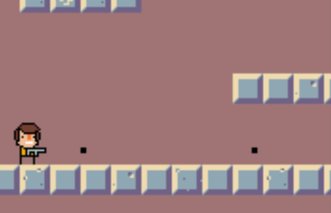
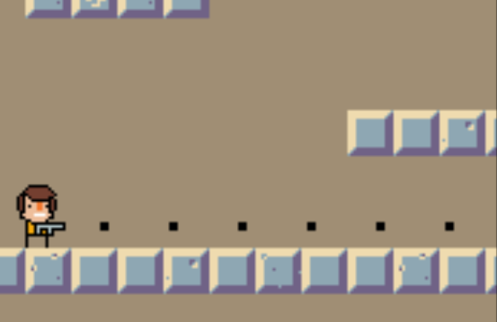
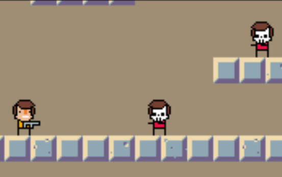
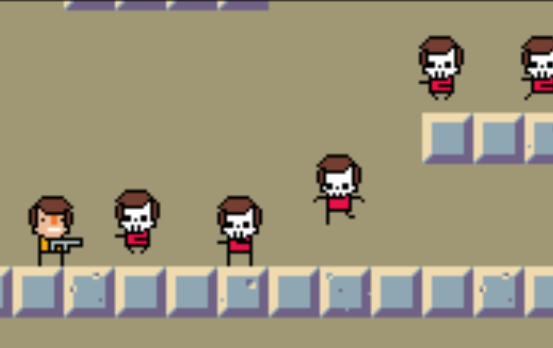
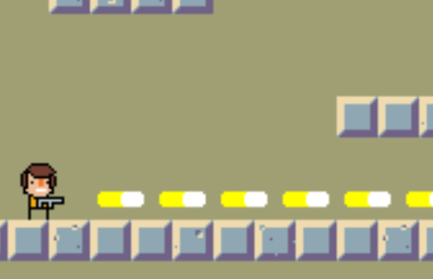
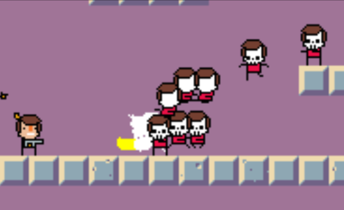
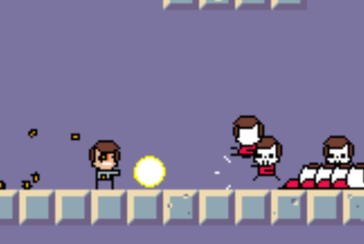
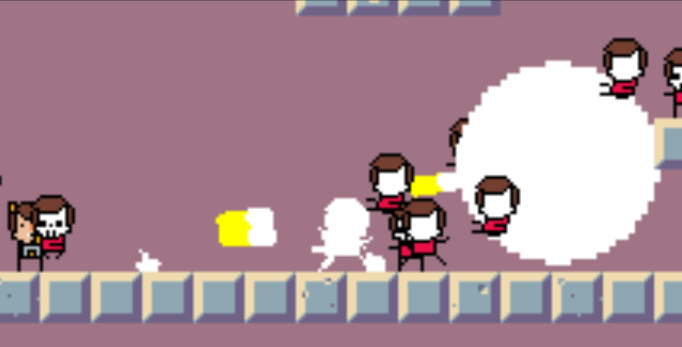

[ゲームデザイン改善ガイド 第02回]

# ゲームフィール

## 1. ゲームフィールってなんだ？

ゲームフィール(ゲームの感触)は、「ゲームのプレイヤーが、ゲームを操作するときに感じる好ましい手触りや没入感」のことです。

これは「プレイヤーの行うあらゆる操作に対して、ゲーム世界にとって意味のある応答を迅速に返すこと」と言い換えてもよいでしょう。もっと簡単には「操作していて心地良い」ということです。

操作の心地よさは、応答の純粋な素早さや、プレイヤーの想像通りの結果が起きる、といった基本的なことだけでなく、銃を撃つときに銃口が光る、ジャンプするときに土埃が舞う、といった小さなことからも生まれます。

これらの工夫のひとつひとつは大したことではありませんが、多くのゲーム開発者はゲームフィールを改善するために、何日も、何ヶ月も、場合によっては何年もかけています。

とはいえ、ゲームフィールを磨くためだけに何年もかけられるのは、資金と時間に余裕のあるゲーム開発者だけです。わたしたちには、「できるだけ短い時間」で「簡単に作れる」ようなゲームフィールの改善手法が必要です。

## 2. ゲームフィールを改善するには

幸いなことに、何人かのゲーム開発者が「自分たちがゲームフィールを改善するために行ったことのリスト」を公開してくれています。次のリストは、それを日本語に翻訳してまとめたものです。

これは、オランダのインディゲーム開発者`Jan Willem Nijman`(ヤン・ウィレム・ネイマン)氏による「君のアクションゲームを良くする小さな工夫30選」が元になっています。ゲームに普遍的な項目も多いので、アクションゲーム以外でも役に立つはずです。

>1. 基本的なアニメーションと音声を入れる キャラクターが生き生きしていると感じられて、操作するのが楽しくなります。自動車のような無機物でも上下に振動させたり、飛行機ならプロペラを回したり、ジェット噴射を点滅させるなど、やれることはいくらでもあります。
>2. 敵の体力を簡単に倒せるくらいにする 固い敵はフラストレーションが溜まります。特に雑魚敵は簡単に倒せるくらいがちょうどいいです。固い敵はアクセントとして使う程度で十分です。
>3. 武器の攻撃間隔を短くする(弾丸を連射する、武器を素早く振る) 多くのゲームにおいて、「武器」はプレイヤーがゲーム世界と対話する唯一の手段です。ボタンを押してもなかなかゲーム世界が応答しないのはストレスになります。

&emsp;

>4. 敵をたくさん出す ゲーム世界がプレイヤーの攻撃に反応するには、攻撃を受ける敵が必要です。誰もいない空間を攻撃しても楽しくありません。柔らかい敵が6体いるのと、その6倍の固さの敵が1体いるのでは、明確にプレイフィールが異なります。柔らかい敵はすぐに「死ぬ」という応答を返すため、攻撃するのが楽しくなります。

&emsp;

>5. 弾丸や武器を大げさにする 武器や弾丸を現実世界の大きさに合わせると、攻撃したことが分かりにくく手応えが得られません。武器を大きくすると武器がボタンに反応した手応えを感じられて楽しくなります。

&emsp;

>6. マズルフラッシュや武器の軌跡を入れる 武器や弾丸を大きくするだけでなく、発射時に銃口を光らせたり武器の軌跡を表示すると、ボタンを押した手応えがより強く伝わります。
>7. 弾丸の移動速度や武器を振る速度を速くする 攻撃が敵に届くまでの時間を短くすると、ボタンを押してから手応えを感じるまでのタイムラグが短くなるので、没入感が増して楽しくなります。
>8. 武器の攻撃方向や攻撃開始位置を毎回ちょっとだけずらす ゲームが毎回わずかに異なる応答を返すと、いつも同じことが起こるよりも操作が楽しくなります。

>9. 攻撃が当たった位置にエフェクトを入れる 弾丸や武器が壁や敵に命中したとき、煙や血しぶき、小さな爆発を表示するなど、ゲーム世界がプレイヤーの操作に応答することを示すと、武器を使うことが楽しくなります。
>10. 敵がダメージを受けたらアニメーションと音声を入れる 攻撃が命中したときに敵を光らせたり血しぶきを飛び散らせたり拡大縮小したりすると、攻撃の手応えを感じられて楽しくなります。

>11. ダメージを受けたら反対方向に少し動かす(ノックバック) 弾丸や武器が命中したとき、弾丸や武器とは反対方向に敵を少し移動させると、衝撃を与えた手応えを感じられて楽しくなります。
>12. 倒した敵を表示したままにする 倒した敵が画面に残っていると、どれだけの激戦を制したかが視覚的に伝わるため楽しくなります。ゲーム内容によっては、既に通過した場所を示すためにも使えます。
>13. (アクションゲーム限定)カメラがプレイヤーより少し遅れて動くようにする カメラがプレイヤーより少し遅れて動くようにすると、ゲーム世界がプレイヤー操作に反応しているように見えて楽しくなります。
>14. カメラがプレイヤーの向いている方向を広く映すようにする プレイヤーが倒すべき敵や超えるべき地形はプレイヤーの前方にあるはずなので、プレイヤーが向いている方向を広く映すことで、プレイヤーが操作を計画しやすくなります。
>15. 画面を揺らす 弾丸を撃ったときや敵がやられたときなど、衝撃が発生しそうなイベントが起きるたびに画面を揺らすと、ゲーム世界全体がプレイヤーの操作に応答していると感じられて楽しくなります。やりすぎると酔うので注意。画面揺れをオン・オフしたり、揺れの程度を調製できるオプションがあると最高です。
>16. (弾丸限定)弾丸を発射したときにプレイヤーを反対方向に動かす 弾丸を発射すると反動があるはずなので、プレイヤーが弾丸を発射したとき少し後ろに下がるようになっていると、発射した手応えを感じられて楽しくなります。
>17. ヒットストップを入れる 攻撃が命中したときに少しの時間だけ敵の動きを止めると、攻撃が命中した手応えがより分かりやすくなって楽しくなります。
>18. キャラクターの移動に反応するパーツを入れる 髪の毛やイヤリングのような、移動すると遅れて付いてくるようなパーツがあると、キャラクターを移動させるだけで楽しくなります。
>19. (アクションシューティング限定)武器の発射ボタンを押しっぱなしにしている間、プレイヤーの向きを固定する 攻撃しながらバックすることができるので、考えることが増えて楽しくなります。
>20. 攻撃の跡を残す 攻撃のときに薬莢を出して地面に落としたり、壁に弾丸の跡を残したり、剣で草を切ったりといった、ゲーム世界に攻撃の跡が残るようにすると、ただ攻撃ボタンを押すだけで楽しくなります。

>21. 効果音がはっきり聞こえるように誇張する 効果音がはっきりと聞こえると、プレイヤーは自分の行った操作の結果を目だけでなく耳でもしっかり確認できます。アクセントになる高音の効果音と、迫力を加える低音の効果音を同時に再生すると、プレイヤーの聴覚に関わらず何かが起きたことが伝わります。
>22. 最初から強力な武器を使えるようにする 最初から強力な武器が使えるほうがすぐにゲームを楽しめます。
>23. 敵のやられパターンを複数用意する ときどき敵が普段とは違う死に方をすると、クリーンヒットを与えた感覚が得られてゲームが楽しくなります。
>24. 敵の動きを速くする 敵の動きが速いとゲームのテンポが良くなったように感じられてゲームが楽しくなります。
>25. 敵を大量に出す たくさん敵を倒すと気分がよくなって楽しくなります。
>26. 頻繁に画面を揺らす 些細な衝撃でも少しでいいので画面を揺らすと、画面の揺れから衝撃の強さが伝わってゲーム世界との一体感が高まります。

>27. エフェクトを大きく派手にする エフェクトが大きいほどプレイヤーに何かが起きたことが伝わりやすくなり、情報を取りそこねるストレスがなくなって楽しさが続きます。

>28. エフェクトを部分的に長い時間表示する 爆発の煙や血しぶき、機械の破片など、敵を倒したときに出るエフェクトの一部だけを通常より長く画面に残すと、勝利の余韻が感じられるため楽しくなります。
>29. ゲームプレイを意味のあるものにする 少ない敵を弱そうな武器で倒すようなことは、主人公がわざわざやることではありません。「たくさんの敵を強力な武器でなぎ倒す、これは君にしかできない」というほうがずっと楽しいです。
>30. ゲームオーバーを劇的にする プレイヤーが倒されたときただ"GAME OVER"と表示するのではなく、画面をスローモーションにしたり、色を変えたり、特別な演出を加えると、プレイにとてつもなく価値があったように感じられ、たとえ敵に倒されたとしても満足感が得られます。

これらの要素を半分以上実装すれば、あなたのゲームは触れるだけで楽しいものになるでしょう。場合によっては、これらの要素をあえて実装しなかったり、逆のことを行うとゲームのアクセントになることがあります。

もちろん、ただ奇をてらっただけでは価値は生まれません。それどころか、ゲームの価値が低下する恐れすらあります。要素を追加(または削除)することに価値を持たせるには、「この要素があると(または、この要素をなくすと)、遊ぶ人はもっとゲームを楽しめるだろうか？」ということを考え続けなくてはなりません。

<pre class="tnmai_assignment">
<strong>【課題】</strong>
プランナー:

ゲームフィール改善リストから好きな項目を3つ選び、それらを主題とするアクションゲームの1ページ企画書を作成しなさい(文章のみの企画書で構いません)。

プログラマ:

ゲームフィール改善リストから、あなたの作品に足りない項目を3つ選び、これまでに制作した作品に追加しなさい。
</pre>

>**【参考動画】** 
>Jan Willem Nijman - Vlambeer - "The art of screenshake" at INDIGO Classes 2013 
><https://www.youtube.com/watch?v=AJdEqssNZ-U>
>
>ゲーム感覚と「ジュース」の秘密 | Game Maker's Toolkit 
><https://www.youtube.com/watch?v=216_5nu4aVQ>
