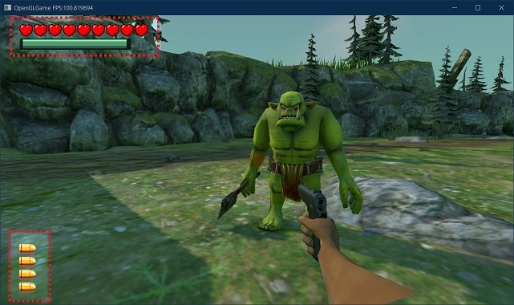

[ゲームデザイン改善ガイド 第03回]

# ユーザーインターフェイス

## 1. ユーザーインターフェイスの効果

ゲーム開発ではよくあることですが、開発終盤に差し掛かってもユーザーインターフェイス(UI)が「長方形を寄せ集めてシステムフォントを配置しただけ」という場合があります。

しかし、本当に良いゲームを作りたいと考えているのであれば、UIはゲームデザインの重要な要素として取り組まなくてはなりません。なぜなら、UIはゲームの見た目だけでなく、ゲームの仕組みやゲームフィールに大きな影響を与えるからです。

UIの基本的な機能は「プレイヤーにゲームの状態を伝えること」です。「ゲームの状態」には大きく分けて「現在の状態(ゲージ)」と「将来の予測(プレビュー)」の2つがあります。

「現在の状態」とは、プレイヤーが操作するキャラクターの体力や残弾数、ミニマップのように、プログラムが保持しているパラメータを公開するものです。

「将来の予測」とは、「(E)でドアを開ける」のような「いま出来ること」を表示したり、「攻撃範囲の表示」のように「行動の結果起こること」について注意を促すものです。

&emsp; 
[左=現在の状態 右=将来の予測]

これら二種類の情報は、どちらも「プレイヤーが行動計画を立てる」ことを助けます。

例えば、自分の体力を知る手がかりがなければ、プレイヤーは常に「次の瞬間死ぬかもしれない」と考えるでしょう。すると、死なないように消極的な行動を選ぶようになります。

逆に、体力を正確に知ることができれば、体力が多いときは楽観的に、少ないときは慎重に、というように、体力に応じて適切な行動を選べるようになるでしょう。

他の例として、「(E)でドアを開ける」などの表示がなければ、開くかどうかも分からないすべてのドアの前で片っ端からボタンを押していくか、そもそもドアが開くことに気づかない可能性すらあります。

このように、適切なUIはプレイヤーの認知力に対する負担を減らし、より楽しいゲームプレイを促進することができます。

## 2. フォントを選ぶ

UIの目的はプレイヤーにゲームの状態を伝えることなので、プレイヤーが正しく情報を受け取れるように「見せ方」を工夫しなくてはなりません。

また、ファンタジーRPGならファンタジー感のあるUIデザイン、SFシューティングゲームならSF風のUIデザイン、というように、UIデザインはゲーム内容に合わせて選びます。

UIデザインがゲームのデザインとかけ離れていると、プレイヤーがゲームに集中しにくくなるからです。

そして、UIデザインにおいて最初に決めるべきなのは「フォント」です。フォントによって文字の大きさが異なるため、後でフォントを変えようとすると、UI全体のレイアウトが崩れてしまうからです。

必要なフォントの種類はゲームによって変わりますが、一般的には「見出し」と「それ以外」の2種類あれば十分です。面倒な場合は、どちらにも同じフォントを使って、見出しだけ「太字」や「イタリック体」にする、という方法もあります。

フォントを選ぶタイミングは、ゲームデザインがなんとなく決まって、プロトタイプが動くようになった頃です。ゲームデザインに合うフォントを選ぶには、まずゲームデザインが決まっている必要があるからです。

&emsp; 
[左=ペルソナ5(アトラス)のフォント 右=ニーアオートマタ(プラチナゲームズ)のフォント]

## 3. UIの配置

ゲーム画面のどこにどんなUIを配置するかは早い段階で決めておきましょう。UIの配置をあとまわしにすると、プレイヤーに気づいてほしい要素がUIで隠されてしまう場合があります。

そうならないように、UIは他の要素を邪魔しない位置に置くべきです。代表的な邪魔しない位置は、やはり画面の四隅でしょう。実際、ほとんどのゲームは四隅のどれかにUIを配置しています。

 
[ELDEN RING(FROM SOFTWARE)のUI配置]

配置で注意する点として、「画面端から少し離してUIを配置する」ことが挙げられます。理由は次のとおりです。

>* 画面外から入ってくるオブジェクトに気づきやすくなる。
>* 余白がないと、UIというより画面の枠に見えてしまう。

また、UIを「他の要素を邪魔しない」ように配置すると、「UIが目立たない」という状態におちいりがちです。しかし、UIには「プレイヤーに情報を伝える」という重要な役割があります。そのため、画面上で目立たせる工夫が必要です。

ただし、すべての要素を目立たせるとどの情報が重要なのかが分かりません。UIが伝える情報を重要度ごとに分類して、重要な情報ほど目立つように作るのが基本となります。

UIを目立たせるには「UIに枠を付ける」、「目立つ色を使う」という方法が使われます。

ゲーム内容によっては、一部のUIを目立たせることを優先して、「画面内の他の要素をUIの邪魔にならないように配置する」という、通常とは逆の方法も考えられます。

例えば、アトラスの「ペルソナ3 リロード」では、戦闘中の操作UIは左下に大きく表示され、ゲームフィールを高めるデザインになっています。そして、デザインを邪魔しないように、敵は右にずらして表示しています。

 
[ペルソナ3リロード(アトラス)の戦闘画面]

この場面では操作キャラクターをUIの一部に組み込むことで、誰のコマンドを入力しているのかを伝えています。また、コマンドごとに大きさを変えることで、コマンドの重要度を伝えています。

「ペルソナ」シリーズのUIはちょっと極端な例ですが、ゲームが伝えたい情報を目立たせるには、これくらいのことをしても良いのです。

## 4. タイトル画面

タイトルロゴなどのフォントはUIとは別に選びます。ロゴを含むタイトル画面は、早い段階でそれなりに見栄えのするものを用意するべきです。

ゲームをテストするたびにハリボテのタイトルを見せられるより、それらしいタイトル画面で始められるほうが開発のモチベーションが上がるからです。これは自分ひとりで開発する場合でも当てはまります。

 
[タイトル画面の例]

就職作品として考えたとき、タイトル画面はゲームの「第一印象」です。そのため、「タイトル画面が丁寧に作られていないのなら本編も丁寧ではないだろう」と思われると考えてください。

ですから、タイトル画面があまりにも適当だったり、おふざけが過ぎるのはよくありません。「私は本当にゲームを作りたくてゲーム会社に就職したいのです」ということが伝わるかどうかを考えなくてはなりません。

また、タイトル画面を作るときは、画面のどこかが常にアニメーションするようにします。そのほうが雰囲気が良いというだけではなく、ゲームがエラーで停止していないことを伝えるという重要な役割があります。

タイトル画面がフェードインやアニメーション等で始まるのはとても良いことです。ただし、使いやすさの観点から、プレイヤー操作でスキップできるようにしましょう。

スキップ機能は、実際にゲームを遊ぶ人のためだけではありません。ちょっとしたテストをしたいだけなのにフェードインやアニメーションの終了を待つ必要があると、テストやデバッグが面倒になってゲームを改善するモチベーションが下がってしまうからです。

タイトル画面を作成する適切な時期は、フォントと同様にゲームデザインがある程度決まったあとになるでしょう。

## 5. ダイエジェティックUI

UIとして機能する要素はフォントやアイコンだけではありません。例えばサードパーソンシューティングの「DEAD SPACE」では、主人公アイザックの体力と特殊能力の残量は、彼が着用するスーツの背面に表示されます。

 
[背骨部分=体力(縦棒グラフ) 背中右側=特殊能力の残量(円グラフ)]

任天堂の対戦シューティング「スプラトゥーン」では、キャラクター背面の「インクタンク」によって残弾数を表示します。また、スペシャルウェポンが使用可能になると髪が燃え上がります。

&emsp; 
[左=インクタンク 右=スペシャルウェポン使用可能]

`Maddy Makes Games`が開発したアクションゲーム「Celeste」では主人公マデリンの髪が茶色いときは「ダッシュ可能」で、ダッシュを行うと髪が青くなり「ダッシュ不可能」を表します。

&emsp; 
[左=ダッシュ可能 右=ダッシュ不能]

また、ゲーム空間の風向きや風量は、マデリンの髪の毛のたなびく方向や強さによって表されます。

 
[右から左へと風が吹いている]

このように、キャラクターが画面に表示されるゲームでは、「キャラクター自身がUIとして機能する」という手法も有効です。この手法は`Diegetic`(ダイエジェティック、「物語中に存在する」という意味) UIと呼ばれます。

ダイエジェティックUIをうまく使うと、視線を大きく動かさなくて済む、没入感が高くなる、という利点が得られます。

ただし、見せ方がまずいと情報が伝わりにくく、使いづらいUIになってしまいます。また、多くの情報を表示するのには向きません。例えば、パーティ制RPGで各メンバーの背中にHPやMPを表示するのは、一覧性が低くなるだけです。

ダイエジェティックUIはデザインと一体になって作る必要があるため、アセットを使ってゲームを作る場合は利用が難しいかもしれません。

<pre class="tnmai_assignment">
<strong>【課題】</strong>
プランナー:

これまでに作成した企画書をひとつ選び、PowerPoint等を使ってゲームプレイ画面のUIの仕様書を作成しなさい。UIで使用するフォント、フォントの色、縁取り等の有無を含めること。

プログラマ:

これまでに作成したゲームのUIについて、フォントや色、表示位置を再考し、より良くなるように調整しなさい。また、他に表示するべきUI要素があれば追加すること。
</pre>

>**【参考動画】** 
>ゲームにおける HUD の影響力 | Game Maker's Toolkit 
><https://www.youtube.com/watch?v=4Bv45aPMGyI>
