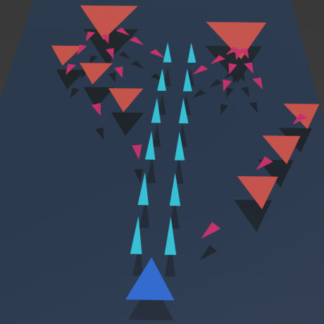
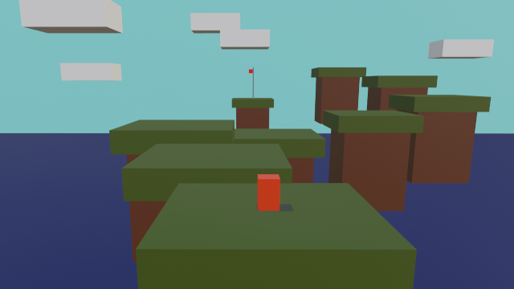
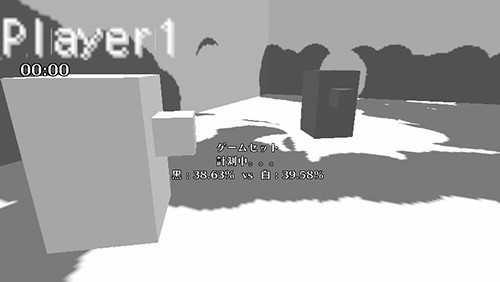
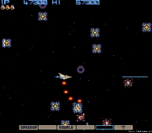

[ゲームデザイン改善ガイド 第01回]

# ゲームのアイデアの出し方

## 1. この講義の進め方

この講義では「就職活動で通用するように作品の品質を改善する方法」を学習します。そのために、以下の２つの内容に取り組んでもらいます。

>1. これまでに制作したゲーム作品、企画書、仕様書の「ゲームメカニクス(仕組み)」「ユーザーインターフェイス」「ゲームフィール(手触り)」を改善することで、ゲームの品質を高める方法を学ぶ。
>2. 今後制作するゲームや企画書、仕様書について、組み込むアイデアや技術を実験、選定する。

題材として、YouTubeの「ゲームメーカーズ・ツールキット(GMTK)」や「桜井政博のゲームを作るには」などを取り上げ、作品の品質を高めるためのヒントを学習します。

そして、学習したヒントを活用することで、これまでに制作した作品を改善したり、今後制作するゲームの品質を高めるために必要な技術を習得することを目指します。

第01回は就職作品のための「ゲームのアイデアの出し方」について考えます。

## 2. アイデアの出し方

プログラムにしろ企画書や仕様書にしろ、新しいことを学びはじめたばかりの頃は、どんなゲームを作ればよいのかがよく分からないと思います。

それでも、自分が作りたいゲームの内容は、早めに考えておくべきです。漫然と技術を学ぶのではなく、学んだ技術をどうやって作りたいゲームに応用するかを考えることで、より深く技術を理解できるようになるからです。

また、就職活動が本格的に始まるまでの残り時間は既に1年を切っています。ゲーム業界への就職を目指すなら、早急にプロトタイプを作り始めて作品の品質を高めていかないと間に合いません。

ひとつの方法として、全く新しいゲームのアイデアを考えるのではなく、既存のゲームをベースにして、以下の点について考えます。

>* ゲームを最小の要素に分解する 
>例えば、「ゲームの目的→目的を達成するために必要な中間目標→中間目標達成に必要な小目標→小目標を実現するための手段・操作」のように、段階的に分解します。
>* ゲームの長所と短所を分析する 
>例えば、ジャンプアクションでは、「ジャンプ」が目標達成の重要な手段です。高所にたどりついたり、深い谷や落とし穴などを避けることができます。ですが、ジャンプ中に制御ができない、着地点の把握が難しい、といった問題もあります。この長所と短所が、ゲーム性にどのように貢献しているのかを考えます。

これらの点について十分な情報を収集したら、次のような方法で要素に変化を加えたり、要素同士の関係性を変えてみます。

>* ゲームの要素をゲームから削除する。「シューティングゲームから弾を打つ操作を削除する」など。
>* ゲームの要素に通常期待される役割や効果を逆転する。「ボタンを押すと自分ではなく敵がジャンプする」など。
>* ゲームに追加の制約を設ける。「ジャンプ回数に制限がある」など。
>* 異なるゲームの要素を組み合わせる。「2Dシューティングゲームに、ジャンプして敵の攻撃を避けたり、敵を踏みつける要素を加える」など。

なお、プログラマーの場合、既存のゲームを3D化するだけでも、なにか違いが生まれるかもしれません。ポリゴンさえ表示できれば、基本的な3Dゲームを作ることが可能です。敵も味方も全部三角形のシューティングゲームや、四角形がぴょんぴょん飛び跳ねるアクションゲームなどが思いつきます。

&emsp;

例えば、「スプラトゥーン」の開発初期のキャラクターは「灰色の四角形」で作られていました。ゲームの動作を確認するには十分だったからです。

 
<a href="https://www.nintendo.co.jp/wiiu/interview/agmj/vol1/index.html">社長が訊く「Splatoon(スプラトゥーン)」</a>より

上記の方法は例に過ぎません。現在までに得た知識や経験を使って、過去に作成した企画書や仕様書に要素を付け加えたり、表現を洗練させるだけでも、ひと味違った作品につながる場合があります。

いずれにしても、早めに作りたい作品の内容を決めておくことが重要です。手がかりがない場合は、とりあえず「好きなゲームと同じジャンルのゲーム」を作ってみるのがよいでしょう。

## 3. ジャンルによる難易度の違い

ゲームを作る難易度は、ゲームジャンルによって大きく異なります。あまり難しいジャンルを選んでしまうと「いつまでたってもゲームが完成しない」ということになりかねません。

以下のリストは、ゲームのジャンルを制作難易度の低い順に並べたものです。ジャンルを決める参考にしてください。

>1. (難易度:易しい) 3Dジャンプアクション
>2. FPS(ファースト・パーソン・シューティング)
>3. TPS(サード・パーソン・シューティング)
>4. RCG(レーシング・ゲーム)
>5. 格闘ゲーム
>6. アクション・アドベンチャー
>7. RPG(ロール・プレイング・ゲーム)
>8. (難易度:難しい)RTS(リアルタイム・ストラテジー)

これはおおよその目安で、どのジャンルであっても簡単に作ろうと思えばいくらでも簡単にできますし、逆に難しくしようと思えばいくらでも難しくできます。

例えば「ジャンプとダッシュを使って、直方体を組み合わせた地形のゴールまでたどり着く3Dジャンプアクション」は、かなり簡単に作れそうです。

しかし、「二段ジャンプ、壁ジャンプ、ダッシュジャンプのような多彩なアクションを駆使することで、複雑な地形と、高度なAIを持つ敵の妨害をくぐり抜けて、ゴールまで辿り着く3Dジャンプアクション」となると、大きく難易度が上がります。

他にも、「それぞれが多彩な技を持つ10人以上のキャラを選択できる3D格闘ゲーム」を作るのは大変そうです。しかし、「キャラが棒人間だけで操作はパンチとガードだけの格闘ゲーム」であれば、もっと簡単に作れるでしょう。

そのため、さきほどのリストは「最低限ゲームとして遊べる程度の内容を作ろうとすると、相対的にこのくらいの難易度になるという目安」くらいに考えてください。例えば、難易度の高いRPGやRTSを最低限遊べるレベルで作るには、プログラムにしろ仕様にしろ、かなりの分量をこなさなくてはならないでしょう。

なお、この時点で決めたジャンルはあとで変えても構いません。開発が進むにつれて「このゲームにふさわしいジャンルを発見したが、それは当初予定していたジャンルとは違う」、というのはよくあることです。

それから、ほとんどの2Dゲームと比べて、3Dゲームの制作は難易度が一気に上がります。空間の理解、ベクトルと行列を使った座標の操作など、要求される数学の技術と知識が高くなるからです。

とはいえ、ゲーム会社への就職を目指すなら、3D主体の作品を作らざるを得ません。一応、「グラフィックスは3Dでゲーム内容は2D」というデザインを選ぶ方法もあります。例えば、次のような内容が考えられます。

>* 横スクロールジャンプアクション(表示は3D)
>* 見下ろし型シューティングゲーム(表示は3D)

つまり、ゲーム性に関わる部分は2Dで、表示だけ3Dにするやりかたです。「スーパーマリオ・ワンダー」や「ソニック・ザ・ヘッジホッグ」のようなゲームが該当します。

もちろん、3D技術の勝負からは半分降りることになるため、普通に作品を完成させるだけでは就職は難しいでしょう。就職するためには「他の候補者より優れた部分が必要」という事実は変えられないからです。

そのため、操作感や演出、敵のアルゴリズムなど、3D以外の部分で技術力をアピールしていく必要があります。「3Dでがんばる」か「その他の技術で超がんばる」かの二択で考えてください。

## 4. ゲームデザインの再利用

 
<a href="https://www.freepik.com/free-vector/lightbulb-idea-puzzle-team-solving-puzzle-teamwork_26477384.htm">Image by vector4stock</a> on Freepik

ゲームにおいて「新規性のあるアイデア」は、他のゲームとの差別化要因として非常に重要です。既存のゲームと同じ内容のゲームを買おうと考える人は少ないからです。

しかし、そのゲームが「就職作品」となれば話が違ってきます。ゲーム会社が求める能力は「新規性のあるアイデアを創造する力」だけではなく、「アイデアを適切に仕様やプログラムに落とし込める力」も重要だからです。

そのため、ゲーム会社への就職作品を作る場合は「既存ゲームのアイデアを再利用した作品」も考えに入れてください。ただし、完全な再現を目指すことはおすすめしません。現代のゲームのアイデアには「そのアイデアの実現には十分な経験を必要とする」ものが少なくないからです。

就職作品の重要な目的のひとつは「分からないことを解決する能力を示すこと」ですが、「自分で解決できる範囲を理解していること」もまた重要だからです。

「多少分からないところがあるけど、多分作れそう」というくらいがちょうどいいアイデアです。「アイデアを実現する方法が全く思いつかない」場合、そのアイデアは難しすぎます。

選ぶべきアイデアの規模は想像できたでしょうか？　想像できたら、以下の手順でアイデアを作品に組み込みましょう。

>1. お好みのゲームのアイデアを3つ選ぶ。各アイデアは別のゲームから選んでよい。
>2. 3つのアイデアを作りやすそうな順に並べる。
>3. 一番作りやすいアイデアを再現する。完璧に再現しようとは考えないこと。
>4. 二番目に作りやすいアイデアを再現する。
>5. 三番目に作りやすいアイデアを再現する。

この手順の少なくとも3番まで実行できれば、つまり、一番作りやすいアイデアさえ完成させられれば、とりあえず作品として提出できる状態になります。その後は、二番目、三番目のアイデアを完成させて、作品の完成度を高めていってください。

## 5. 技術力をアピールできるポイントを加える

ゲームとして面白いアイデアが、技術的にも興味深いものであるとは限りません。特にプログラマーの場合は、ただ面白いだけでなく技術的に挑戦しているアイデアを選ぶべきです。

とはいえ、コンピューターゲームで使われているアイデアというものは、大抵は一定の技術力を必要とします。ですから、どんなアイデアを選んだとしても、そこには何らかの技術的な挑戦が含まれている可能性が高いです。

例えば、1985年に作られた2Dシューティングゲーム「グラディウス」には、プレイヤーの移動に追従し、プレイヤーと同じ攻撃をする「オプション」という装備があります。

 
[オレンジ色の球体がオプション(グラディウス ©Konami Digital Entertainment)]

「オプション」を実現するには、「過去のプレイヤーの位置を覚えておき、過去のある時間の位置にオプションを表示する」機能が必要となります。この機能を適切な仕様として書き出したり、プログラムとして再現するにはそれなりの経験が必要です。

オプションは40年以上も前のゲームのアイデアですが、それでもこのような技術的な挑戦が含まれます。

基本的には、挑戦的なアイデアほど、就職活動において強力な武器になります。しかし、あまりに挑戦的すぎるとアイデアを適切に書き上げられなかったり、作成に時間をかけすぎて作品として完成させられなかったりします。

作品が完成しないのでは本末転倒です。目安として、一週間調べても実現方法が分からないアイデアは、<ruby>諦<rt>あきら</rt></ruby>めて他のアイデアに変えてください。

先に述べたように、「多少わからないところがあるけど、多分作れそう」というアイデアがちょうどよいです。

それから、どのようなアイデアを作ったにせよ、就職作品のアピールポイントとして、以下の点をメモしておきましょう。作品に添えるドキュメントを書くときに、これらを書き写して清書してください。

>1. 他の類似したアイデアではなく、そのアイデアを選んだ理由。
>2. アイデアを作品に組み込むうえでぶつかった技術的課題。
>3. 技術的課題を解決した方法。

<pre class="tnmai_assignment">
<strong>【課題】</strong>
プランナー:

好きなゲームの要素を分解、分析し、そこから3つ程度の要素を選んでームの1ページ企画書を作成しなさい(文章のみの企画書で構いません)。

プログラマ:

好きなゲームの要素を分解、分析し、自分の能力で再現できそうな要素を3つ選んで簡単な企画書にまとめなさい。
</pre>

>**【参考動画】** 
>How to find amazing game ideas - Game Maker's Toolkit
><https://www.youtube.com/watch?v=0m60QbT85Tc>
>
>Making Your First Game: Minimum Viable Product - Scope Small, Start Right - Extra Credits 
><https://www.youtube.com/watch?v=UvCri1tqIxQ>
