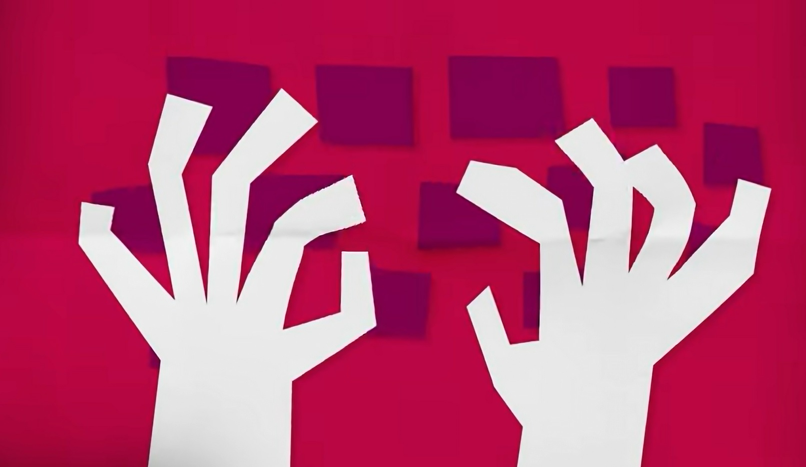
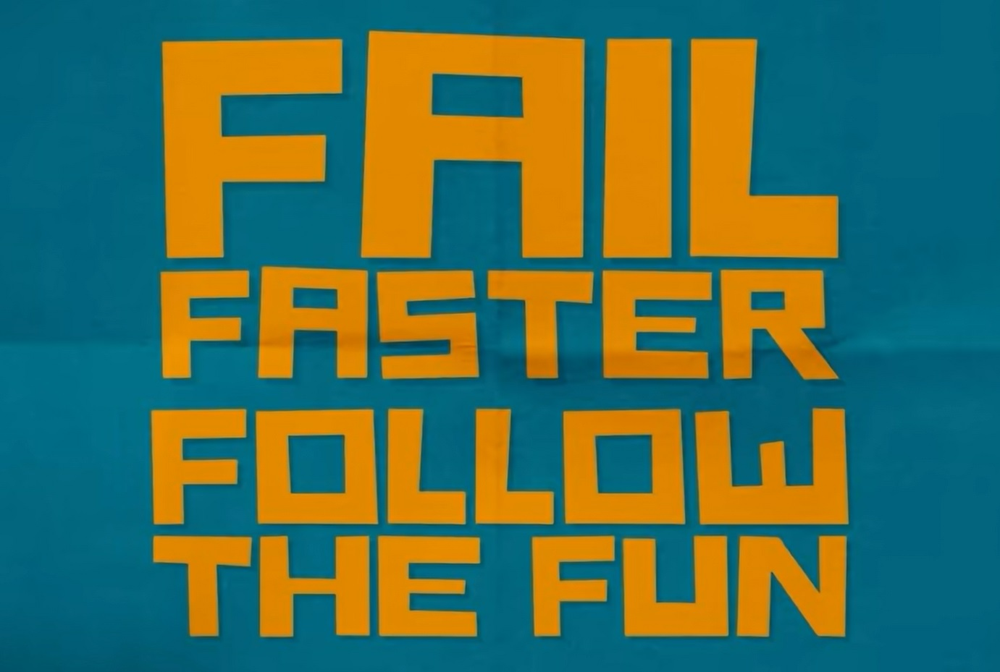
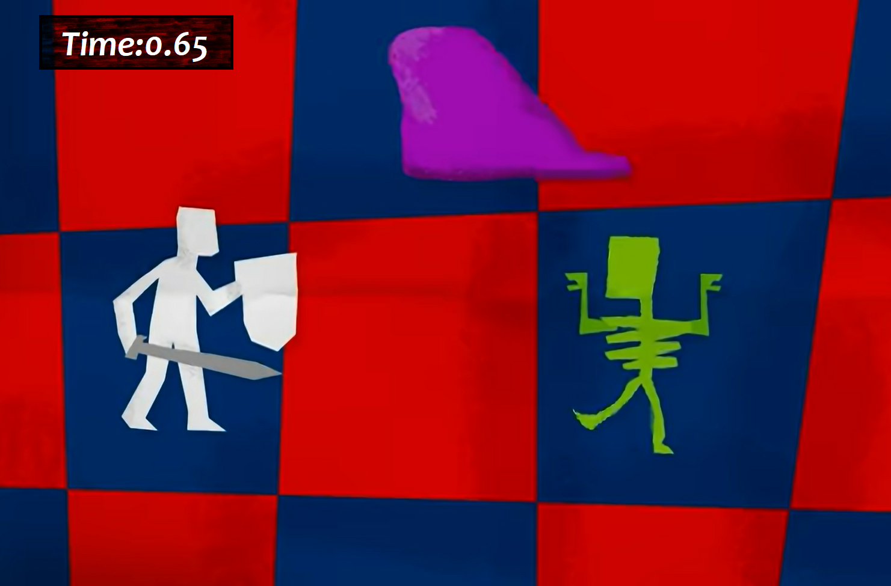
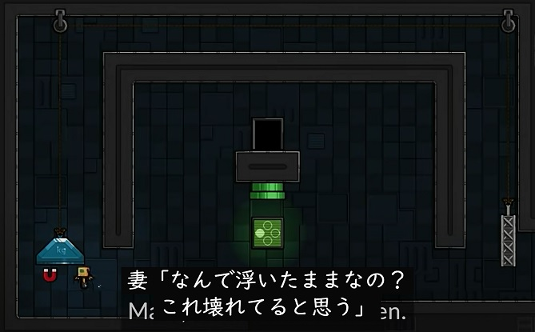
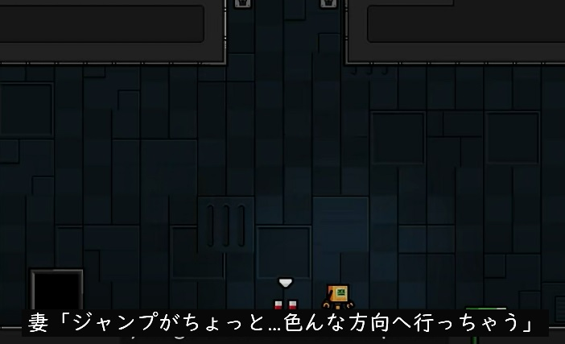
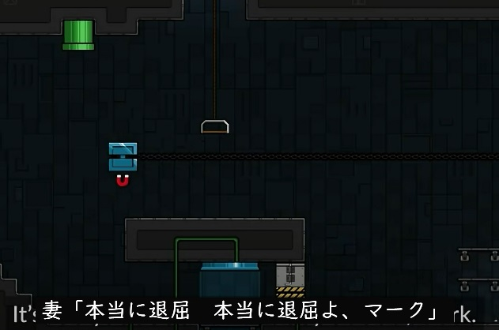
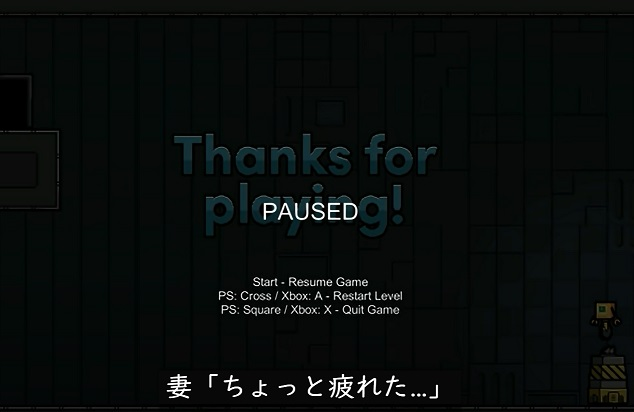

[ゲームデザイン改善ガイド 第05回]

# アイデアを試作する

## 1. アイデア出しに時間をかけない

 
[とにかく手を動かして試す(www.youtube.com/watch?v=kMDe7_YwVKI)]

「それほど難しくないだろう」と考えていたアイデアが、実際に制作してみると「さまざまな問題が起きて、なかなか思うようにいかない」というのは、よくある話です。

「組み合わせたら面白いだろう」と思っていたアイデアが、実際に試してみると「アイデア同士が噛み合わなくて、思ったほど面白くなかった」というのも、よくある話です。

とはいえ、これは開発の初期段階ではほとんど問題になりません。アイデアの実現にかけた時間はわずかで、大抵はまだグラフィックスも作成していないからです。

しかし、既にほとんどゲームが完成している場合は話が変わります。新しいアイデアのために、プログラムとグラフィック、その他多くのデータを一から作り直す時間も予算も残ってはいないのです。当初のアイデアに固執してゲームを完成させるか、ゲームを放棄するしかありません。

これは就職作品の制作でも同じことです。完成までに掛けられる時間がずっと少なく、期限を遅らせることができないという点では、就職作品のほうが実際のゲーム開発より大変かもしれません。

逆に、「想定外の面白さが見つかる」ということもありえます。その場合は、見つけた面白さを改めて追求することになります。この場合でも、開発終盤に本当の面白さを見つけるのでは遅すぎます。もっと早く見つけなければ、面白さをゲームに反映させることはできないからです。

「試作」を行うためには、とにかく何らかのアイデアが必要になります。しかし、全てのアイデアを自分で考え出す必要はありません。既存のゲームからアイデアを借りれば、アイデア出しの時間を短縮できます。既存のアイデアの面白さは元のゲームで証明されており、「面白くない」という可能性は低いです。

ですが、実際に制作を進めていくと、「思ったより簡単に作れてしまい、スキルのアピールには向いていなかった」とか、逆に「作るのが想像以上に難しくて作品が完成しない」ということが起こり得ます。

「試作」は、このような事態を防ぐ手段の一つで、ゲームエンジン等を利用して、アイデアが最低限確認できるアプリを作ることを指します。実際に動作させてみることで、アイデアに問題があるどうかを調べたり、本当に面白いものになるかどうかを確認するのです。

問題が起きた場合は、その問題を修正可能かどうかを調べます。現実的な時間で修正できそうなら試作を続けます。修正できない、あるいは修正に時間がかかりすぎる場合は、そのアイデアは捨てて別のアイデアを試します。

このように「試しては捨てる」という作業をすばやく繰り返すことで、「自分の力で作成できるレベルのアイデア」を見つけられるでしょう。

>**【Tips】**
>
>* アイデアは、実際にアプリを作って試さなくてはならない(プランナーの場合、誰かに試作を作ってもらってもよい)。
>* 試してみるまでは、そのアイデアが自分に作れるレベルなのか、作れたとして面白いゲームにできるのか、といったことが分からない。

## 2. 試作は素早く行う

 
[より早く失敗し、面白さを追いかける(www.youtube.com/watch?v=kMDe7_YwVKI)]

アイデアの試作は、できるかぎり素早く行ないます。グラフィックスやサウンドには既存のデータを流用するなど、動作テストに最低限必要なものが揃っていれば十分です。

試作の目的は、「実際にプログラムに変換できる」、「プログラムが意図したように動く」という点を確かめることです。ですから、それ以外の要素に時間をかけていては本末転倒です。

試作では、多少バグがあったとしても、そのバグがアイデアのテストの邪魔にならない場合は放置します。「アイデアを試すこと」が目的なので、その目的が達成できるのなら、多少作りが甘くても構いません。

2日で試作プログラムを動作させられない場合、他の人に助言を求めてください。10日たってもまだ動作させられない場合、そのアイデアは、今のあなたにとって少し難しすぎる可能性があります。

このようなアイデアは、経験を積んでから改めて試作することにして、どこかにメモしておきましょう。そして、今はもう少し簡単そうな別のアイデアを試してください。

>**【Tips】**
>
>* アイデアの試作に時間をかけてはいけない。試作に時間がかかるようなアイデアは難しすぎて完成しない可能性が高い。

## 3. アイデアは変わりゆくもの

 
[1ターン1秒制限のターン制ローグライクのアイデア(www.youtube.com/watch?v=kMDe7_YwVKI)]

試作プログラムを作成しているとき、「元のアイデアのままだと難しいけれど、少し変えたら簡単に作れそう」と考えることがあるかもしれません。

あるいは、何度か動作テストをしているうちに「このアイデアを少し変えてみたらもっと面白くなるかも？」と考えることもあるでしょう。

これはとても良いことです。試作には、ただ元のアイデアを再現するだけでなく、アイデアについての理解を深め、そのアイデアの持つ可能性を探る意味もあるからです。

当然ながら、他のゲームから借りてきたアイデアは、そのゲームに合うように細部が調整されています。そのため、そのアイデアをそっくりそのまま自分のゲームに持ってきても、あまり面白くならないことがあるのです。

そのため、「アイデア本来の面白さを再現するために、自分のゲームに合わせてアイデアを調整しなくてはならない」というのは普通に起こります。

なお、アイデアを調整・変更した結果、「技術的にアピールできる要素」が弱くなったり、場合によってはなくなってしまうことがあります。

その場合、「より面白くするために、あえて技術を使わない選択をした」ことをアピール材料にするとよいでしょう。技術面にこだわりすぎて、「アイデアの面白さ」が失われてしまっては本末転倒だからです。

「技術的にアピールできる要素」をなくしても「アイデアの面白さ」を残せている、ということは、「元のアイデアより少ない労力で、同等の面白さを再現できる」ことを証明したわけです。

これは「技術が必要ないことを示した」という点で、十分なアピール要素になります。

>**【Tips】**
>
>* アイデアは途中で変化してよい。他のゲームから借りてきたアイデアが、なんの変更もなく自分のゲームに合致することは少ない。
>* アイデアを変更した結果、技術的なアピール要素が無くなってもよい。「より簡単なプログラムでアイデアを再現できる」と証明したことになる。

## 4. 他人に評価してもらう

  
  
[ある人が妻にゲームを遊んでもらった結果...(www.youtube.com/watch?v=0lhjLNYopHM)]

アイデアを試作した時点で、その品質が「就職作品として通用するレベル」に達しないと感じた場合、そのアイデアをもっと磨き上げるか、捨てて別のアイデアを試すかを選ばなくてはなりません。

ただし、自分だけでプログラムの良し悪しを判断すると、大抵は失敗します。誰しも自分のプログラムには思い入れがあるので、心理的に甘い評価をしがちだからです。

そのため、試作品の評価は他人にしてもらうほうが正確になります。人によって評価の甘さが異なるため、家族や友人、クラスメイトなど、複数の人に試してもらうのがよいでしょう。

評価してもらうタイミングは「アイデアがひととおり動作するようになり、それを何度か自分でテストしたあと」です。

アイデアを作りかけの状態だと、アイデア自体を評価してもらう段階にたどりつけず、「書きかけのプログラムをデバッグしているだけ」になることが多いからです。

とはいえ、アイデアの出来栄えを気にして評価を先延ばしにすると、自分では気づかなかったアイデアの問題点に対応するのが遅くなってしまいます。

そして、問題を見つけるのが遅くなると、遅くなったぶんだけ問題の修正に時間がかかります。アイデアの開発が進むほど関連するプログラムが増えていき、それらすべてを調査しなくてはならないからです。

こうなるくらいなら、多少プログラムに問題があっても、早く評価してもらうほうが安全かつ効率的です。アイデアが動作するようになったら、できるだけ早く他人に評価してもらうことが大切です。

また、ひとりだけでなく複数の人に評価してもらうことも重要です。ひとりの評価では見逃してしまう問題点があったとしても、複数人で評価してもらえば誰かが問題点に気づく可能性が高くなるからです。

また、人によって問題と感じる要素は異なります。そのため、複数人に評価してもらうほうが、さまざまな観点から問題点を見つけてもらえる可能性が高まります。

>**【Tips】**
>
>* アイデアを試作した結果は、自分だけでなく他人にも評価してもらうこと。他人のほうがアイデアの予備知識などがないぶん、公平に評価してくれる可能性が高い。
>* 評価は複数の人間にお願いすること。ある人が問題と感じない部分でも、他の人にとっては大きな問題となるかもしれない。

<pre class="tnmai_assignment">
<strong>【課題】</strong>
プランナー:

これまでに作成した企画書からひとつを選び、いちばん面白いと思う要素をUnity等を使って試作しなさい。

プログラマ:

これまでに作成したプログラム作品をフォルダごとコピーし、そこに好きなゲームから一番面白いと思う要素をひとつ追加しなさい。
</pre>

>**【参考動画】** 
>ゲームが自らを設計する - Game Maker's Toolkit 
><https://www.youtube.com/watch?v=kMDe7_YwVKI>
>
