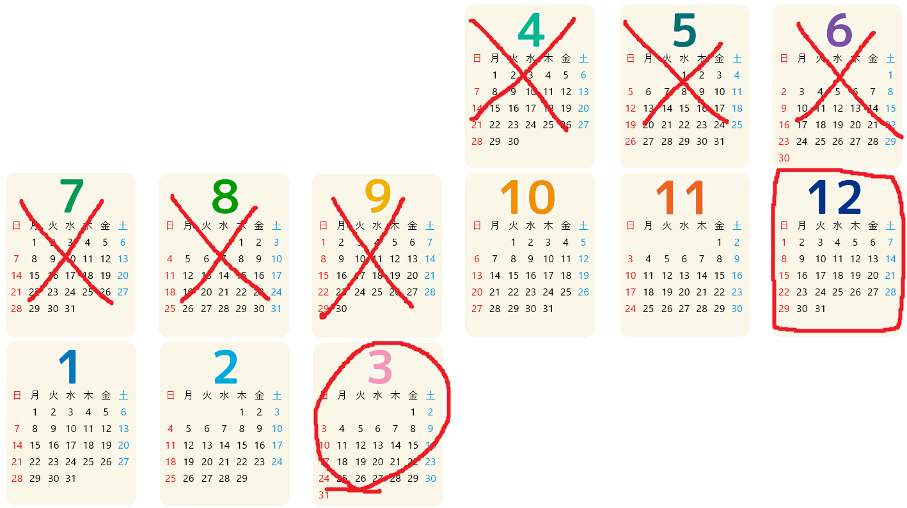

[ゲーム改善ガイド 第05回]

# 就職作品の制作期間を考える

## 1. 開発期間を見積もる

 

ひとつのアイデアの内容を決めて試作を終えるまでに、10日かかるとしましょう。土日は休みとして考えると、これは2週間に相当します。3つのアイデアを試作する場合は6週間、およそ1.5ヶ月かかります。

ということは、6月中旬からアイデアの選定と試作に取り掛かったとして、すべての試作が終わるのは7月末から8月初め頃になる計算です。

試作した結果「大きな問題はなさそうだ」となったら、次はアイデアを洗練させてゲームとしての<ruby>体裁<rt>ていさい</rt></ruby>を整えていきます。

>ここでの「体裁」は、タイトルやゲームクリア、ゲームオーバーなどが組み込まれ、ゲームとしての流れが動作する状態を意味します。

体裁を整えるための作業は、だいたい次のようになるでしょうか。他にもあるかもしれませんが、とりあえず11項目を挙げています。

>1. 試作を参考にして、アイデアをうまく活用したゲームを作る。
>2. ゲーム内で使用するキャラクターや背景を見栄えのする画像や3Dモデルにする。
>3. ゲーム中のUIを見栄えがするように変える。
>4. ゲームのあらゆる部分に効果音とBGMを設定する。
>5. タイトル画面を作る。
>6. ゲームクリアを作る。
>7. ゲームオーバーを作る。
>8. オプション画面を作る。
>9. ゲームフィールが向上するようにエフェクトや画面効果を追加する。
>10. 自分で見つけたバグを修正する。
>11. 他人の意見を聞いてさらバグを修正する。

項目によって必要な日数は異なると思いますが、大雑把に「1項目につき5日」として試算してみましょう。

すると全部で55日、およそ3ヶ月かかると予想できます(1ヶ月=約4週間=平日5日x4=20日として計算)。8月に入ってすぐに作業を始められた場合は、10月末か11月初頭には就職活動に使えるゲームが出来上がる計算です。

ただし、これは「11項目が平均して5日以内に完了する」ことが前提です。「大抵の計画は実際には1.5倍から2倍の時間がかかる」と言われているため、「体裁を整え終わるのは来年1月末」ということも十分にありえます。

そもそも、最初の「1. 試作を参考にして、アイデアをうまく活用したゲームを作る」の時点で、とても5日で終わるとは思えません。

加えて、8月に入ってすぐに体裁を整える作業に入れるかというと、それもちょっと怪しいです。夏季休暇中はインターンに行ったり、家族旅行だったり、アルバイトがあるなどで、あまり時間を取れない可能性があるからです。

また、現在は3Dグラフィックスを学習している途中でしょうから、「試作したアイデアを、思いどおりの品質に高めるために必要な技術」を身につける時間が必要になるかもしれません。

これらのことを考慮すると、「体裁を整える作業を始められるのは10月から」となることも十分に考えられます。この場合、体裁を整え終わるのはよくて12月末、悪いと3月末になります。

>* 作りたい内容にどれくらいの時間がかかるのかを早めに見積もること。
>* 見積もった時間を、少なくとも2倍にして予定を組むこと。

## 2. 応募期間に間に合わせる

 

新卒の募集が本格化するのは「2024年12月頃」です。つまり、3Dゲームの完成がこのラインより遅れてしまうと、就職活動の前半戦は2Dゲームで戦っていくしかありません。

また、新卒募集の後半戦は2025年4月頃から始まります。そちらに間に合わせる場合のタイムリミットは「2025年3月末」となります。

こうして、ゲーム開発に必要な日数を見積もり、就職活動が本格化する時期と比較すると、「就職活動に間に合うようにゲームを開発するなら、残された時間は想像よりもずっと少ない」ことが分かります。

もちろん、2025年後期になった途端に社員の募集がなくなる、ということではありません。

しかし、大手企業は次年度の採用に焦点を移しているため、残る選択肢は、あまり魅力的ではない会社か、採用を絞りすぎて定員不足になった会社くらいしかありません。

残った企業であっても「優秀な応募者しか採用しない」という点は変わりません。会社は、今年の採用が少なくても来年また採用すればいいので、あまり困らないからです。

このような現実を踏まえると、それなりの会社に就職したいと考えているなら、期限は「2025年3月末」となります。以後は、作品の完成が1ヶ月遅れるたびに、応募できる会社の数が減っていきます。

ところで、「2025年3月末」という期限は、「体裁を整える作業が終わる時期」の最悪の予想と一致します。つまり、今からしっかり予定を立ててゲームを開発していけば、十分に間に合うわけです。

やるべきことをリストアップし、それぞれに期限を設定する。そして期限を守れるように努力する。期限を守れなくても、今度こそ守れるような期限を設定しなおしてゲーム開発を続ける。 
これらを堅実にこなしていけば、ゲーム会社への就職は決して夢物語ではありません。

>* 残り時間を考えて「やるべきこと」に集中すること。
>* 「やらなくてもよいこと」は後回しにすること。

## 3. 個人が期限内に作れるゲーム内容にする

&emsp;&emsp; 
[Apex Legends/ポケットモンスター/Elden Ring]

Apex LegendsやポケモンやElden Ringのような大作ゲームは、その多くが十分な開発経験を持つ数百人のゲーム開発者によって、2年から5年(あるいはそれ以上)かけて制作されています。

例えば、200人が3年掛けて作ったゲームなら、600人分の労力がかかっている計算です。みなさんとの開発経験の差を考慮すると、開発効率は5倍ほど高いと考えられるため、みなさん基準で3000人分の労力にあたります。

つまり、みなさんが1年間がんばったとすると、これらの大作ゲームの`1/3000`の規模のゲームが作れる、ということです。

実際には、グラフィックスやサウンドにはアセットが使えます。これで100人節約できるとすると、200人が3年掛けて作ったゲームの`1/1500`の規模なら作れると考えられます。

この試算から分かることは「就職作品で大作ゲームを真似ようとしても、現実的に不可能」ということです。

>**【余談】** 
>開発者ひとりを一年雇用すると、会社視点では500～1000万円かかります(金額は会社によります)。600人分のゲームなら少なくとも30億円はかかる計算です。 
>小売店、流通、工場、ハードウェアメーカーの取り分を抜いて、一本売れると3000円儲かるとすると、100万本売れてようやく元が取れる計算になります。

そのため、大作ゲームの真似をするにしても「どこを真似るか」が重要になります。ゲーム全体を真似ることは不可能でも、「ゲームを面白くしている要素」だけを真似ることは可能だからです。

Apex Legendsを例に取ると、このゲームにはPUBGから受け継いだ「バトルロイヤル」と「安全ゾーン」の概念があり、その上に「多様な能力を持つレジェンド」、「3人のチーム」という要素が加えられています。

これらのいずれかひとつの要素を控えめにプログラムすることは不可能ではありません。

「バトルロイヤル」であれば「99体のCPUキャラクターをすべて倒す」というゲームが作れるでしょう。

「安全ゾーン」であれば「徐々に狭まる安全ゾーンを気にしながら強力な敵から逃げ回る」ようなゲームが考えられます。

「多様な能力を持つレジェンド」も、何十個もの能力を作る必要はありません。3～5種類の能力を、敵や地形に応じて切り替えて進むアクションゲームなどが考えられます。

このように、元のゲームに多様な要素が含まれるとしても、そのうちひとつの要素だけを取り出して、期限までに作れるゲームに仕上げるのは不可能ではありません。

そのうえで、「少ない労力でゲームの品質を高める」ように工夫します。例えば、「より良いアセットを見つける」、「ゲームフィールを改善する」といったことです。

>* 市販ゲームの内容をそのまま真似ようとしないこと。
>* そのままでは真似できなさそうな内容でも、うまく要素を取り出せば個人でも製作できる面白い挑戦になりうる。
>* 応募期間に間に合うような内容を選ぶこと。
