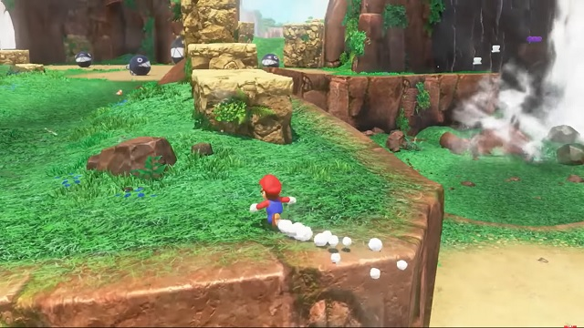
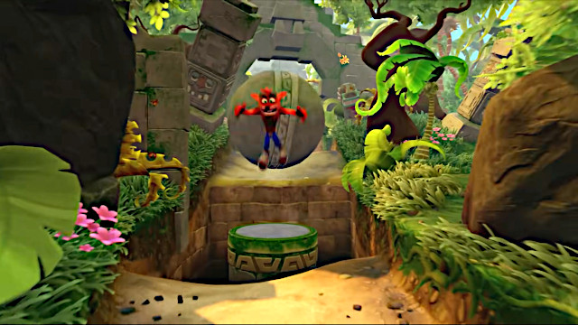
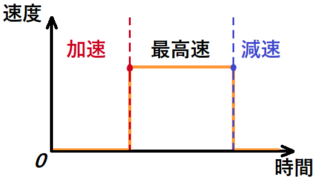
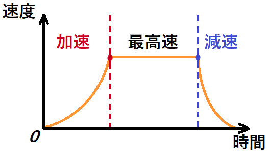
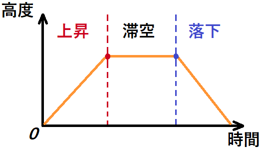
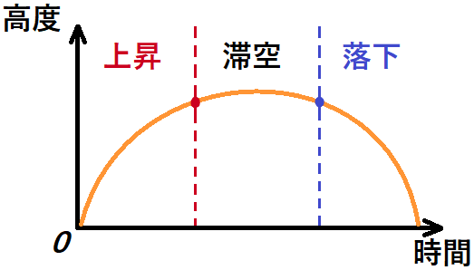
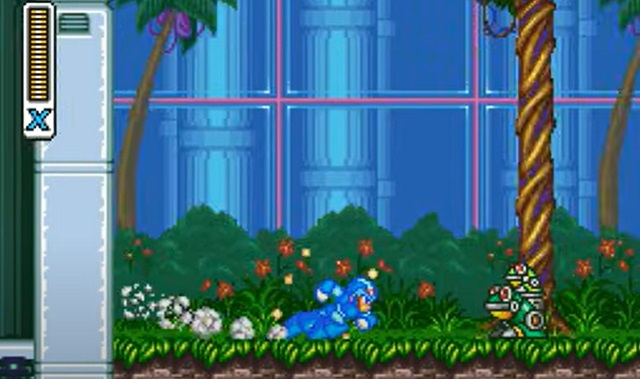
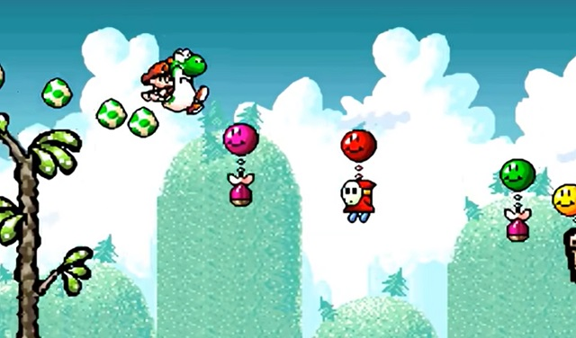
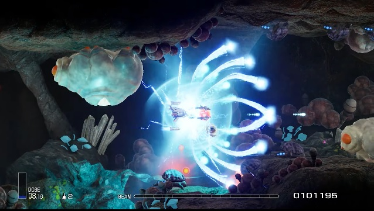
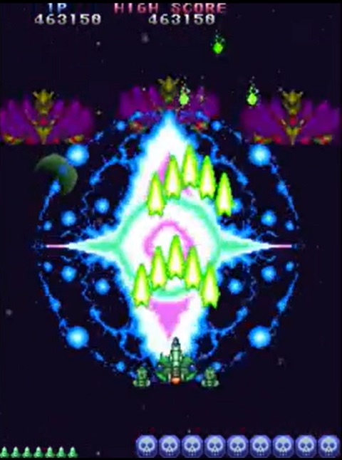

[ゲーム改善ガイド 第06回]

# ゲームの操作性を改善する

## 1. キャラクターの基本動作

アクションゲームやシューティングゲームのような「プレイヤーがキャラクターを操作して、地形や敵、敵の攻撃を避けて進んでいくゲーム」では、「キャラクターを気持ちよく動かせること」が重要です。

この要素は「操作性」と呼ばれています。本テキストでは、多くのゲームにおいてキャラクターの基本動作となっている「走る・歩く」と「ジャンプ」の2つに焦点を当てて、操作性を改善する方法を探ります。

&emsp; 
[スーパー マリオ オデッセイ(走る)/クラッシュ バンディクー(ジャンプ)]

## 2. 走る・歩く

&emsp; 
[デジタルな速度変化/アナログな速度変化]

スティックやキーを入力すると、キャラクターはその方向に移動します。みなさんが最初に学んだのは「移動・停止」の2値しか持たない、デジタル的な移動方法だと思います。

デジタル的な移動方法の利点は、操作が瞬間的にゲームに反映されることです。進みたいと思った瞬間に進める、止まりたいと思ったところで止まれる、という気持ちよさがあります。

しかし、現代の多くのゲームでは、現実世界と同じように「加速・移動・減速・停止」という4つの状態を持つように作られています。これは、加減速がアナログ的に変化する移動方法です。

また、現代のコントローラーの大半はアナログスティックを装備しているため、「スティックを倒した角度に応じて速度が変わる」というゲームも多いです。

アナログ的な移動方法の利点は、物体の質量を表現できることです。ゆっくりと加速してすぐに停止すると重く感じられ、素早く加速してなかなか停止しないと軽く感じられます。

さらに、状況によってさまざまな速度を使い分けるという楽しみが生まれます。物体の存在感の向上と速度の使い分けがあることで、「実際に存在するキャラクターを操作している」ような気持ちよさが得られます。

このように、「デジタル的な移動」と「アナログ的な移動」には一長一短があり、どちらに寄せるかはゲーム内容によって異なります。

出発点としては「加速と減速が0.2秒以内に終わるアナログ的な移動」をオススメします。「0.2秒」の加減速でもプレイヤーには物体の質量が伝わります。そして、ほぼ思い通りの操作が可能です。

>1. 「現在の速度」を表す変数を用意する。
>2. 毎フレーム、キャラクターに「現在の速度」を加算する。
>3. キーが入力されたら「現在の速度」を増やす。
>4. キーが離されたら「現在の速度」を減らす。

その後で、ゲーム内容に合わせて「加速にかかる時間」と「減速にかかる時間」を調整していくのがよいでしょう。

それから、特定の操作をすると移動速度が変化するゲームもあります。アクションゲームでよく使われるのは「ボタンを押している間だけ最高速度が上がる」ものです。

逆に「攻撃中だけ最高速度が下がる」という機能もあります。これは主に2Dシューティングで使われ、画面を埋め尽くすほどの敵の攻撃を、ドット単位で避ける繊細な操作を可能にします。

このような機能を付け加えて、さらに機能を生かせるステージを作ることで「キャラクターを思い通りに操作している」という感覚を高めることができます。

欠点としては、まず「ボタンが増えたぶん操作が難しくなる」という点が挙げられます。

また、PCのキーボードには「同時に認識できるキーの数」に制限があります。ゲームが求める操作の組み合わせによっては、同時押しが反応せず意図した操作できない場合があります。

この問題を回避するには、これらの機能を`Shift`キー、`Ctrl`キー、`Alt`キーなどの「特殊キー」に割り当てるとよいでしょう。

特殊キーは他のキーと同時押しすることが前提なので「同時に認識できるキーの数」の制限とは別に扱われるからです。

>**【まとめ】** 
>
>* 移動に「加速」と「減速」を追加すると、物体の重さを感じさせることができ、操作に納得感が生まれる。
>* ダッシュなどの操作をキーボードに割り当てるときは「特殊キー」に割り当てるとよい。「同時に認識できるキーの数」の制限を避けられる。

## 3. ジャンプ

&emsp; 
[デジタルな高度変化/アナログな高度変化]

多くのゲームには「人間基準では大きすぎる障害物や、到底飛び越せないような裂け目」があります。そこで、キャラクターにはそれらを乗り越えるための「能力」が与えられます。

大抵のアクションゲームでは、その能力は「ジャンプ」です。ジャンプは人間にとって自然な動作のひとつなので、理解しやすいからです。

そして、キャラクターのジャンプ力は「障害を乗り越えるのに十分な高さ」を持つように設定されます。

というのも、普通の人間並のジャンプ力で超えられるような障害ばかりでは、あまり楽しいゲームにはならないからです。

例えば、すべての障害がハードル走のハードルの高さまでしかない場合、「ジャンプで障害物を超えることが楽しい」というゲームにはならないでしょう。

ただし、地球と同じ重力で高いジャンプをさせると、ボールのようにふわりとした挙動になって現実感がなくなります。

そこで、多くのゲームでは重力を強くかけたり、重力の代わりに数式によってジャンプの速度を制御します。

例えば、初代スーパーマリオブラザーズのジャンプは、ボタンを押しているときよりボタンを離したあとのほうが重力が強くなります。これによって、ボタンを離すタイミングによってジャンプ力が変わる仕組みを実現しています。

また、格闘ゲームではキャラクターごとにジャンプ力と重力を変えることで、ジャンプに個性を与えています。これらは現実の物理とは異なりますが、ゲーム世界では「面白ければなんでもあり」です。

ジャンプに関しては、ジャンプしたあと「空中にいるときに可能な移動操作」についても考える必要があります。

>* 向いている方向を変えられる
>* 水平方向の移動速度を変えられる

「空中で向いている方向を変える」というのは現実には不自然な挙動ですが、「背後の敵を攻撃できる」という利点があります。射撃要素を含むゲームでは検討する価値があるでしょう。

移動速度を変えられるゲームでも、走る速度と同じ(ロックマンなど)なのか、走る速度より遅い(スーパーマリオなど)のか、といった違いがあります。

スーパーマリオは「踏みつける」ことが主要な攻撃手段なので、空中で位置を微調整できるほうが便利です。

ロックマンには踏みつけがなく、「敵の攻撃や地形を素早くかわして進む」ことが求められるため、空中で大きく移動できることが役立ちます。

>**【まとめ】** 
>
>* ジャンプを楽しいものにするには、ジャンプ力と速度をゲームに合うように調整する。
>* ジャンプ中に向きや位置を変えられるかどうかは、作りたいゲームによって異なる。

## 4. 特殊な移動方法/攻撃方法(ダッシュや壁登りなど)

大抵のアクションゲームには、ゲームを特徴づける「特殊な操作」があります。種類が多すぎるためすべてを網羅することはできませんが、いくつか挙げてみましょう。

>* 空中でもう一度ジャンプ(二段ジャンプ)
>* 高速ダッシュ
>* 壁を蹴ってジャンプ
>* 壁に張り付いて移動
>* 滑空
>* スライディング
>* 前転、横転、バク転
>* ロープで振り子のように移動

&emsp; 
[ロックマンXのダッシュ/ヨッシーアイラインドの踏ん張りジャンプ(滑空)]

これらは「走り」「ジャンプ」に次ぐ「第三の移動手段」となります。うまくプログラムできれば、技術力のアピール材料としても役立つでしょう。

攻撃要素が強いアクションゲームの場合、移動だけでなく攻撃に関する特殊操作があるとよいでしょう。

>* ダッシュ攻撃
>* 連続攻撃
>* 必殺技
>* キー入力方向よって攻撃の種類が変わる

攻撃操作はシューティングゲームでも重要な要素です。以下のような特殊操作が考えられます。

>* 溜め攻撃
>* 回数制限のある強力な攻撃
>* 攻撃方向の変更
>* 複数の武器の切り替え

&emsp; 
[R-TYPEの溜め攻撃/TATSUJINのボム攻撃]

どのような特殊操作を追加するにしても、「操作して気持ちの良いもの」になるまでパラメータを調整することが重要です。例えば、ジャンプと同じく「加速」「減速」があると操作感が良くなります。

また、エフェクトや効果音を追加して、「特殊操作が可能」とか「特殊操作を実行中」という状態が、プレイヤーに伝わるようにすることも大切です。

>**【まとめ】** 
>
>* ゲームを特徴づける「特殊な操作(機能)」があると、ゲームの遊び方が広がり、技術力のアピール材料になる。
>* ゲームのジャンル次第だが、「移動」だけでなく「攻撃」や「防御」の特殊操作の追加も考慮する。
>* エフェクトや効果音によって、「プレイヤーが可能な操作」や「操作の結果」がプレイヤーに伝わるようにする。
