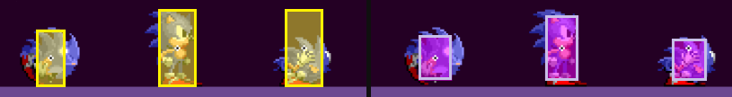

[ゲームデザイン改善ガイド 第04回]

# ゲームの操作性を改善する

## 1. キャラクターの基本動作

アクションゲームやシューティングゲームのような「プレイヤーがキャラクターを操作して、地形や敵、敵の攻撃を避けて進んでいくゲーム」では、「キャラクターを気持ちよく動かせること」が重要です。

この要素は「操作性」と呼ばれています。本テキストでは、多くのゲームにおいてキャラクターの基本動作となっている「走る・歩く」と「ジャンプ」の2つに焦点を当てて、操作性を改善する方法を探ります。

&emsp; 
[左=スーパー マリオ オデッセイ(走る)&emsp;右=クラッシュ バンディクー(ジャンプ)]

## 2. 走る・歩く

&emsp; 
[デジタルな速度変化/アナログな速度変化]

スティックやキーを入力すると、キャラクターはその方向に移動します。みなさんが最初に学んだのは「移動・停止」の2つの状態しか持たない、デジタル的な移動方法だと思います。

デジタル的な移動方法の利点は、操作が瞬間的にゲームに反映されることです。進みたいと思った瞬間に進める、止まりたいと思ったところで止まれる、という気持ちよさがあります。

しかし、現代の多くのゲームの移動処理は、「加速・移動・減速・急ブレーキ・停止」という5つの状態を持つように作られています。この方法では、現実世界と同じように、移動速度がアナログ的に変化します。

アナログ的に変化させる利点は、物体の質量を表現できることです。ゆっくりと加速してすぐに停止すると重く感じられ、素早く加速してなかなか停止しないと軽く感じられます。

また、現代のコントローラーの大半はアナログスティックを装備しているため、「スティックを倒した角度に応じて速度が変わる」というゲームも多いです。

プレイヤーが移動速度を制御できると、状況によってさまざまな速度を使い分けるという遊び方が作れます。物体の存在感の向上と、速度の使い分けを組み合わせることで、「実際に存在するキャラクターを操作している」ような気持ちよさが得られます。

このように、「デジタル的な移動」と「アナログ的な移動」には一長一短があり、どちらに寄せるかはゲーム内容によって異なります。

出発点としては「加速と減速が0.2秒以内に終わるアナログ的な移動」をオススメします。わずか「0.2秒」の加減速でも、プレイヤーには物体の質量が伝わります。そして、素早い加減速は、デジタルに近い、思い通りに操作できるという感覚を生み出します。

アナログ的な移動は、キャラクターに次のような機能を付け足すことで実現できます。

>1. 「現在の速度」を表す変数を用意する。
>2. 毎フレーム、キャラクターに「現在の速度」を加算する。
>3. キーが入力された方向に応じて「現在の速度」を増やす。
>    * ただし、入力されたキーの向きが移動方向と逆向きの場合、「現在の速度」を「急ブレーキ」の速度で減らす。
>4. キーが入力されていなければ「現在の速度」を減らす。
>    * 減らす量が「現在の速度」より大きい場合、「現在の速度」を0にする。

これらを作成した後で、ゲーム内容に合わせて「加速度」と「減速度」を調整していくのがよいでしょう。

移動速度の設定例:

| タイトル                       | 最高速度 | 加速度     | 減速度     | 急ブレーキ |
|:-----------------------------:|---------:|----------:|----------:|----------:|
| スーパーマリオブラザーズ(歩き)   |  8.79m/s | 12.52m/s² | 17.14m/s² | 34.28m/s² |
| スーパーマリオブラザーズ(走り)   | 14.41m/s | 18.79m/s² | 17.14m/s² | 34.28m/s² |
| ソニック・ザ・ヘッジホック(通常) |  9.00m/s |  4.22m/s² |  4.22m/s² | 45.00m/s² |
| ソニック・ザ・ヘッジホック(回転) | 24.00m/s | (角度による) | 2.11m/s² | 11.25m/s² |
| セレステ                       |  8.65m/s | 96.11m/s² | 192.22m/s² | (なし) |

### 移動速度を変化させる

ゲームによっては、特定の操作をすると移動速度が変化します。アクションゲームでよく使われるのは「ボタンを押している間だけ最高速度が上がる」ものです。

逆に「攻撃中だけ最高速度が下がる」という機能もあります。これは主に2Dシューティングで使われ、画面を埋め尽くすほどの敵の攻撃をドット単位で避けるための、精密な操作を可能にします。

このような機能を付け加えたうえで、その機能を生かせるステージを作ることで「キャラクターを思い通りに操作している」という感覚を高めることができます。

ただし、操作するボタンが増えたぶん操作が難しくなります。ステージの設計は、追加の操作をしなくても、ある程度遊べるようにするべきでしょう。

また、一般的なノートPC用のキーボードは「同時に認識できるキーの数」に制限があります。ゲームが求める操作の組み合わせ次第ですが、同時押しが反応せず意図した操作できない場合があります。

この問題を回避するには、これらの機能を`Shift`キー、`Ctrl`キー、`Alt`キーなどの「特殊キー」に割り当てるとよいでしょう。特殊キーは他のキーと同時押しすることが前提なので「同時に認識できるキーの数」の制限とは別に扱われるからです。

>**【Tips】**
>
>* 移動に「加速」と「減速」を追加すると、物体の重さを感じさせることができ、操作に納得感が生まれる。
>* ダッシュなどの操作をキーボードに割り当てるときは「特殊キー」に割り当てるとよい。「同時に認識できるキーの数」の制限を避けられる。

## 3. ジャンプ

&emsp; 
[デジタルな高度変化/アナログな高度変化]

多くのゲームには「人間基準では大きすぎる障害物や、到底飛び越せないような裂け目」があります。そこで、キャラクターにはそれらを乗り越えるための「能力」が与えられます。

大抵のアクションゲームでは、その能力は「ジャンプ」です。ジャンプは人間にとって自然な動作のひとつなので、理解しやすいからです。そして、キャラクターのジャンプ力は「障害を乗り越えるのに十分な高さ」を持つように設定されます。

というのも、普通の人間並のジャンプ力で超えられるような障害ばかりでは、あまり楽しいゲームにはならないからです。

例えば、すべての障害がハードル走のハードルの高さまでしかない場合、「ジャンプで障害物を超えることが楽しい」というゲームにはならないでしょう。

ただし、地球と同じ重力で高いジャンプをさせると、ボールのようにふわりとした挙動になって現実感がなくなります。そこで、多くのゲームでは重力を強くしたり、重力の代わりに数式によってジャンプの速度を制御します。

例えば、初代スーパーマリオブラザーズのジャンプは、ボタンを押しているときよりボタンを離したあとのほうが重力が強くなります。ボタンを早く離せばすぐに重力が強くなり、低いジャンプになります。逆に、遅く離せば高いジャンプになります。

初代ロックマンにも似た仕組みがあります。上昇速度が6.61m/sより大きいときにジャンプボタンを離すと、即座に上昇速度が3.3m/sに設定されます。

また、格闘ゲームではキャラクターごとにジャンプ力と重力を変えて、個性を演出しています。身軽なキャラクターのジャンプは高くて速く、鈍重なキャラクターのジャンプは遅くて低く、特殊な力を持つキャラクターのジャンプは紙風船のようにゆるやか、という具合です。

これらのジャンプ挙動は現実世界ではありえませんが、ゲーム世界では「面白ければなんでもあり」です。

ジャンプ速度の設定例:

| タイトル                     | 初速     | 通常重力   | 落下時重力  | 最大落下速度 |
|:----------------------------|---------:|----------:|-----------:|------------:|
| スーパーマリオブラザーズ(通常) | 22.50m/s | 42.19m/s² | 147.66m/s² | (無制限) |
| スーパーマリオブラザーズ(走り) | 28.12m/s | 52.73m/s² | 189.84m/s² | (無制限) |
| ロックマン1, 2               | 16.07m/s | 49.50m/s² |  49.50m/s² | 39.6m/s |
| セレステ                     | 10.09m/s | 86.50m/s² | 86.50m/s² | 15.38m/s 23.07m/s |

補足: マリオは速度によってジャンプ挙動が変化。セレステは下入力で最大落下速度が増加。

### ジャンプ中にできること

ジャンプに関しては、ジャンプしたあと「空中にいるときに可能な移動操作」についても考える必要があります。例えば、次のような操作が考えられます。

* 向いている方向を変えられる
* 水平方向の移動速度を変えられる

「空中で向いている方向を変える」というのは現実には不自然な挙動ですが、「背後の敵を攻撃できる」という利点があります。射撃要素を含むゲームでは検討する価値があるでしょう。

移動速度を変えられるゲームでも、走る速度と同じ(ロックマンなど)なのか、走る速度より遅い(スーパーマリオなど)のか、といった違いがあります。

スーパーマリオは「踏みつける」ことが主要な攻撃手段なので、空中で位置を微調整できるほうが便利です。

ロックマンには踏みつけがなく、「敵の攻撃や地形を素早くかわして進む」ことが求められるため、空中で大きく移動できることが役立ちます。

>**【Tips】**
>
>* ジャンプを楽しいものにするには、ジャンプ力と速度をゲームに合わせて調整する。
>* ジャンプ中に向きや位置を変えられるかどうかは、作りたいゲームによって異なる。

### 寛容なジャンプ

崖のぎりぎりでジャンプボタンを押したつもりが落ちてしまった、なんてことはありがちです。一部のゲームでは「崖から落ちた直後はジャンプできる」ようにして、このような悲劇を回避しています。

また、ソニック・ザ・ヘッジホッグでは、地形に対する判定を、それ以外の衝突判定よりわずかに大きく設定しています。この違いによって、プレイヤーは崖のぎりぎりに立っているつもりでも、実際には多少余裕があるという状態を作り出しています。

 
[左=地形に対する判定の大きさ&emsp;右=敵などに対する判定の大きさ]

他にも、着地してすぐジャンプボタンを押したつもりが、まだ着地前だった、ということもありがちです。これも「着地直前にジャンプボタンが押されたら、着地後に即座にジャンプする」という仕組みで回避できます。

ゲームを気持ちよく遊んでもらうためには、このような小さな工夫も重要です。

## 4. 特殊な移動方法/攻撃方法(ダッシュや壁登りなど)

大抵のアクションゲームには、ゲームを特徴づける「特殊な操作」があります。種類が多すぎるためすべてを網羅することはできませんが、いくつか挙げてみましょう。

>* 空中でもう一度ジャンプ(二段ジャンプ)
>* 高速ダッシュ
>* 壁を蹴ってジャンプ
>* 壁に張り付いて移動
>* 滑空
>* スライディング
>* 前転、横転、バク転
>* ロープで振り子のように移動
>* 武器の反動で後ろ向きに移動

&emsp; 
[左=ロックマンXのダッシュ&emsp;右=ヨッシーアイラインドの踏ん張りジャンプ(滑空)]

これらは「走り」「ジャンプ」に次ぐ「第三の移動手段」となります。うまくプログラムできれば、技術力のアピール材料としても役立つでしょう。

攻撃要素が強いアクションゲームの場合、移動だけでなく攻撃に関する特殊操作があるとよいでしょう。

>* ダッシュ攻撃
>* 連続攻撃
>* 必殺技
>* キー入力方向よって攻撃の種類が変わる

攻撃操作はシューティングゲームでも重要な要素です。以下のような特殊操作が考えられます。

>* 溜め攻撃
>* 回数制限のある強力な攻撃
>* 攻撃方向の変更
>* 複数の武器の切り替え

&emsp; 
[左=R-TYPEの溜め攻撃&emsp;右=TATSUJINのボム攻撃]

どのような特殊操作を追加するにしても、「操作して気持ちの良いもの」になるまでパラメータを調整することが重要です。例えば、ジャンプと同じく「加速」「減速」があると操作感が良くなります。

また、エフェクトや効果音を追加して、「特殊操作が可能」とか「特殊操作を実行中」という状態が、プレイヤーに伝わるようにすることも大切です。

>**【Tips】**
>
>* ゲームを特徴づける「特殊な操作(機能)」があると、ゲームの遊び方が広がり、技術力のアピール材料になる。
>* ゲームのジャンル次第だが、「移動」だけでなく「攻撃」や「防御」の特殊操作の追加も考慮する。
>* エフェクトや効果音によって、「プレイヤーが可能な操作」や「操作の結果」がプレイヤーに伝わるようにする。

<pre class="tnmai_assignment">
<strong>【課題】</strong>
プランナー:

2Dジャンプアクションゲームを想定し、移動とジャンプの仕様書を作成しなさい。可能であれば「特殊な操作」の仕様も追加すること。UnityやUEでカプセルを動かす仕組みを作ってみるとイメージしやすいでしょう。

ゲーム仕様:
- 重視する操作性: 精密な操作(狭い足場がある), スピード感(狭い足場はない)
- 主体となる操作: ジャンプ, 射撃, 近接攻撃
- カメラとキャラクターの距離: 近い(キャラを大きく見せる、ステージの狭い範囲を表示), 遠い(キャラを小さく見せる、ステージを広く表示)
- 時間の単位: 秒, 1/60フレーム
- 距離の単位: メートル, ドット

移動の仕様:
- 最高速度
- 加速度
- 減速度
- 急ブレーキ

ジャンプの仕様:
- 初速
- 重力
- 入力によって速度や重力が変化する場合、その仕組みを書く

プログラマ:

これまでに作成したゲーム(どれでもよい)のキャラクターに「アナログ的な移動」を実装しなさい。
</pre>

>**【参考動画】** 
>Celesteの操作が心地よい理由 - Game Maker's Toolkit 
><https://www.youtube.com/watch?v=yorTG9at90g>
>
>プラットフォーマー・ツールキット - Game Maker's Toolkit 
><https://www.youtube.com/watch?v=zWi0jgghGcI>
>
>速度の単位 - 桜井政博のゲームを作るには 
><https://www.youtube.com/watch?v=DDcEGLyaVMU>
>
>ジャンプの仕組み - 桜井政博のゲームを作るには 
><https://www.youtube.com/watch?v=zxOBCjqP8-Y>
>
>ガケぎわのふるまい - 桜井政博のゲームを作るには 
><https://www.youtube.com/watch?v=R80GEUbK2Fo>
