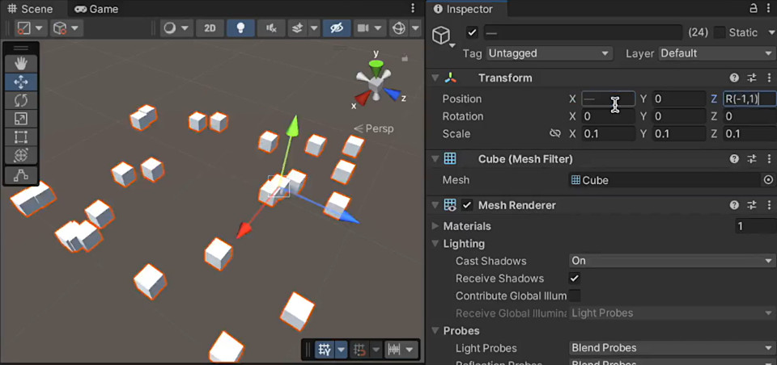
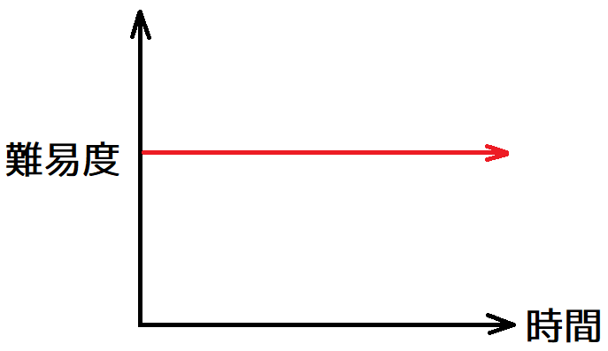
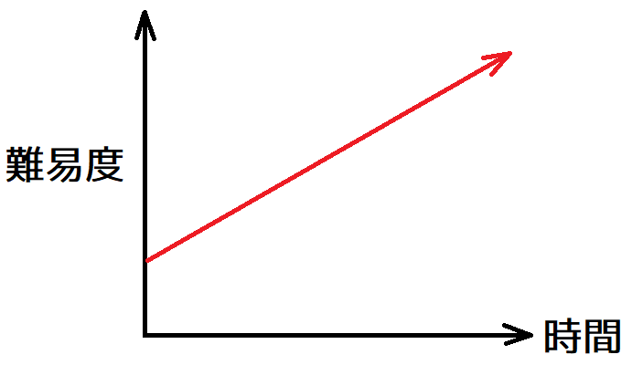
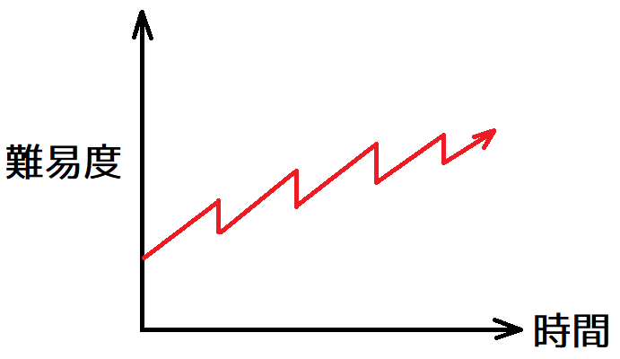
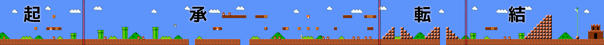

[ゲーム改善ガイド 第07回]

# ステージの仕掛けの増やしかた

## 1. メカニズム・テーブル

多くの3Dゲームは、ゲーム空間にさまざまな地形やオブジェクトを配置することで、プレイヤーが楽しく探検できるステージを作り上げます。

地形には「普通のジャンプでは超えらないような大きな川や谷」「岩を伝って登れそうな崖」「崩れる床」「滑る床」「底なし沼」「溶岩」のようなものが考えられます。

オブジェクトは「プレイヤーを邪魔する敵」「何かが起こるボタン」「移動する床」「揺れるロープ」「動かせる岩」などが考えられます。

さらに、プレイヤーが操作するキャラクターは「ダッシュ」「二段ジャンプ」「滑空」のような、特別なアクションが可能かもしれません。

これらの要素はすべて、ゲームの「メカニズム(機構)」です。面白いステージを作るには、これらのメカニズムをステージ中にやみくもにばらまくのではなく、目的を持って組み合わせなくてはなりません。

組み合わせについて考えるときに便利なのが「メカニズム・テーブル」です。メカニズムテーブルは2次元の表で、縦と横の見出し行に「ゲームに登場するすべてのメカニズム」が並びます。

>|               | 　移動する床　 | 　　ボタン　　 | 　動かせる岩　 | 二段ジャンプ | 　　弓兵　　 |
>|:-------------:|:-------------:|:-------------:|:-------------:|:-----------:|:-----------:|
>| 　移動する床　 |               |               |               |             |             |
>| 　　ボタン　　 | -             |               |               |             |             |
>| 　動かせる岩　 | -             | -             |               |             |             |
>|  二段ジャンプ　| -             | -             | -             |             |             |
>| 　　弓兵　　　 | -             | -             | -             | -           |             |

表の各マスは、「縦の見出し」と「横の見出し」のメカニズムを組み合わせることを意味します。実際に利用するのは表の右上(または左下)の半分だけです。線対称の内容が重複するマスは使いません(`-`のマス)。

なお、これはアクションゲームを想定したメカニズムテーブルです。敵との戦闘が中心となるゲームでは、さまざまな種類の敵が並ぶことになるでしょう。

例えば「移動する床(移動床)」と「ボタン」のペアについて考えてみましょう。簡単なアイデアとして「ボタンを押すと移動床が動き出し、谷や崖を越えられるようになる」などが思いつくと思います。

また、「ボタンを押すたびに移動と停止が切り替わる移動床」のようなものも考えられます。うまく位置を調整して足場を作るような、簡単なパズル要素として使えそうです。

ステージの主題を「2つのメカニズムの組み合わせ」に絞り込むと、プレイヤーが覚えておくべき要素が少なくなり、ゲームの目標設定に迷う確率を減らせます。

基本的には「主題」だけで設計しますた、必要に応じて他のメカニズムを追加して「主題を補強」することもできます。例えば「敵を誘導して遠くのボタンを押させ、その隙に自分は移動床に飛び乗る」などです。

とはいえ、ひとつのペアだけでは、ステージを埋めるのに十分な数のアイデアが思いつかないことが多いです。そのときは、別のマスを選んでまたアイデアを考えていきます。

これを、ステージを埋めるのに十分な数のアイデアが集まるまで繰り返します。「十分な数」の目安は、地形の克服がメインのゲームでは10個以上、敵との戦闘がメインのゲームでは5個程度です。

こうして十分な数のアイデアが集まったら、それらを主題ごとにグループにして、難易度順に並べなおします。これで、ステージの基本形はできあがりです。

>【メカニズムテーブルの使い方】
>
>1. チェックマークのない適当なマスを選ぶ。
>2. ステージに見出し行の2つのメカニズムを適当に配置して動作実験をする。 
>   面白い相乗効果が見つかるまで、配置や数を変えて実験を繰り返す。
>3. 面白い相乗効果が見つかったら、スクリーンショットやメモなどで、アイデアを記録しておく。
>4. ステージを埋めるのに十分な数のアイデアが見つかるまで、2～3を繰り返す。
>5. 新しいアイデアが出なくなってきたら、マス目にチェックマークを書く。 
>   そして、1に戻って新しい組み合わせを試す。
>6. 組み合わせによっては、面白い相乗効果がなかなか見つからない場合がある。 
>   そんなときは、1に戻って別の組み合わせを試す。

## 2. メカニズムのアイデアの出し方

アイデアが天から降ってくるまで待っているようでは、いつまで経ってもアイデアは浮かびません。この段階では、とにかく手を動かすことが重要です。

ここで重要なのは、素早くリトライしやすい環境で実験することです。そのため、この実験を実際のプログラムで行う必要はありません。

紙の上に書いても構いませんし、以前作成した2Dゲームのプログラムで試すこともできます。UnityやUnreal Engineを利用するのも良い方法です。

そして、メカニズムをステージ中にランダムにばらまいてみて、面白い構造になっている部分がないか探してみましょう。面白い構造を見つけたら、その構造をより際立たせるように、地形やメカニズムの配置を調整します。

別の方法では、地形をランダムに生成して、その地形をクリアできるような必要最小限のメカニクスを追加していきます。この方法では、特徴的な地形を見つけて活用することを目指します。

例えばUnityの場合、インスペクターの座標欄に`R(0,10)`と入力すると、`0.0`～`10.0`の範囲でランダムな座標が設定されます。

 
Unity公式Xから: https://x.com/unity_japan/status/1442760999153537030

「解くのが簡単なアイデア」と同じ配置を利用して、「解くのが少し難しい配置」を考えたり、逆に「解くのが難しいアイデア」から要素を減らして、「より簡単に解ける配置」を作り出す、という方法もあります。

「販売されているゲームからアイデアを借りる」のも良い考えです。そのまま使えるアイデアもあれば、調整が必要なアイデアもあるでしょうが、アイデアの出発点として使いやすいです。

また、少なくともひとつは「プレイヤーにメカニズムを学んでもらうための仕組み」を入れるべきです。そうしないと、プレイヤーは試行錯誤でメカニズムの仕組みを学ばなくてはならないからです。

いくつかアイデアが見つかったあとは、それらの中から適当なアイデアを2つを選び、その中間的なアイデアを考えることもできます。これには、<ruby>後述<rt>こうじゅつ</rt></ruby>する「難易度曲線」を作りやすくする効果もあります。

>**【アイデアが不発でも気にしないこと】** 
>こうして多くのアイデアを考えても、実際にゲームの一連の流れに組み込んでみると、他のアイデアと噛み合わなかったり難易度が合わずに使えない、ということも多いです。 
>これは当たり前に起こることなので、がっかりする必要はありません。逆に「ゲームに使えないアイデアを見抜いた！なんて偉いんだ！」と考えましょう。

## 3. 難易度曲線

アイデアを難易度順に並べただけでも、それなりに楽しめるステージが出来上がるかもしれません。とはいえ、いつもそんなにうまく事が運ぶとは限りません。

当初に思いついたアイデアだけでは難易度の変化が急激すぎたり、逆にアイデア間にあまり難易度の差がなくて単調に感じる、という状況も多いでしょう。

そのような状況からより遊びやすいステージへと改良していくには、「難易度曲線(なんいどきょくせん)」を考慮した設計を行う必要があります。

難易度曲線は「ゲームの進行に応じて、難易度がどのように変化するかを表すグラフ」です。

   
[左=難易度は一定 中=徐々に難しくなる 右=徐々に難しくなるが定期的に難易度が下がる]

左の図のようにいつまでもゲームの難易度が変わらないと、プレイヤーはゲームに慣れて飽きてしまいます。

中央の図のように時間経過によってゲームが徐々に難しくなると、プレイヤーはやりがいを感じます。しかし、休む間もなく難易度が上がり続けることで、すぐに疲れてしまいます。

右の図のように、時間経過によって徐々に難しくなるものの、ときどき難易度が大きく下がるようにすると、プレイヤーには一息入れる時間ができます。すると、より長くゲームを楽しめるようになります。

2024年現在では、右のノコギリ状の難易度曲線が「あらゆるゲームにおいて最初に選ぶべき難易度曲線」だと考えられています。

この形状では、ある主題が続くあいだ、難易度は徐々に上昇します。そして主題が切り替わるタイミングで大きく難易度が下がります。この難易度の低下は、新しい主題について理解する機会を与えるためです。

難易度の単調な増加を避ける理由はいくつかあります。ひとつは、単調な増加を達成するには複数の主題を混ぜて難易度別に並べる必要があることです。

この場合、プレイヤーはひとつの主題に集中できないため、必要以上に難易度が高いと感じるか、難易度の変化がなさすぎて退屈してしまうかのいずれかになりがちです。

こうなることを避けるために主題ごとにグループ化すると、今度は新しい主題の最低の難易度を、前の主題の最高の難易度以上に設定せざるを得ません。この場合、新しい主題を学習する難易度が高くなりすぎます。

ノコギリ状の難易度曲線が優れているのは、これらの問題を避けることができるからです。 
また、難易度の変化に緩急があることで、ゲームプレイが単調になりにくいという利点もあります。

>プレイヤーにゲームを遊び続けてもらうには、ゲームの難易度を徐々に上昇させて、時々大きく下げるように設定する。

## 4. 起承転結のレベルデザイン

 
[起=ルール説明 承=様々な地形の紹介 転=階段の紹介 結=高い階段からのジャンプ]

先に説明したように、ステージには主題となるメカニズムがあります。それは「新しい能力」であったり、「新しい地形」であったり、「新しい敵」であったりします。

いずれにしても、プレイヤーには「メカニズムを理解し、それを利用しながらステージを進めていく」ことが求められます。この要求を自然に伝える方法のひとつは、メカニズムのアイデアを「起承転結(きしょうてんけつ)」の4つの部分に分けることです。

>1. 第1段階(起): 起点となる概念を紹介する。
>2. 第2段階(承): 考えをもう少し発展させる。
>3. 第3段階(転): 展開に変化をつける。
>4. 第4段階(結): 結論を出す。

ステージの最初の「起(き)」の部分では、メカニズムはプレイヤーのミスを許容する環境で始まります。例えば、移動床の下に地面があり、乗りそこねてもすぐに開始点に戻って再挑戦できるような設計が挙げられます。

「起」をクリアすると、メカニズムを応用する「承(しょう)」に進みます。この部分では、例えば移動床から落ちると死んだりダメージを受けるようになったり、複数の移動床を乗り継いで行くなど、少し高度な技術が要求される設計がなされます。

続く「転(てん)」の部分では、メカニズムに変化が加わります。移動床の上で敵と戦ったり、トリッキーな動きをする移動床が登場したりして、プレイヤーに工夫を求めます。

最後の「結(けつ)」の部分はメカニズムの総集編です。「承」と「転」を突破し、メカニズムを十分に理解したプレイヤーを、最後のアイデア(複数の移動床を乗り継いでボス敵と戦うなど)が待ち受けます。

このように、ステージを通して徐々にメカニズムを学習させるように設計すると、プレイヤーは必要以上に悩むことなくスムーズにゲームを楽しめるようになります。

そして、「徐々に難易度を上げていく」という点で、難易度曲線との相性も抜群です。さらにこの手法は、ひとつのステージだけでなくゲーム全体の流れにも応用できます。

>ステージ全体をいくつかの部分に分割し、それぞれの段階の目的を明確にすることで、自然なステージの流れを作ることができる。

>**【三幕八場のレベルデザイン】** 
>映画や小説では「起承転結」のかわりに、「三幕構成(さんまくこうせい)」と呼ばれる作劇術がよく使われています。これは物語を「発端(ほったん)」「葛藤（かっとう)」「解決(かいけつ)」の三部に分ける考え方です。三幕はさらに八個の「場(ば)」に分けられます。
>
>一幕: 発端 
>&emsp;一場: 状況説明 
>&emsp;二場: 最初の目的の設定 
>二幕: 葛藤 
>&emsp;三場: 小さな障害の解決 
>&emsp;四場: 中くらいの障害の解決 
>&emsp;五場: 真の目的の設定 
>&emsp;六場: 大きな障害の解決 
>三幕: 解決 
>&emsp;七場: 真の問題の解決 
>&emsp;八場: 結末 
>
>この三幕八場構成を「起承転結」当てはめると、一～二場が「起」、三～四場が「承」、五～六場が「転」、七～八場が「結」に相当すると考えられます。
>こちらのほうが8つのアイデアを当てはめていくだけなので、「起承転結」より使いやすいかもしれません。
