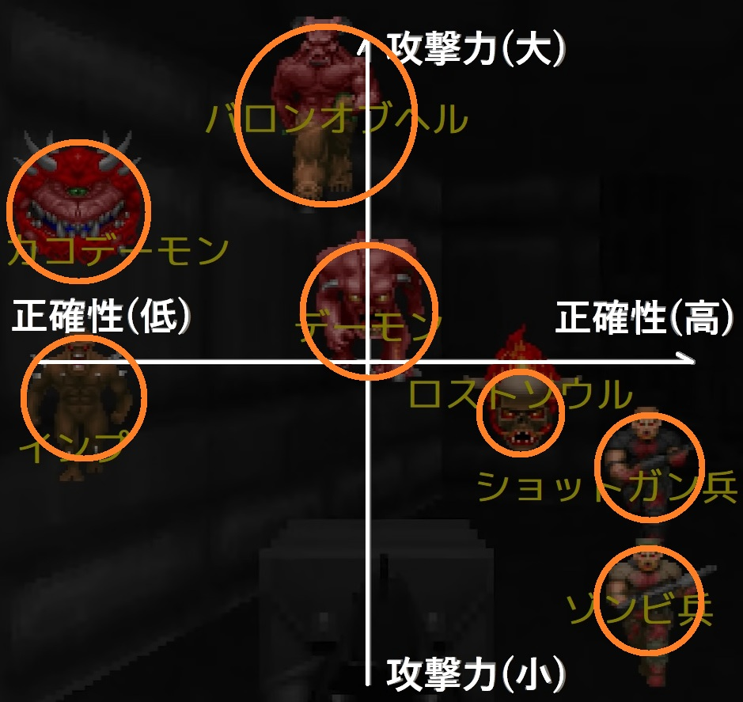

[ゲームデザイン改善ガイド 第08回]

# 敵の種類の増やしかた

## 1. 敵の性質を平面グラフで表す

アクションゲームの制作者にとって、「敵キャラクター」はゲームの進行に強弱をつけるための強力なツールです。多くのゲームで何種類もの敵が登場します。

敵の種類に多様性があると、プレイヤーは敵の組み合わせに応じて適切な移動ルートや攻撃手段を考えなくてはならなくなります。これは、ゲームに戦略性を追加する方法のひとつです。

この方法の問題は、「多様な種類の敵を作らなくてはならない」ことです。特に、就職作品の制作では時間が限られているため、制作できる敵の種類には限界があります。

制作できる敵の種類が制限される場合、「性質が重複する敵を作らない」ことが重要になります。「見ためは違うけれど、どの敵も体当たりしてくるだけ」とか「色は違うけれど、みんな遠くから同じような弾を撃ってくるだけ」というのは、敵の種類が多いとは言えないからです。

ここでいう敵の「性質」とは、「プレイヤーに戦略的な判断を下させる要素」だと考えてください。それで、「性質が重複する敵を作らない」方法ですが、これは「２つの異なる性質を縦横に組み合わせたグラフ」を使うとよいでしょう。

例として、DOOM(ドゥーム)というFPSゲームに登場する敵をグラフに表してみます。

 
DOOMから学ぶべきこと: www.youtube.com/watch?v=yuOObGjCA7Q

このグラフでは、「攻撃の正確性」を横軸、「攻撃力」を縦軸として配置しています。

「ゾンビ兵」と「ショットガン兵」は攻撃力は弱いものの、命中率の高い高速弾を撃つ敵です。それに対して「インプ」や「カコデーモン」の弾は高い攻撃力を持ちますが、低速なので簡単に避けられます。

「ロストソウル」と「デーモン」は突進攻撃をしてきます。「ロストソウル」の突進は高速ですが直線的で、攻撃力はそこそこです。「デーモン」の突進は攻撃力が高く、プレイヤーを追いかけてくるため避けにくいです。しかし速度は「ロストソウル」より遅いので、近づかれる前に撃退するチャンスがあります。

「バロン・オブ・ヘル(地獄の男爵)」は高い攻撃力を持つ中程度の速度の弾を発射し、さらに近接攻撃もできる強敵です。

重要な点は、これらの敵が「グラフ上で互いに離れた位置に置かれている」ことです。つまり、「敵によって性質が大きく異なる」のです。

 
互いに離れていて重なっていない

結果として、プレイヤーの取る戦略も、敵ごとに大きく異なるものになります。 
例えば、突進攻撃が単調な「ロストソウル」に対して、プレイヤーは「突進を避けてから攻撃する」という判断を下すでしょう。

高速弾を撃つ「ゾンビ兵」に対しては、プレイヤーは「障害物を盾に遠距離攻撃をする」か「障害物を伝って近接攻撃をする」のどちらかを選ぶと考えられます。

このように、それぞれの敵への対策は難しくありません。しかし、この2種類の敵が同時に出現すると、プレイヤーは2つの行動を適切に切り替えながら戦わなくてはならなくなります。

「ロストソウル」の突進攻撃を避けるために障害物から出ると、「ゾンビ兵」から攻撃を受けてしまいます。かといって、「ゾンビ兵」を恐れて障害物の裏でじっとしていては、「ロストソウル」の突進攻撃を避けられません。プレイヤーは状況判断を迫られます。

プレイヤーの戦略は、敵の数によっても変化します。「ゾンビ兵」の数が多くて「ロストソウル」の数が少ない場合、できるだけ障害物の裏にとどまって、先に「ロストソウル」を倒してしまうほうがよいでしょう。

逆に「ロストソウル」のほうが数が多い場合、大きく動き回りながら「ゾンビ兵」を全滅させ、それからゆっくり「ロストソウル」を始末するほうがいいかもしれません。

このように、性質がまったく異なる敵を作ると、それらを組み合わせるだけでさまざまな状況を作り出せます。

新しい種類の敵を作る場合は、このグラフの空いている領域を埋めるような性質を選びます。そうすることで性質が異なることが保証され、敵の多様性はさらに増加します。

例えば、右上に「攻撃力が高く、正確性も高い」敵を作ることができます。このような性質を持つ敵は、ゲーム中でも最強の敵になる可能性が高いでしょう。

また、軸に与える「性質」を変えると、別の視点から性質の異なる敵を作れます。実際に、続編のDOOM IIでは「敵を生み出す敵」や「死んだ敵を復活させる敵」など「再生能力」を軸にしたバリエーションが追加されています。

>**【Tips】**
>
>* 性質が大きく異なる敵を作ることで、少ない種類でもさまざまな状況を作り出せる。
>* 性質が大きく異なる敵を作るには、2つの性質を軸にしたグラフを用意し、グラフの離れた位置を占めるような敵を考えるとよい。

## 2. 敵の見た目を特徴的なものにする

 
[左=基本 中左=横拡大 中右=縦縮小 右=基本+武具]

十分に性質の異なる敵が作れたとしても、それだけで遊んでいて楽しいゲームになるとは限りません。「敵によって性質が異なる」ことを、プレイヤーが認識できなくてはなりません。 
このために必要なのは「敵の性質ごとに見た目が異なる」ようにすることです。

3Dゲームでは遠近法が影響するため、「見た目が異なる」ことは特に重要です。少し離れた高台にるキャラクターが遠距離型なのか近距離型なのか、中ボスなのか雑魚なのかということが判別できなければ、戦略的な判断など下せません。

そこで、敵ごとに目立つ特徴を持たせて、プレイヤーに敵の種類を伝えるようにします。 
例えば、次のような方法があります。

* 色を変える
* 大きさを変える
* 特徴的な武器や装飾を付ける

敵の見た目を特徴づける最も簡単な方法は、キャラクターの色を変えることです。赤い敵と青い敵は、比較的遠くからでも明らかに違う種類だと認識できます。

次に簡単なのは、キャラクターの大きさを変えることです。これは通常、ゲームオブジェクトのスケールパラメータによって調整します。十分に見分けられるようにするには、かなり極端に大きさを変える必要がある点に注意してください。

XYZのすべての方向をスケールするだけでなく、縦方向にだけ拡大すればのっぽなキャラクターになりますし、逆に前後左右にだけ拡大すればちょっと太ったキャラクターを作り出せます。

もうひとつの方法は、敵が装備している武器などを大きめに描画することです。これによって、敵がどんな武器を持っているのかが明確になり、遠くから敵の種類を判別する助けになります。

>**【Tips】**
>
>キャラクターの種類によって、色や拡大率、装備品を変えることで、遠くからでもキャラクターを見分けられるようになる。

## 3. 地形と敵を組み合わせる

&emsp; 
[敵の数は同じで地形が異なる]

プレイヤーの判断は、敵の種類だけでなく「地形や障害物との組み合わせ」によっても変化します。

例えば、ある空間に「10体以上の遠距離攻撃型の雑魚敵」がいるとします。それが身を隠せるものがない広い空間の場合、雑魚敵といえどもプレイヤーは慎重になり、もしかすると諦めて他のルートを探しに行くかもしれません。

しかし、障害物が多く攻撃を防ぎやすい空間ならば、障害物をうまく利用して切り抜けることを考えるでしょう。

別パターンとして、この空間にいるのが10体の雑魚ではなく、1体の「強力な突進攻撃や近距離攻撃だけをしてくる敵」だった場合、プレイヤーはどうするでしょう。

&emsp; 
[敵の種類が異なれば、地形に対する判断も異なる]

先ほどとは逆に、障害物が多いほどプレイヤーの移動が制限されます。そのような空間での戦闘は避けたいと考えるでしょう。

そして、なにもない広い空間であれば、常に十分な距離を取って戦えるので、好戦的な判断を下す可能性が高くなります。

別の例として、細長い通路を考えます。この通路に遠距離攻撃手段を持つ敵が居座っている場合、プレイヤーは可能ならばその通路を避けようとするでしょう。

しかし、通路にいる敵が近距離攻撃しかしてこない場合、プレイヤーは遠距離攻撃を使って簡単に敵を排除できます。この通路の通行をためらうプレイヤーは少ないでしょう。

このように、敵の組み合わせだけでなく、地形や障害物と敵を組み合わせることでも、戦闘のバリエーションを増やすことができます。

>**【Tips】**
>
>* 敵と地形を組み合わせることで、さまざまな状況を生み出し、プレイヤーに異なる戦略を考えさせることができる。
>* 敵の種類が少なくても、地形や障害物を工夫することでゲームを面白くできる。

<pre class="tnmai_assignment">
<strong>【課題】</strong>
プランナー:

次の手順で、性質の大きく異なる敵の仕様書を作成しなさい。
  1. 好きなゲームを選ぶ。
  2. そのゲームに登場する敵について、全く異なる性質を2つ決める。
  3. 2つの性質をX軸とY軸に割り当てた平面グラフを作る。
  4. ゲームに登場する敵を何体かグラフに割り当てる。
  5. 表の空いている座標を選ぶ。
  6. その座標における2つの性質の強弱を考慮して、ゲームに追加できそうな敵の能力や、
     行動の仕様を決める。
  7. 5～6を3回から5回繰り返し、仕様書にまとめる。

プログラマ:

作成しているゲームに新しい敵を追加したい場合は、プランナーと同じ手順で敵の仕様を決定し、
その敵を実装しなさい。
多彩な敵を必要としない場合は、以前に作成したゲームの敵を平面グラフで分析しなさい。
</pre>

>**【参考動画】** 
>Doomから学ぶべきこと - Game Maker's Toolkit 
><https://www.youtube.com/watch?v=yuOObGjCA7Q>
>
>パラメータでキャラ立ちを - 桜井政博のゲームを作るには 
><https://www.youtube.com/watch?v=4RSMUmraGt4>
>
>キャラを立てるデザイン - 桜井政博のゲームを作るには 
><https://www.youtube.com/watch?v=AfaUAO5lEs0>
>
>長所を伸ばし､短所も伸ばす - 桜井政博のゲームを作るには 
><https://www.youtube.com/watch?v=IUy0aSubhjg>
