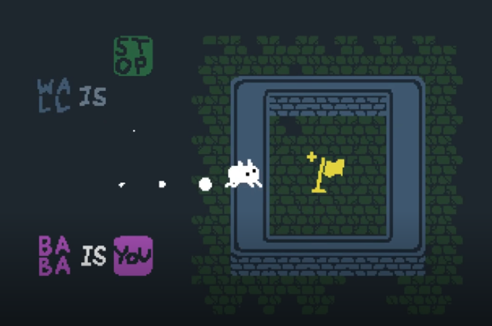
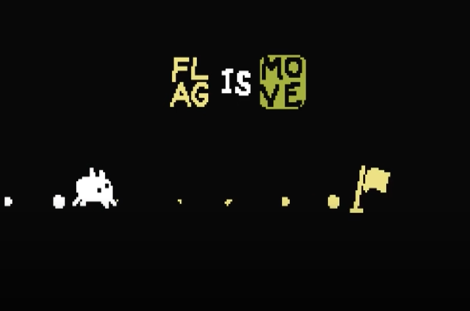
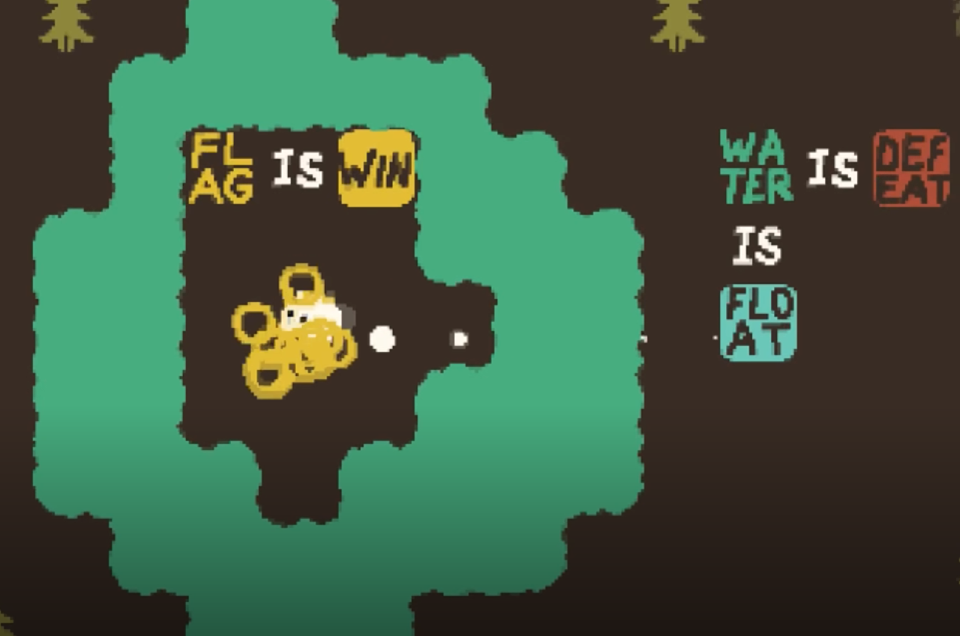
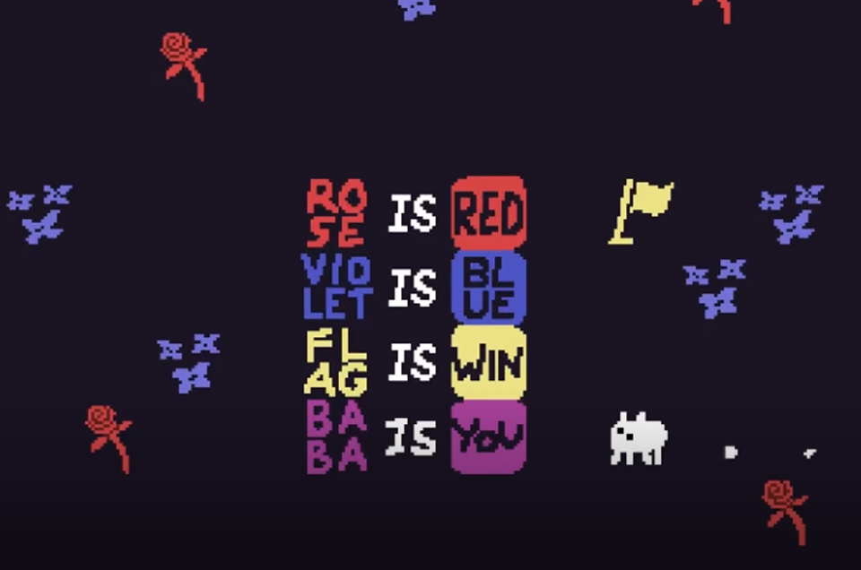
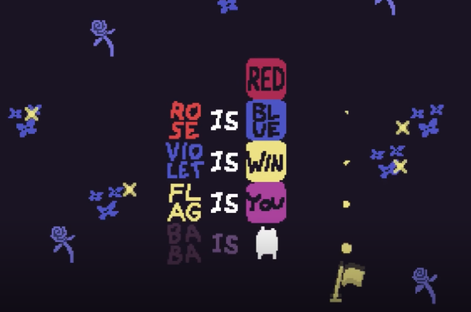
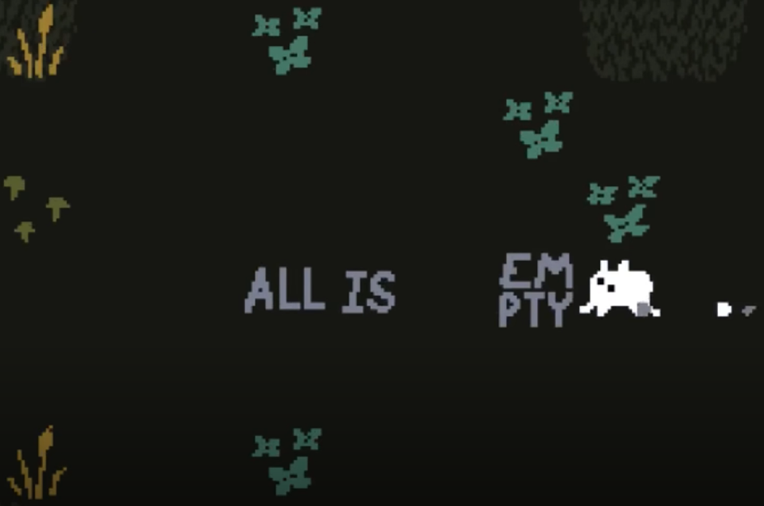
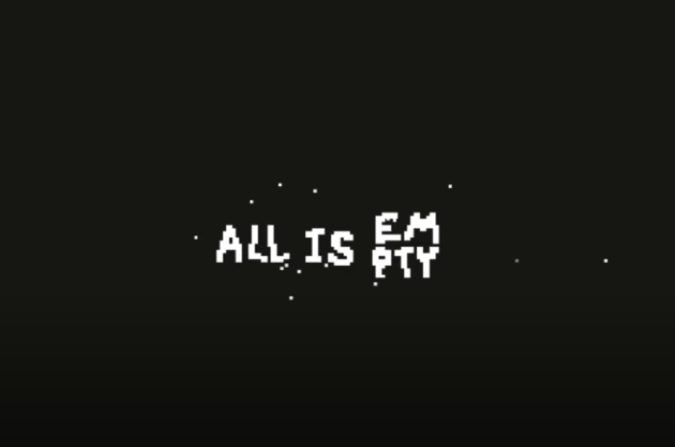

[ゲームデザイン改善ガイド 第09回]

# プレイ動画の目的

## 1. プレイ動画が必要な理由

&emsp; 
左=動画のあるストアページ(steam) 右=動画のないストアページ(itch.io)

就職作品を提出するときは「プレイ動画」を添えるべきです。例えば、みなさんがゲームを探しにオンラインストアを開き、見たことも聞いたこともないけれど面白そうなゲームを見つけたとします。

そのゲームのストアページを開いてみると、動画はひとつもなく、わずかなスクリーンショットと体験版のダウンロードリンクがあるだけでした。

さて、あなたは数十MB～数GBもある体験版をダウンロードし、インストールしてまで無名のゲームを試したいと思うでしょうか？　それとも、興味を失って別の面白そうなゲーム探しに戻るでしょうか？

このような状況は、何十、あるいは何百の就職作品を審査しなければならない採用担当者にとっても同様です。採用基準に達しているかどうかも分からない作品のために、いちいち時間をかけてプレイする理由はないのです。

そもそも「就職作品のプレイ動画がない」という状況は、「作品制作に手一杯で、短いプレイ動画を作る余裕すらなかった」、「プレイ動画を作るように助言されたが、その助言を聞かなかった」という可能性が高いわけです。

あなたが採用担当者だったとして、どちらの理由であれ、そのような候補者を採用したいとは考えないのではないでしょうか。

プログラマーは自分で制作した作品のプレイ動画を用意すれば十分です。プランナーの場合は、自分で制作した作品だけでなく、制作に関わった作品のプレイ動画もあるとよいでしょう。

>**【Tips】**
>
>* プレイ動画を含む応募書類は「採用担当者に書類削除ボタンを押す口実を与えるもの」だと考えること。
>* 自分の応募書類を生き延びさせたいなら、あなたの応募書類は、少なくとも形の上では完璧でなくてはならない。
>* 「プレイ動画が添えられていない応募書類」は完璧とはいえない。

## 2. 優れたプレイ動画の要素

 
さまざまなゲームの特徴的なシーン 
左=The Witness 中=Crypt of NecroDancer 右=Undertale

就職作品において、プレイ動画は「就職作品の優れた紹介映像」になっている必要があります。ゲームプレイをだらだらと流すだけとか、適当なカットをでたらめに寄せ集めただけでは、良い紹介映像とはいえません。

また、ゲームに実装された機能を羅列するものでもありません。ましてやゲームのストーリーを紹介するものではありません。採用担当者が求めているのは「この作品についてもっと詳しく知りたい」と思わせるような情報です。

例えば、次のような情報が考えられます。

* プログラミング技術
  * プレイヤーの行動にかしこく反応する敵のAI
  * 十分な速度で動作する物理演算オブジェクト
  * 高度なシェーダーエフェクト
* 興味深い仕様
  * 意外なジャンルの組み合わせ
  * 遊んでみたくなる多彩なアクション
  * ゲームの要素を活かしたレベルデザインや敵の仕様
* ゲームの細かい部分にまで気を配っていること
  * キャラクターの様々な動作に付けられた適切なアニメーションやエフェクト
  * 木々や草が風に揺れる表現

また、単に情報を入れるだけではなく、 
&emsp;**プレイ動画を見た人が、そのゲームについてどう感じるか** 
まで考える必要があります。

プログラミング技術を見せたいからといって、プログラムの詳細を長々と説明しても、見せられた人は退屈なだけです。それ以前に、採用担当者が技術に明るいとは限りません。ですから、実際に動いているところを見せるべきです。

「ゲーム内容についての説明」も必要です。どんなゲームか分からないのに使われている技術だけ説明されても、ゲーム内での活用のされかたを想像できないからです。

ただし、動画の時間は短いため、これらの情報を「シンプルに要点だけを伝えるようにまとめる」ことが求められます。「短い時間で、ゲームの基本的な遊び方、面白さ、楽しさを過不足なく紹介する動画」を目指す必要があるわけです。

>**【Tips】**
>
>* プレイ動画は「就職作品の紹介映像」。
>* 採用担当者に向けて作品内容を紹介し、作品についてもっと詳しく知りたいと思わせるような「プログラミング技術」や「ゲームの仕様」、「細部への気配り」などを、シンプルかつ必要十分な内容としてまとめることが求められる。

## 3. プレイ動画の流れ

プレイ動画で紹介したい要素はいくつかあるものですが、それらの要素の順序と時間配分は注意深く決めるべきです。これにはゲームの予告編で使われる手法が応用できます。

よくできたゲーム予告編では、特徴的な映像で始まり、その後徐々にペースを早くしながらゲーム内容を紹介します。そして、最後に購入を促す文言(「Steamで好評発売中！」みたいなやつ)で終わります。この流れで参考になるのは、以下の「強度上昇グラフ」です。

 
出典: Trailer Made by Derek Lieu in GDC 2019

### 導入

&emsp;&emsp; 
[パズルゲーム BABA IS YOU の導入では、文章を変えて操作キャラクターを変更している]

強度上昇グラフは5つの部分に分かれています。最初に来るのは「導入」です。

「導入」はいわゆる「つかみ」で、その目的は「なんか面白そうだぞ」と思わせることです。 
この部分では「ゲームを特徴づける、一番見せたい要素や機能」を手早く紹介します。 
間違っても、タイトル画面やストーリーを入れてはいけません。

また、就職作品のプレイ動画は予告映像とは違うので、要素を隠すのは無意味どころかマイナスです。一番見せたいAIやエフェクトがボス戦にあるのなら、そのボス戦を見せてください。

### 内容説明

&emsp; 
[左=WALLはSTOPしない 右=FLAGはMOVEする]

次に「内容説明」に進みます。ここでは、ゲームジャンル、プレイヤーの目的、基本的なプレイ方法などを説明します。タイトル画面やストーリーを入れても良いですが、手短に済ませます。

説明は文章に頼らず、映像を見るだけで内容が伝わるように工夫します。せっかく動画にしているのに、文章を読み終わるまで待つ時間を入れると、動画の時間がもったいないからです。

例えばゲームに「射撃」「ダッシュ」「横転回避」「壁走り」などがあるとします。これらの動作が分かる映像になっていれば、操作方法の説明は不要です(アクション名や操作ボタンを表示するのはありです)。細かい操作説明は実際のゲームで行うべきです。

これには、大乱闘スマッシュブラザーズの「キャラクター参戦動画」が参考になるでしょう。参戦動画に操作説明は一切出ませんが、どんな行動ができるのかは十分に伝わるように作られています。

何人かに映像を見てもらって、一人でも内容説明を理解できない部分があれば見せ方を改善するか、映像の追加を検討するとよいでしょう。

### 強度上昇

&emsp; 
[LAVA(溶岩)はMELTする(溶けて消える)]

&emsp;
 
[左=BABAはMOREする(増える) 右=WATERはFLOATする(浮くので下をくぐれる)]

&emsp;
 
[バラが青に、紫花がゴールに、フラッグがYOUに変わる]

基本的なゲーム内容を伝えたら、次は「強度を上昇」させます。ここでは、実際のゲームで体験できるさまざまな場面をダイジェストで紹介します。「一番見せたい要素以外の要素」は、ここで紹介します。

アクションを駆使してすばやくステージをクリアしたり、敵のAIが状況によって変化する様子を見せたり、ボスの多彩な攻撃やエフェクトを見せるなど、ゲームの興味深い部分を余さず紹介してください。

強度上昇では、できるだけさまざまな映像を見せることが重要です。これは、「内容が薄そうだしもう見なくていいか」と思われることを避けるためです。なにかが足りないと感じたら、足りない要素をゲームに追加することも考慮します。

### 山場

&emsp;
 
[ALLがEMPTYになる(全てが消える)]

最後の「山場」は「強度上昇」の締めくくりで、ゲームの一番派手な映像を配置します。 
強度上昇の映像がうまく作れていれば、最後の部分が自動的に山場になるはずです。

「導入」でチラ見せした「一番見せたい要素」を、じっくり確認できるように少し長めに見せたりしても良いでしょう。

改めての確認ですが、予告編ではないのですから要素の出し惜しみはしないこと。

### おまけ(オプション要素)

「おまけ」では劇的なゲームオーバーや、プレイ動画の撮影中に起こった面白い映像などを最後に入れます。ちょっとした遊び要素なので、作成しなくても問題ありません。

とはいえ、プレイ動画も作品の一部です。見ていて楽しめる映像になっているほうが、採用担当者の印象も良くなるはずです。

>**【Tips】**
>
>* 動画の構成は「導入」「内容説明」「強度上昇」「山場」の順にするとよい。
>* 「導入」には「一番見せたい要素」を持ってくること。
>* 「山場」には「一番派手な部分」を持ってくること。

## 4. 気をつけること

最後に、プレイ動画に求められる要素をリストします。

* **見栄えが良いこと** 
他の作品のプレイ動画と比べられたときに、それらに対して見劣りするようでは審査を通過できません。
* **ゲームの重要な要素が十分伝わること** 
ゲームの面白い部分を紹介していても、その面白さが伝わらないようでは評価してもらえません。プログラマーの就職作品の場合は、技術的なアピールポイントが伝わるように構成しなくてはなりません。
* **上手なプレイ動画を撮影すること** 
これは単純に「下手くそなプレイは見栄えがしないから」です。ゲームオーバー画面の説明は不要ですが、死んで復活することがゲーム性になっている場合などは例外です。
* **BGMや効果音が適切なタイミングで入っていること** 
音声はゲームを盛り上げる重要な要素です。ゲームのBGMと効果音を消さないこと。また、編集で動画を切り貼りする場合は、音量のフェードイン・フェードアウトを必ず入れてください。

みなさんがこれらの指針をうまく活用して、「採用担当者が実際にゲームを遊んでみたくなるようなプレイ動画」を作成することを願っています。

→→ 
&emsp;→→ 
[サブノーティカ https://store.steampowered.com/app/264710]

<pre class="tnmai_assignment">
<strong>【課題】</strong>
プランナー・プログラマ共通:

これまでに作成したプレイ動画の以下の点について、「達成できている」または「達成できていない」のどちらかを判定しなさい。
  ・「見栄えが良い」動画になっている
  ・「ゲームで最も重要な要素」を過不足なく紹介できている
  ・「興味を引くような構成」になっている
  ・「場面に合った適切な音声」を再生できている
  ・「不必要な要素」が入っていない
各項目について、「達成できている」、「達成できていない」のいずれであっても、そのように考える理由を箇条書きで書き出しなさい。可能なら、書き出した内容にしたがってプレイ動画を修正しなさい。
</pre>

>**【参考動画】** 
>独立系ゲームの予告編の作り方 - Game Maker's Toolkit 
><https://www.youtube.com/watch?v=4CSYA9R70R8>
>
>ゲーム画面を見せてくれ! - 桜井政博のゲームを作るには 
><https://www.youtube.com/watch?v=eo0OCw3lgJo>
>
>とにかくゲームさせてみて - 桜井政博のゲームを作るには 
><https://www.youtube.com/watch?v=1toox93mCzs>
>
>最初にクライマックスを - 桜井政博のゲームを作るには 
><https://www.youtube.com/watch?v=7wbsGgawZVk>
>
>プレゼンはスピード - 桜井政博のゲームを作るには 
><https://www.youtube.com/watch?v=jVnBk3p7T-Q>
