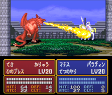

[ゲーム改善ガイド 第10回]

# 乱数を活用する

## 1. どんなときに乱数を使うのか？

2024年現在、ほとんどすべてのゲームで不規則な結果をもたらす「乱数」が利用されています。

例えば、「マインクラフト」や「ローグライク」では、多様なマップを生成するために乱数が使われています。また、「シャドウ・オブ・モルドール」の隊長オークたちは、能力だけでなく外見や性格までも乱数で決定されます。

「マリオカート」シリーズのアイテムも乱数によって決定されますが、順位によって得られるアイテムの確率を変えることで、逆転のチャンスを作り出しています。

<p align="center">
&emsp;<br>
&emsp;<br>
左上=マインクラフト&emsp;&emsp;&emsp;&emsp;右上=ローグ&emsp;&emsp;&emsp;<br>
左下=シャドウ オブ モルドール&emsp;右下=マリオカート8デラックス
</p>

ロールプレイングゲームでは、敵からアイテムを入手できるかどうかが乱数によって決定されます。また、アイテムの種類も乱数で決められることが多いです。一般に良いアイテムほど入手確率が低いため、手に入れたときの喜びが大きくなります。

<p align="center">
<br>
2048分の1の確率で入手できる「悟りの書」<br>
https://www.youtube.com/watch?v=2Z7t82c2_MU
</p>

攻撃が命中するかどうか、命中したとしてダメージ量はどのくらいか、といったことも乱数で決まることが多いです。これは、プレイヤーの行動計画に不確実性を持ち込みます。その結果、計画をなんとか成功させたときの喜びが大きくなります。

敵の行動を乱数で決めるゲームも多いです。行動パターンと実行確率を適切に組み合わせると初歩的なAIになり、プレイヤーに「敵が状況に応じて賢く反応している」と感じさせることができます。

これらの例から分かるように、ゲームで乱数が使われる理由は「ゲーム展開に多様性を与える道具として適している」からです。

また、プログラミングの視点からだと、乱数には「計算が非常に高速」で「メモリをほとんど消費しない」という利点があります。

複雑なAIを持つキャラクターは行動の計算に時間がかかるため、大量に配置するのは難しいです。しかし、乱数による擬似的なAIに置き換えれば、かなりの数の敵を配置できます。

登場する個々の敵キャラクターに所持品リストを用意するには大量のメモリが必要となります。しかし、所持率という統計データに置き換えれば、わずかなメモリでほぼ同様の効果が得られます。

<div style="page-break-after: always"></div>

## 2. 入力乱数の良いところ悪いところ

<p align="center">
&emsp;<br>
左=ハースストーンのデッキ&emsp;右=ウィザードリィのキャラクター作成
</p>

ゲームで利用される乱数は、以下の2つに分けられます。

1. プレイヤーの操作前に情報を与える「入力乱数」
2. プレイヤーの操作結果を反映する「出力乱数」

まずは「入力乱数」から見ていきましょう。「入力乱数」には次のようなものが挙げられます。

>* マインクラフトのマップ生成。
>* デッキ構築ゲーム開始時のカードシャッフル。
>* ロールプレイングゲームのキャラクターの初期パラメータ。
>* マリオカートのアイテムボックス。

これらに共通するのは、まず乱数によってパラメータが決定され、「プレイヤーは乱数の結果を参考にして意思決定を行う」という点です。プレイヤーへ情報を入力するので「入力乱数」というわけです。

入力乱数の良いところは、「毎回違った選択肢を選ぶ機会を与えられる」ことです。これには、プレイするたびに同じ選択をするだけのゲームになることを防ぐ、という効果があります。

例えば、マインクラフトが毎回同じ地形で始まるとしたら、新しくゲームをやりなおすモチベーションはあまり起きないでしょう。

また、マリオカートのアイテムボックスから得られるアイテムの順番が決まっていたとしたら、強力なアイテムが出ることを期待して最後まで諦めずにプレイすることが難しくなり、盛り上がりに欠けるゲーム展開になるでしょう。

入力乱数の悪いところは、ゲームの難易度設計に直接影響することです。例えばマインクラフトでは、プレイ開始地点が不利なバイオームになった場合、序盤のゲーム展開は過酷なものになり、最悪の場合、ゲームの継続はほぼ不可能になってしまいます。

別の例として、デッキ構築ゲームを見てみましょう。このタイプのゲームでは、カードの引きが良いとあっけなくゲームに勝利できてしまうことがあります。逆に引きが悪い場合は、何もできずにあっさり負けてしまうかもしれません。

２回目以降のプレイであれば、理不尽な難易度も「歯ごたえのあるゲーム展開」につながるため意味があります。しかし、少なくとも最初のプレイでは、あまり理不尽にならないように乱数を制御する必要があるでしょう。

<div style="page-break-after: always"></div>

## 3. 出力乱数の良いところ悪いところ

<p align="center">
&emsp;<br>
<br>
左=ファイヤーエムブレム(2%の必殺率で死亡)&emsp;右=Apexのルートボックス<br>
下=スプラトゥーン3の弾ブレ
</p>

「出力乱数」には次のようなものが挙げられます。

>* シミュレーションゲームやロールプレイングゲームの行動の成否。
>* ターン制ゲームの敵の行動。
>* ルートボックス(ガチャ)。
>* シューティングゲームの弾道、ダメージ。

これらに共通するのは「プレイヤーが行動を決定したあと、その結果が乱数で決められる」という点です。結果を出力するときに使われるので「出力乱数」というわけです。

出力乱数の良いところは、「行動結果の不確実性を再現できる」ことです。つまり、「同じ選択をしても、結果まで同じになるとは限らない」という、いかにも現実にありそうな現象を再現できるのです。

例えば、シミュレーションゲームやロールプレイングゲームにおいて、どんな状況でも攻撃が常に命中するのは現実的とはいえません。また、プレイヤーの同じ行動に対して、敵が時々違う反応をすると、ゲームのリプレイ性が向上します。

出力乱数の悪いところは、「プレイヤーの立てた計画を台無しにしがち」なところです。大事な場面で「命中率99%」と表示された攻撃がはずれてしまったら、プレイヤーは危機的な状況に陥るかもしれません。

シューティングゲームなどで弾道が極端にずれてヘッドショットが決まらず、敵が警戒モードになって施設への潜入が難しくなってしまうこともありえます。

とはいえ、これらの最悪な状況が起きることを「悪いところ」だからと切り捨てるのはもったいないです。これらの「不測の事態」は、ゲームのリプレイ性を向上させる効果があるからです。

ただし、「不測の事態が起きうる」ことをプレイヤーに伝えておくことは重要です。不測の事態が起きうると知ったうえで行動し、ひどい目にあのと、何も知らずに突然ひどい目にあうのでは、印象がまったく異なります。

「攻撃の命中率」や「弾道のぶれる範囲」を表示することで、プレイヤーはどの程度不確実なのかを考慮に入れて行動を選択できます。

また、いちかばちかの選択が成功した場合の喜びは、出力乱数ならではの醍醐味です。

上手に付き合えば、「乱数」は非常に便利な道具になります。ゲーム展開に多様性を作り出し、プレイヤーにさまざまな喜びや失望を体験させてくれるでしょう。

<div style="page-break-after: always"></div>

## 4. 乱数生成プログラム

<p align="center">
<br>
</p>

乱数というと「毎回異なる無秩序な値」が返されると考えがちです。このような乱数は「真の乱数」と呼ばれます。しかし、多くの場合、コンピューターが扱うのは「擬似乱数(ぎじらんすう)」という「乱数のように見える計算式」です。

計算式なので、最後の生成された乱数から次に生成される乱数は予測できます。そのため、同じ乱数から始めれば、毎回おなじ乱数列が得られます。

予測可能なのに乱数として機能するのは、「ユーザーに実際の乱数値を見せることはない」からです。一般的な疑似乱数は32ビットの値を生成しますが、ゲームで必要なのはせいぜい1000くらいの大きさです。

実際に使うのは、例えば「`100`で割ったあまり」などでしょう。この場合、例えば`50`という値は実際には「数百万ある末尾が`50`になる値のどれか」ということになります。こうなると、もはやプレイヤーには予測できません。

そういうわけで、適切に利用するかぎり「擬似乱数」は十分に「真の乱数」の代わりになります。

疑似乱数を生成する代表的な方法を、古いものから順に示します。

* 線形合同法(せんけいごうどうほう)
* メルセンヌ・ツイスター
* XorShift(エックスオア・シフト)/Xoshiro(エックス・オシロ)
* PCG(ピーシージー)

線形合同法はC言語の`rand`関数で使われています。メルセンヌ・ツイスターはC++言語の`mt19937`乱数クラスで使われています。2024年現在では、最後発の`PCG`の採用率が徐々に高まっています。

本テキストでは、最も簡単に実装できる「線形合同法」と、その発展型である`PCG`を解説します。

<div style="page-break-after: always"></div>

### 線形合同法

線形合同法は以下の式で表されます。`a`, `c`, `m`は任意の定数です。

>`次の乱数 = (a * 直前の乱数 + c) % m`

この式から良質な疑似乱数を生成するには、`a`, `c`, `m`に適切な値を設定しなくてはなりません。例えば、Visual StudioのC言語ライブラリでは

`a=214013`<br>
`c=2531011`<br>
`m=2^31`

が使われています。この数値を使った式は次のようになります。

>`次の乱数 = (214013 * 直前の乱数 + 2531011) % 2^31`

```c++
static uint32_t state = 12345678; // 内部状態
static const uint32_t a = 214013;
static const uint32_t c = 2531011;

uint32_t random()
{
  state = a * state + c;
  return state;
}

void init_random(uint32_t seed) { state = seed; }
```

なお、線形合同法には2つの欠点があることが知られています。

>1. 下位ビットがあまりランダムにならない(周期が短い)。
>2. 上位ビットがなかなか変化しない(ランダム性が低い)。

例えば`1`について、良質な乱数を生成するには定数`a`と`c`に奇数を指定する必要がありますが、そうすると「偶数と奇数が常に交互に現れる」ようになります。

計算式が単純なため、線形合同法では「下位のビットほど同じパターンが繰り返されやすい」のです。幸い、この問題に対処するの簡単です。単に下位ビットを無視すれば良いのです。

上位ビットはその逆で、パターン自体はかなり長いのですが、かわりに「ビットがなかなか変化しない」のです。そのため、「一度巨大な数値になったら、しばらく巨大な数値が続く」ことになります。対処法は、上位ビットを無視することです。

実際に、Visual Studioの`rand`関数では「内部状態を右に16ビットシフトして、16～30ビット目だけを返す」ようになっています。上位、下位ビットを無視することで、問題を回避しているわけです。

しかし、「内部状態をそのまま返す」という実装も多いです。このような実装では、プログラマが上位、下位ビットの問題に対処しなくてはなりません。

実装が「上位、下位ビット問題」に対処しているかどうかは、実装のドキュメントに書いてあることが多いです。例えばVisual Studioの場合、戻り値の範囲が`0`～`32767`だと明記されています。

Linuxでは、「Linux C Library版は完全にランダムだが、古い`rand`や実装によっては下位ビットが上位ビットほどランダムではない」と書かれています。

>線形合同法による乱数は、上位、下位ビットの問題はあるものの、非常に高速であり、ほとんどのゲームにおいては十分に優秀です。

<div style="page-break-after: always"></div>

### PCG

続いて、PCGを簡単に説明します。PCGは`Permuted Congruential Generator`(パーミュート・コングルエンシャル・ジェネレータ、「置換合同生成器」という意味)の短縮形です。

PCGは線形合同法をベースに`Xorshift`の機能を取り込み、さらに戻り値には下位ビットを除去してからビットの前後を入れ替えた値を利用します。これにより、線形合同法の欠点を解消しています。

PCGの実装を以下に示します。

```c++
static uint64_t state = 0x4d595df4d0f33173; // 内部状態
static const uint64_t a = 6364136223846793005u;
static const uint64_t c = 1442695040888963407u;

uint32_t random()
{
  uint64_t x = state;
  const uint32_t count = (uint32_t)(x >> 59);
  state = a * x + c; // 線形合同法
  x ^= x >> 18;	     // Xorshift
  const uint32_t xx = (uint32_t)(x >> 27); // 戻り値から下位ビットを除去
  return xx >> count | xx << (-count & 31); // 戻り値の前後を入れ替え
}

void init_random(uint64_t seed) { state = seed; }
```

>式`-count`は通常使われない技法なので注意が必要です。C++規格によると、符号なし整数`i`に対して単項`-`演算子を使った結果は「`i`の2の補数表現になる」と定められています。<br>
>例えば`i`が8ビット符号なし整数だとすると、`i = 3`のとき、`-i = 2^8 - 3 = 253`になります。

PCGは、既存の乱数の研究成果を取り込みつつ、より不規則な結果を返すように設計されています。線形合同法より多少計算が複雑ではあるものの、2024年のCPUにとっては簡単すぎるくらいです。

さらに、線形合同法の欠点だった「上位、下位ビットの問題」も解消されています。必要なメモリもわずか64bitだけです。数百万のパーティクルを初期化したい、のように、精度よりも速度が重要な場合を除いて、乱数にはPCGを使うとよいでしょう。

>2024年現在、乱数には`rand`関数ではなく、PCG法を使う関数を自作すると良いでしょう。
