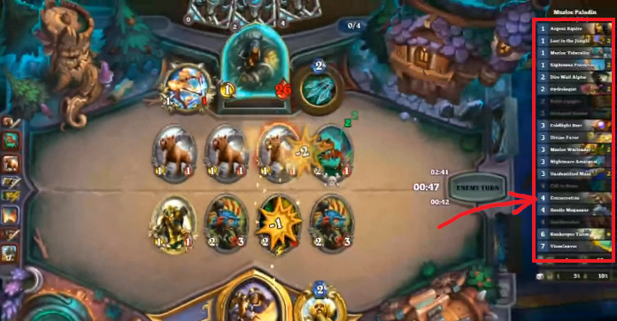

[ゲームデザイン改善ガイド 第10回]

# 乱数を活用する

## 1. どんなときに乱数を使うのか？

2025年現在、ほとんどすべてのゲームで不規則な結果をもたらす「乱数」が利用されています。

例えば、「マインクラフト」や「ローグライク」では、多様なマップを生成するために乱数が使われています。「マリオカート」シリーズのアイテムも乱数によって決定されますが、順位に応じてアイテムの出現率を変えることで、逆転のチャンスを作り出しています。

<p align="center">
&emsp;&emsp;<br>
[左=マインクラフト&emsp;中=ローグ&emsp;右=マリオカート8デラックス]
</p>

また、アクションRPGの「シャドウ・オブ・モルドール」に登場する隊長オークたちは、能力だけでなく外見や性格までも乱数で決定されます。

<p align="center">
<br>
[シャドウ オブ モルドール]
</p>

<div style="page-break-after: always"></div>

ロールプレイングゲームでは、敵からアイテムを入手できるかどうかが乱数によって決定されます。また、アイテムの種類も乱数で決められることが多いです。一般に良いアイテムほど入手確率が低いため、手に入れたときの喜びが大きくなります。

<p align="center">
<br>
[2048分の1の確率で入手できる「悟りの書」]<br>
アカイライから悟りの書をゲットする - www.youtube.com/watch?v=2Z7t82c2_MU
</p>

攻撃が命中するかどうか、命中したとしてダメージ量はどのくらいか、といったことも乱数で決まることが多いです。これは、プレイヤーの行動計画に不確実性を持ち込みます。その結果、計画をなんとか成功させたときの喜びが大きくなります。

敵の行動を乱数で決めるゲームも多いです。行動パターンと実行確率を適切に組み合わせると初歩的なAIになり、プレイヤーに「敵が状況に応じて賢く反応している」と感じさせることができます。

これらの例から分かるように、ゲームで乱数が使われる理由は「ゲーム展開に多様性を与える道具として適している」からです。

また、プログラミングの視点からだと、乱数には「計算が非常に高速」で「メモリをほとんど消費しない」という利点があります。

複雑なAIを持つキャラクターは行動の計算に時間がかかるため、大量に配置するのは難しいです。しかし、乱数による擬似的なAIに置き換えれば、かなりの数の敵を配置できます。

RPGに登場する個々の敵キャラクターにアイテムリストを用意すると大量のメモリが必要となります。しかし、所持率という統計データに置き換えれば、わずかなメモリでほぼ同様の効果が得られます。

>**【Tips】**
>
>* ゲームに統計的な性質を持つ要素を追加するには、乱数がもたらす不規則な性質が役に立つ。
>* 適切に設計された乱数を使うと、少ない労力で多彩な展開を作り出せる。

<div style="page-break-after: always"></div>

## 2. 入力乱数の良いところ悪いところ

<p align="center">
&emsp;<br>
[左=ハースストーンのデッキ&emsp;右=ウィザードリィのキャラクター作成]
</p>

ゲームで利用される乱数は、以下の2つに分けられます。

1. プレイヤーの操作前に情報を与える「入力乱数」
2. プレイヤーの操作結果を反映する「出力乱数」

まずは「入力乱数」から見ていきましょう。「入力乱数」には次のようなものが挙げられます。

>* マインクラフトのマップ生成。
>* デッキ構築ゲーム開始時のカードシャッフル。
>* ロールプレイングゲームのキャラクターの初期パラメータ。
>* マリオカートのアイテムボックス。

これらに共通するのは、まず乱数によってパラメータが決定され、「プレイヤーは乱数の結果を参考にして意思決定を行う」という点です。プレイヤーへ情報を入力するので「入力乱数」というわけです。

### 入力乱数の良いところ

入力乱数の良いところは、

&emsp;**毎回違った選択肢を選ぶ機会を与えられる**

ことです。これには、プレイするたびに同じ選択をするだけのゲームになることを防ぐ、という効果があります。例えば、もしも、マインクラフトが毎回同じ地形で始まるとしたら、新しくゲームをやりなおすモチベーションはあまり起きないでしょう。

また、マリオカートのアイテムボックスから、いつも決まったアイテムしか得られなかった場合を考えてみましょう。強力なアイテムが出ることを期待して最後まで諦めずにプレイすることが難しくなり、盛り上がりに欠けるゲーム展開になるでしょう。

<div style="page-break-after: always"></div>

### 入力乱数の悪いところ

入力乱数の悪いところは、

&emsp;**ゲームの難易度設計に直接影響する**

ことです。例えばマインクラフトでプレイ開始地点が不利なバイオームになった場合、序盤のゲーム展開は過酷なものになり、最悪の場合、ゲームの継続はほぼ不可能になってしまいます。

別の例として、デッキ構築ゲームを見てみましょう。このタイプのゲームでは、カードの引きが良いとあっけなくゲームに勝利できてしまうことがあります。逆に引きが悪い場合は、何もできずにあっさり負けてしまうかもしれません。

２回目以降のプレイであれば、理不尽な難易度も「歯ごたえのあるゲーム展開」につながるため意味があります。しかし、少なくとも最初のプレイでは、あまり理不尽にならないように乱数を制御する必要があるでしょう。

>**【Tips】**
>
>* 「入力乱数」は、プレイヤーが操作する前に決定され、事前情報としてプレイヤーに開示される。
>* 「入力乱数」であるためには、その乱数がプレイヤーに開示される必要がある。

<div style="page-break-after: always"></div>

## 3. 出力乱数の良いところ悪いところ

<p align="center">
&ensp;&ensp;<br>
[左=ファイヤーエムブレムの必殺率 中=Apexのルートボックス 右=スプラトゥーン3の弾ブレ]
</p>

「出力乱数」には次のようなものが挙げられます。

>* シミュレーションゲームやロールプレイングゲームの行動の成否。
>* ターン制ゲームの敵の行動。
>* ルートボックス(ガチャ)。
>* シューティングゲームの弾道、ダメージ。

これらに共通するのは「プレイヤーが行動を決定したあと、その結果が乱数で決められる」という点です。結果を出力するときに使われるので「出力乱数」というわけです。

### 出力乱数の良いところ

出力乱数の良いところは、

&emsp;**行動結果の不確実性を再現できる**

ことです。つまり、「同じ選択をしても、結果まで同じになるとは限らない」という、いかにも現実にありそうな現象を再現できるのです。

例えば、シミュレーションゲームやロールプレイングゲームにおいて、どんな状況でも攻撃が常に命中するのは現実的とはいえません。また、プレイヤーの同じ行動に対して、敵が時々違う反応をすると、ゲームのリプレイ性が向上します。

<div style="page-break-after: always"></div>

### 出力乱数の悪いところ

出力乱数の悪いところは、

&emsp;**プレイヤーの立てた計画を台無しにしがち**

なところです。大事な場面で「命中率99%」と表示された攻撃がはずれてしまったら、プレイヤーは危機的な状況に陥るかもしれません。

1人称シューティングゲームなどで弾道が極端にずれてヘッドショットが決まらず、敵が警戒モードになって施設への潜入が難しくなってしまうこともありえます。

とはいえ、これらの最悪な状況が起きることを「悪いところ」だからと切り捨てるのはもったいないです。これらの「不測の事態」は、ゲームのリプレイ性を向上させる効果があるからです。

重要なことは、

&emsp;**不測の事態が起きうる事実をプレイヤーに伝えておく**

ことです。不測の事態が起きうると知ったうえで行動してひどい目にあうのと、何も知らずに突然ひどい目にあうのでは、受ける印象がまったく異なります。

例えば、「攻撃の命中率」や「弾道のぶれる範囲」を表示することで、プレイヤーはどの程度不確実なのかを考慮に入れて行動を選択できます。

また、いちかばちかの選択が成功した場合の喜びは、出力乱数ならではの醍醐味です。

上手に付き合えば、「乱数」は非常に便利な道具になります。ゲーム展開に多様性を作り出し、プレイヤーにさまざまな喜びや失望を体験させてくれるでしょう。

>**【Tips】**
>
>* 出力乱数は、プレイヤーの行動の結果として現れる。
>* 出力乱数を使うとき、つまり、プレイヤーの行動結果に乱数による不確実性がある場合は、そのことを事前に通知することが望ましい。

<div style="page-break-after: always"></div>

## 4. 乱数を制御する

### 人間の脳は確率が苦手

100円を支払うと、1%の確率で1万円がもらえる「くじ引き」があります。この「くじ引き」を100回引いたとき、1回でも1万円がもらえる確率は何%でしょう？

答えは「約63.4%」です。つまり、「1万円支払うと6340円返ってくる」仕組みです。ちなみに、「200回引くと約86.6%」の確率で当たりを引けます。「200回引いても当たらない！」は、十分にありうる話なわけです。

ですが、人間の脳は直感的に「1%が100回だから100%」と思ってしまいます。<br>
脳は **確率を適切に計算するようにできていない** のです。

別の例として、「90%で命中する攻撃が連続で外れるとおかしいと感じる」というものがあります。実際、２回連続で外れる確率は1%しかないので、「めずらしい出来事」であることは間違いありません。ですが、どんなわずかな確率であっても、0%でない限り、それは起こるのです。

そして、確率で起きる出来事には個人差があります。そのため、人によってゲーム体験に大きな差が生まれます。例えば、「あなたもヒーローになれる」という触れ込みのゲームで、確率のせいで攻撃を外しまくるようでは、「ヒーロー体験」ができているとはいえません。

### 確率を管理する手法

これらの状況は主に「出力乱数」で発生し、乱数全般が嫌われる原因となっています。しかし、確率によって「悪いゲーム体験」が起きるのことを防ぐには、どうすればいいのでしょう？

多くのゲームで使われている手法は、「表示上の確率と実際の確率を変える」というものです。以下にいくつか例を挙げます。

* 命中率が90%と表示されるプレイヤーの攻撃は、実際には99%で命中する
* 命中率が33%と表示される攻撃が2回連続で外れたら、次は必ず命中させる
* アイテムを獲得できなかったら、そのたびに入手率を少しずつ上げる。

また、状況によって確率を変える、というゲームも多いです。典型的な例は「体力が少なくなったら、敵を倒したときに体力回復アイテムが出やすくなる」というものです。

これらの手法の目的は「備えようのない不運」をなくすことです。ほとんどのプレイヤーは、
`0.0001%`の確率で起きる出来事に備えたりはしません。あらゆる可能性について備えることなど不可能なので、より起きうる出来事に注力するのは自然なことです。

そのため、「備えようのない不運」が起きてしまうと、理不尽さを感じます。これが、ゲーム体験を悪化させるのです。

ただし、「備えようのない不運」を完全に排除するかどうかはゲーム次第です。例えば、短時間で何度もプレイするスタイルのゲームでは「不運」があっても大した問題とはなりません。むしろ「不運」が面白いゲーム体験となる可能性すらあります。

また、確率で起きるのが常に「幸運な出来事」の場合、どんなに偏りがあってもプレイヤーは気にしない傾向があります。状況が悪化しなければ文句はない、というわけです。

このように、乱数の制御は、ただ盲目的に使うのではなく、「ゲーム体験を向上させるために明確な目的を持って使う」ことが重要です。

>**【Tips】**
>
>* 人間は、確率的な出来事を正しく予想できない。人間の感覚に近づくように確率を調整すると、「悪いゲーム体験」を減らせる。
>* 確率による「備えようのない不運」は、基本的になくしたほうがよい。ただし、ゲームによっては意図的に残しておくほうが面白くなるかもしれない。
>* プレイヤーに利益だけをもたらす確率は、どんなに偏りがあっても許容される可能性が高い。

<div style="page-break-after: always"></div>

## 5. 乱数生成プログラム

<p align="center">
<br>
</p>

乱数というと「毎回異なる無秩序な値」が返されると考えがちです。このような乱数は「真の乱数」と呼ばれます。しかし、実際にコンピューターが扱うのは「擬似乱数(ぎじらんすう)」という「乱数のように見える計算式」です。

計算式なので、最後の生成された乱数から次に生成される乱数は予測できます。そのため、同じ乱数から始めれば、毎回おなじ乱数列が得られます。

予測可能なのに乱数として機能するのは、「ユーザーに実際の乱数値を見せることはない」からです。一般的な疑似乱数は32ビットの値を生成しますが、ゲームで必要なのはせいぜい1000くらいの大きさです。

実際に使うのは、例えば「`100`で割ったあまり」などでしょう。この場合、例えば`50`という値は実際には「数百万ある末尾が`50`になる値のどれか」ということになります。こうなると、もはやプレイヤーには予測できません。

そういうわけで、適切に利用するかぎり「擬似乱数」は十分に「真の乱数」の代わりになります。

疑似乱数を生成する代表的な方法を、古いものから順に示します。

* 線形合同法(せんけいごうどうほう)
* メルセンヌ・ツイスター
* XorShift(エックスオア・シフト)/Xoshiro(エックス・オシロ)
* PCG(ピーシージー)

線形合同法はC言語の`rand`関数で使われています。メルセンヌ・ツイスターはC++言語の`mt19937`乱数クラスで使われています。2025年現在では、最後発の`PCG`の採用率が徐々に高まっています。

本テキストでは、最も簡単に実装できる「線形合同法」と、その発展型である`PCG`を解説します。

<div style="page-break-after: always"></div>

### 線形合同法

線形合同法は以下の式で表されます。`a`, `c`, `m`は任意の定数です。

>`次の乱数 = (a * 直前の乱数 + c) % m`

この式から良質な疑似乱数を生成するには、`a`, `c`, `m`に適切な値を設定しなくてはなりません。例えば、Visual StudioのC言語ライブラリでは

`a=214013`<br>
`c=2531011`<br>
`m=2^31`

が使われています。この数値を使った式は次のようになります。

>`次の乱数 = (214013 * 直前の乱数 + 2531011) % 2^31`

線形合同法の実装例を以下に示します。

```c++
static uint32_t state = 12345678; // 内部状態
static const uint32_t a = 214013;
static const uint32_t c = 2531011;

uint32_t random()
{
  state = a * state + c;
  return state;
}

void init_random(uint32_t seed) { state = seed; }
```

なお、線形合同法には2つの欠点があることが知られています。

>1. 下位ビットがあまりランダムにならない(周期が短い)。
>2. 上位ビットがなかなか変化しない(ランダム性が低い)。

例えば`1`について、良質な乱数を生成するには定数`a`と`c`に奇数を指定する必要がありますが、そうすると「偶数と奇数が常に交互に現れる」ようになります。

計算式が単純なため、線形合同法では「下位のビットほど同じパターンが繰り返されやすい」のです。幸い、この問題に対処するの簡単です。単に下位ビットを無視すれば良いのです。

上位ビットはその逆で、パターン自体はかなり長いのですが、かわりに「ビットがなかなか変化しない」という特徴があります。そのため、「一度巨大な数値になったら、しばらく巨大な数値が続く」ことがよくあります。対処法は、上位ビットを無視することです。

実際に、Visual Studioの`rand`関数では「内部状態を右に16ビットシフトして、16～30ビット目だけを返す」ようになっています。上位、下位ビットを無視することで、問題を回避しているわけです。

しかし、「内部状態をそのまま返す」という実装も多いです。このような実装では、プログラマ自身が上位、下位ビットの問題に対処しなくてはなりません。

実装が「上位、下位ビット問題」に対処しているかどうかは、実装のドキュメントに書いてあることが多いです。例えばVisual Studioの場合、戻り値の範囲が`0`～`32767`だと明記されています。

Linuxでは、「Linux C Library版は完全にランダム。ただし、古い`rand`や実装によっては下位ビットが上位ビットほどランダムではない」と書かれています。

>**【Tips】**
>
>線形合同法による乱数は、上位、下位ビットの問題はあるものの非常に高速。<br>
>下位ビットに注意すれば、ほとんどのゲームでは十分に使える。

<div style="page-break-after: always"></div>

### PCG

続いて、PCGを簡単に説明します。PCGは`Permuted Congruential Generator`(パーミュート・コングルエンシャル・ジェネレータ、「置換合同生成器」という意味)の短縮形です。

PCGは線形合同法をベースに`Xorshift`の機能を取り込み、さらに戻り値には下位ビットを除去してからビットの前後を入れ替えた値を利用します。これらの追加の処理を行うことで、線形合同法の欠点を解消しています。

PCGの実装例を以下に示します。

```c++
static uint64_t state = 0x4d595df4d0f33173; // 内部状態
static const uint64_t a = 6364136223846793005u;
static const uint64_t c = 1442695040888963407u;

uint32_t random()
{
  uint64_t x = state;
  const uint32_t count = (uint32_t)(x >> 59);
  state = a * x + c; // 線形合同法
  x ^= x >> 18;	     // Xorshift
  const uint32_t xx = (uint32_t)(x >> 27); // 戻り値から下位ビットを除去
  return xx >> count | xx << (-count & 31); // 戻り値の前後を入れ替え
}

void init_random(uint64_t seed) { state = seed; }
```

>変数`count`は「符号なし整数型」なので、`-count`という式は奇妙に見えるかもしれません。C++規格では、符号なし整数`i`に対して単項`-`演算子を使った結果は「`i`の2の補数になる」と定められています。PCGはこの性質を利用して、処理を高速化しています。

PCGは、既存の乱数の研究成果を取り込みつつ、より不規則な結果を返すように設計されています。線形合同法より多少計算が複雑ではあるものの、2025年のCPUにとっては簡単すぎるくらいです。

さらに、線形合同法の欠点だった「上位、下位ビットの問題」も解消されています。必要なメモリもわずか64bitだけです。「数百万のパーティクルを初期化したい」のように、精度よりも速度がなにより重要な場合を除いて、乱数にはPCGを使うとよいでしょう。

>**【Tips】**
>
>2025年現在において、`rand`関数や`mt19937`クラスは乱数の品質があまり高くない。<br>
>そのため、PCG法を使う関数を自作するほうがよい。

<div style="page-break-after: always"></div>

<pre class="tnmai_assignment">
<strong>【課題】</strong>
プランナー:
<div style="margin-left:1rem;">これまでに作成した企画書や仕様書、または制作したゲームについて、次の手順で乱数の仕様を分析しなさい。
  1.入力乱数と出力乱数に分類する
  2.入力乱数について：
    ・プレイヤーの選択肢を広げるように設計されているかを確認する
    ・理不尽な状況が起こらないような調整ができているかを確認する
  3.出力乱数について：
    ・ゲームのリプレイ性を広げるように設計されているかを確認する
    ・不測の事態が起きうることをプレイヤーに伝えているかを確認する
  4.それぞれの乱数について、ゲーム体験が向上するような調整方法を考え、テキストにまとめる</div>
プログラマ:
<div style="margin-left:1rem;">これまでに作成した、または現在制作中のゲームについて、使用している乱数を入力乱数と出力乱数に分類しなさい。そして、それらの乱数にどんな制限を加えたらゲーム体験が向上するかを考え、可能ならそのアイデアを実装しなさい。</div></pre>

>**【参考動画】**<br>
>2種類のランダム - Game Maker's Toolkit<br>
><https://www.youtube.com/watch?v=dwI5b-wRLic>
>
>ランダム性は彩りを添える - 桜井政博のゲームを作るには<br>
><https://www.youtube.com/watch?v=yThFT7OnGDc>
>
