[ゲームデザイン改善ガイド 第11回]

# プレイヤーを無意識に誘導する

## 1. コンパスやミニマップで誘導することの問題点

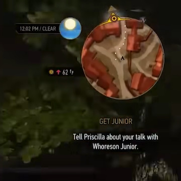&emsp;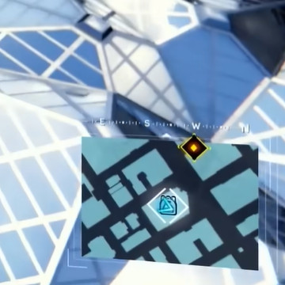 
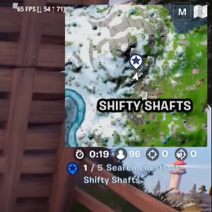&emsp;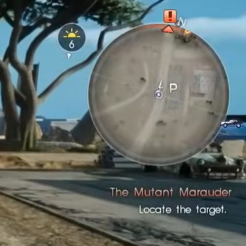 
左上=Witcher 3&emsp;右上=Spiderman&emsp;&emsp; 
左下=Fortnite&emsp;&emsp;右下=Final Fantasy XV

多くの横スクロール2Dゲームでは、プレイヤーの移動ルートは「右」と「左」の2方向だけです。そして、プレイヤーが「右」に進むと決めたあと、レベルデザインによって一時的に逆走することがあっても、最初に決めた方向を見失うことはありません。

しかし、3Dゲームの場合、プレイヤーは360°どの方向にでも進むことができます。そして、カメラが自由に動かせるゲームでは、「前後左右」はカメラの向きによって変化します。

このタイプのゲームでは、プレイヤーがある時点で「前」に進むと決めたとしても、曲がりくねった道を通ったり、敵との激しい戦闘のあとでは、どちらが「前」だったのかが分からなくなってしまいます。

進むべき道を見失ったプレイヤーは、ゲームが本来意図していたルートからはずれたり、同じところを何度も通ったりして無意味に時間を<ruby>費<rt>つい</rt></ruby>やします。こうなると、プレイに飽きてゲームを投げ出してしまう可能性が高くなります。

プレイヤーに無駄な時間を使わせないためには、プレイヤーを「ゲーム開発者が意図したルートに進むように誘導」する必要があります。

もっとも簡単な方法は、「進むべき方向を指すコンパス」や、「ミニマップ」を表示することです。これらの方法はほとんど手間がかからず、プレイヤーを意図したルートに誘導できます。

ただし、欠点もあります。そのひとつは、

>コンパスやミニマップは目的地を示すけれど、現在進むべき方向は示さない。

ということです。例えば、「コンパスは北を指しているが、現在地の北側は行き止まりで、南に戻る道しかない」というとき、コンパスにはあまり意味がありません。

これはミニマップでも同様です。多くのゲームではプレイヤーが進むべきルートは直線ではなく、大きく曲がりくねっています。そのため、ミニマップに目的地だけが表示されても、実際に進むべき方向は変化し続けます。

また、コンパスやミニマップにはさらに重大な問題があります。それは、

>ゲーム画面に注意を払わなくなり、重要な手がかりを見落としやすくなる。

ということです。コンパスやミニマップで進むべき方向が示されているとき、わざわざ周囲の環境を観察してルートを探そうとするプレイヤーは少数派です。

これは「重要なアイテムを見逃す」、「曲がるべき分かれ道に気づかずまっすぐ進んでしまう」という問題につながります。

コンパスやミニマップに問題があるとして、他にどんな方法でプレイヤーを誘導すればよいのでしょう。まず、問題を整理します。この章で挙げた問題は以下の2つでした。

>1. コンパスやミニマップは目的地は示しても、現在進むべき方向は示さない。
>2. ゲーム画面に注意を払わなくなり、重要な手がかりを見落としやすくなる。

これらの問題を解決するには、ゲーム空間に「パンくず」、「ランドマーク(目印)」、「標識」と呼ばれるオブジェクトを配置します。そして、コンパスやミニマップは「補助的な利用」にとどめます。

## 2. パンくず

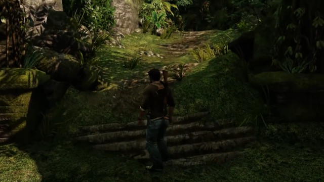&emsp;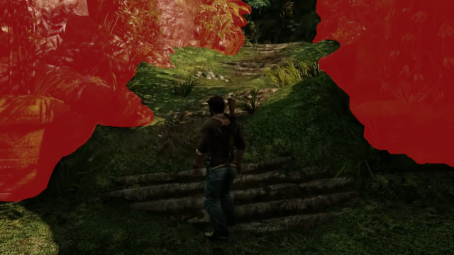&emsp;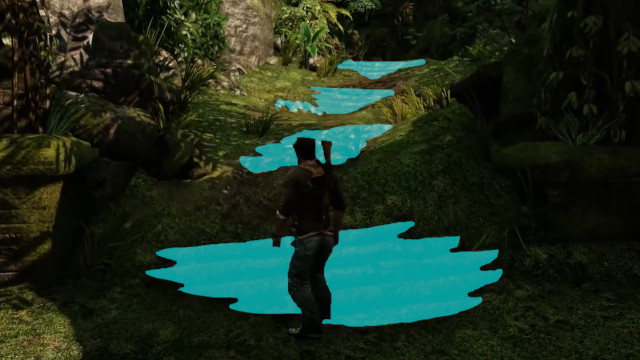 
Uncharted 2:左右を自然物でふさぎ、人工物(階段)の一部を露出させて道を示している

ゲームにおける「パンくず」は、「プレイヤーを目的地に誘導するためのさまざまなオブジェクト」のことです。

「パンくず」という言葉は、グリム童話の「ヘンゼルとグレーテル」の物語からの借用です。 
この物語では、ヘンゼルとグレーテルは森に捨てられますが、道中にこっそり落としたパンくずをたどって家に帰ろうとします。

「パンくず」には、次のようなものが挙げられます。

>* 窓や洞窟の入口から見える光、ランプや松明などの光源
>* 切れた電線から飛び散る火花、風になびく布切れなどの動きのある物体
>* 自然の中に点在する人工物、人工の世界に点在する草木などの場違いな物体
>* 周囲とは違う色で塗られた壁やパイプ、ドアなど

光でプレイヤーを導く例:

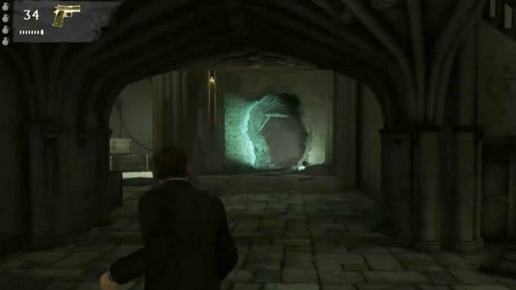&emsp;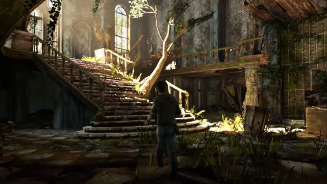&emsp;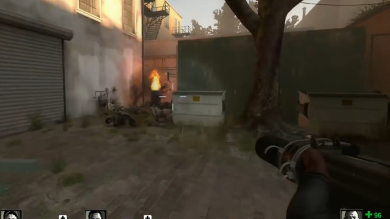 
左,中=Uncharted 2 右=Left4Dead 2

特定の色でプレイヤーを導く例:

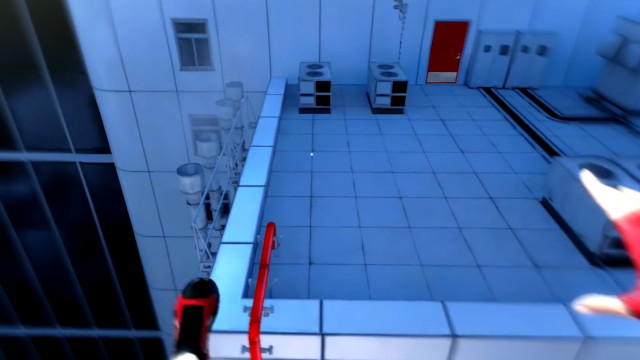&emsp;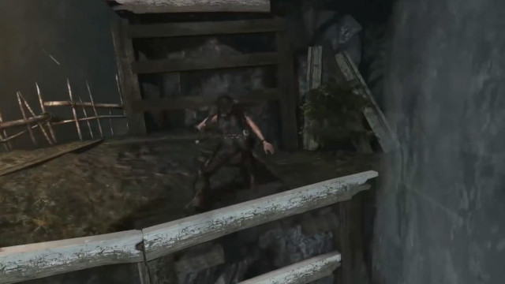&emsp;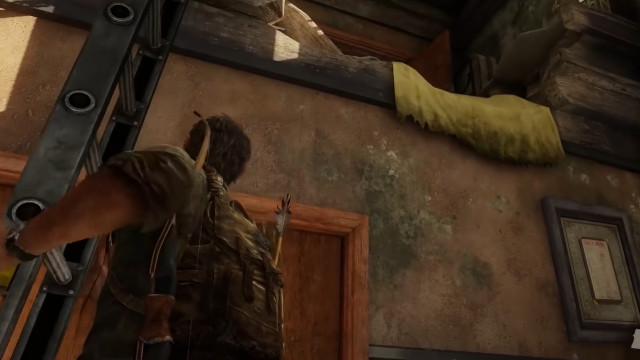 
左=Mirror's Edge(赤) 中=TombRaier(白) 右=Uncharted 2(黄色)

動きでプレイヤーを導く例:

&emsp;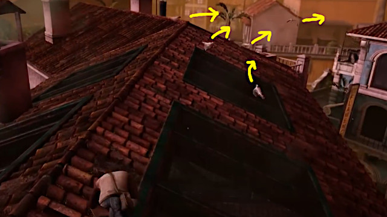&emsp;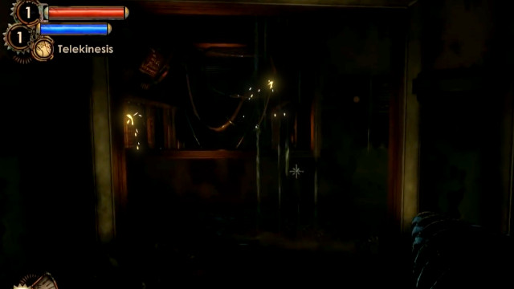 
左=風ノ旅ビト(旗) 中=Uncharted 3(白い鳩) 右=BioShock2(火花)

これらの「パンくず」の目的は、「ゲーム環境においてプレイヤーの目を引き、近距離～中距離にある目的地へとプレイヤーを案内する」ことです。その目的から、パンくずはプレイヤーの注意を引くようなオブジェクトでなくてはなりません。

十分にプレイヤーの注意を引く「パンくず」オブジェクトは、プレイヤーに「近づいてよく見てみよう」という動機を与えます。そのため、意図したルートに「パンくず」を置くことで、プレイヤーは自然にパンくずをたどって目的地へと導かれます。

もちろん、すべてのプレイヤーが順番通りにパンくずをたどってくれるとは限りません。 
しかし、たとえプレイヤーが一時的に寄り道をしたとしても、「パンくず」という目印があることで本来のルートに戻りやすくなります。

>**【Tips】**
>
>* パンくずの目的は「プレイヤーに進んでほしい方向をさりげなく伝える」こと。

## 3. ランドマーク(目印)

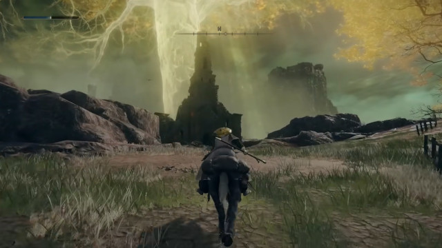&emsp;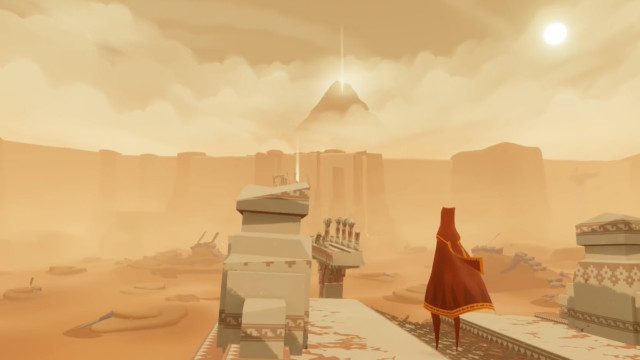 
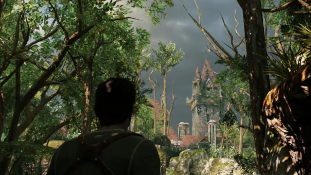&emsp;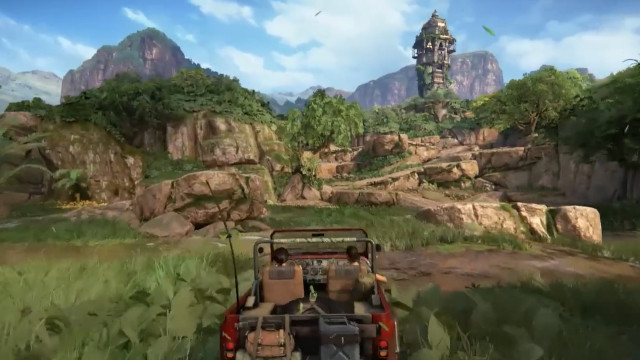 
左上=Elden Ring&emsp;&emsp;右上=風ノ旅ビト&emsp;&emsp;&emsp; 
左下=Uncharted 2&emsp;右下=Uncharted 3(DLC)

ランドマークは「巨大なパンくず」で、遠方からでもはっきり見えるほどに大きく、高さのあるオブジェクトのことです。「ランドマーク」には、次のようなものが挙げられます。

>* 高い塔
>* 大きな山
>* 巨大な城
>* 黄金色の世界樹

ランドマークの目的は「中距離～長距離においてプレイヤーの目標になる」ことです。 
エルデンリングに登場する巨大な黄金樹「エルドツリー」は、分かりやすいランドマークの例です。

大抵のゲームでは、ランドマークにたどり着くことが目的となります。しかし、ランドマークが「守るべき目標」になっているゲームもありうるでしょう。

ランドマークは、その特性上、基本的には3Dゲームで使われますが、2Dゲームで利用されます。マップ上の位置関係を分かりやすくするためだったり、ゲームが進むと背景のランドマークが徐々に大きくなり、目的地に近づいている印象を与える、といった演出で使われます。

また、ランドマークには「プレイヤーに方角を教える」効果があります。例えば目的地となる「塔」が遠く北の方角にあるとしましょう。しばらくゲームを進めて「右手に塔が見えた」のなら、プレイヤーには自分が西を向いていると分かります。

方角が明確でない場合でも、「塔に向かうにはどの方向に進めばいいか」は分かるでしょう。

>**【Tips】**
>
>* ランドマークの目的は「プレイヤーの目的地や現在位置をおおまかに伝える」こと。

## 4. 標識

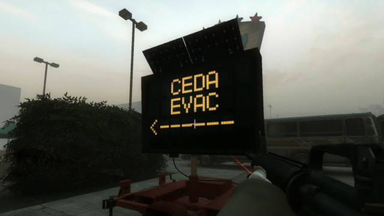&emsp;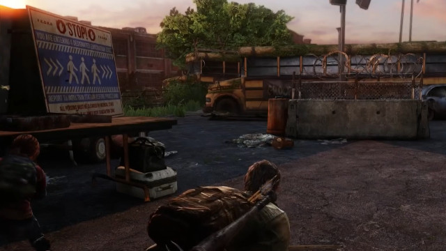&emsp;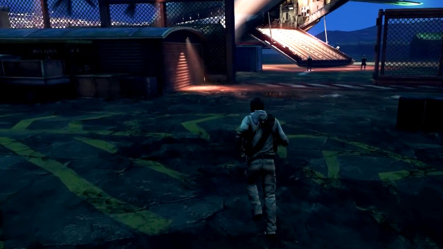 
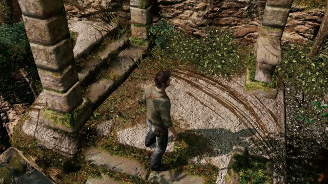&emsp;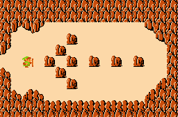 
左上=Left4Dead 2&emsp;中上,右上=Uncharted 2 
左下=Uncharted 2&emsp;右下=ゼルダの伝説&emsp;&emsp;

パンくずやランドマークは、それ自身が目的地として機能します。 
これ対して「標識」の目的は、「現在進むべき方向を示すこと」です。

「標識」には、次のようなものが挙げられます。

>* 矢印が書かれた看板(交通標識など)
>* 何かを引きずった痕跡
>* タイヤがつけた轍
>* 階段やはしご
>* 矢印状に配置された物体

標識の代表例は「矢印が書かれた看板」です。また、直線状、または曲線状の物体や地形など、オブジェクトの指す先にプレイヤーを誘導するもの全般が含まれます。

自然環境の場合、道路や階段といった人工物も標識として機能します。 
これらは「その方向に進める」ことを、プレイヤーに伝えているからです。

矢印とは逆に、侵入できないことを示す標識もあります。ただし、「進入禁止」と書かれた看板を置くだけでは逆効果です。プレイヤーは「一見して通れそうなところはどこであろうと通ろうとする」からです。

代わりに、「これは通れないな」と感じさせる、次のようなオブジェクトを配置します。

>* フェンス
>* 川や谷
>* 道を塞ぐように置かれた倒木や落石
>* 燃えている自動車やガレキ

&emsp;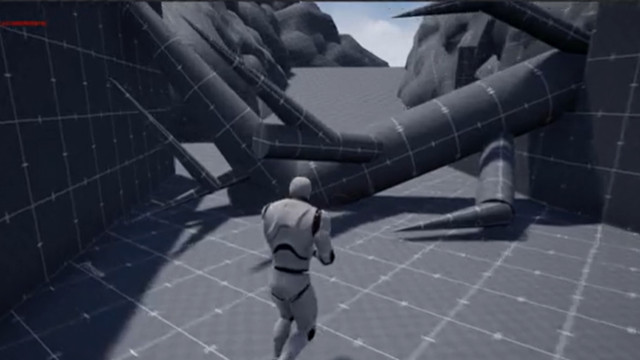&emsp;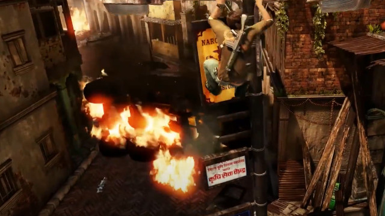 
左=Left4Dead2 中=UE5 BlockOut 右=Uncharted 2

行き先を示す標識は、多少あいまいな表現でも問題になりにくいです。しかし、通行不能なルートは、誰の目にも明らかに「通れない」と分かる必要があります。

そうしないと、一部のプレイヤーは「もしかしたら通れるかもしれない」と考えて無駄な時間を使ってしまうからです。

上記の画像では、手前に低いフェンス、奥に高いフェンスというように二重にしたり、手前の炎の奥にも炎を配置することで「この先は進めなさそうだ」と感じてもらえるような工夫がされています。

対して、UE5 BlockOutの画像では、倒木を乗り越えられそうに見えます。これは、もっと枝を増やすなどの工夫が必要になるでしょう。

>これは、ゲーム側にも責任があります。多くのゲームが困難な道の先に有用なアイテムを配置してきたことで、プレイヤーに「困難な道の先に何か有用なものがある」ことを学習させてしまったからです。 
>とはいえ、困難な道の先になにもなかったり、どこでも売っていそうな安物ばかり、というのではプレイヤーも納得できないでしょう。そのため、「困難だが通れる道」と「絶対に通れない道」がはっきり違って見えることが重要になるのです。

また、進行方向を示す標識と、侵入禁止を示す標識のいずれの場合も、それらが嘘にならないように注意します。

一度でも「矢印の方向に進んだら何もない行き止まりだった」とか「進入禁止にしか見えずゲーム中にヒントもないが、実は隠し通路があって重要なアイテムがある」という体験をしたプレイヤーは、そのゲームの標識を二度と信用しないでしょう。

>**【Tips】**
>
>* 標識には「この先に進め」と「通行止め」の2パターンがある。それらは真実を伝えるものでなくてはならない。

<pre class="tnmai_assignment">
<strong>【課題】</strong>
プランナー:

これまでに作成した、または現在制作中の企画について、想定されるレベル概略図を作成し、プレイヤーの移動ルートを書き込みなさい。そして、プレイヤーを誘導する「パンくず」、「ランドマーク」、「標識」を配置しなさい。

プログラマ:

これまでに作成した、または現在作成中のゲームについて、以下のようなレベル概略図を作成し、プレイヤーを誘導する「パンくず」、「ランドマーク」、「標識」を配置しなさい。

以下は、2Dおよび3Dゲームのレベル概略図の例です。
&emsp;&emsp;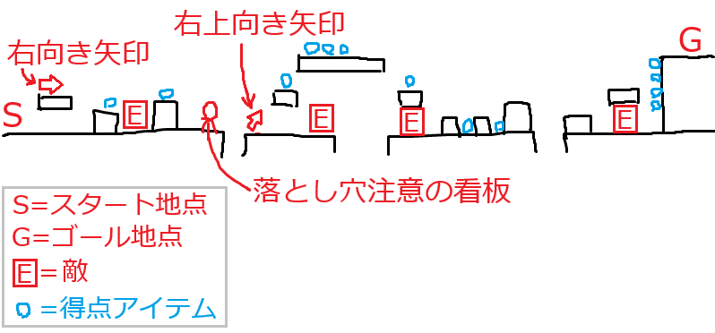
&emsp;&emsp;標識: 矢印、看板、敵
&emsp;&emsp;パンくず: 得点アイテム

&emsp;&emsp;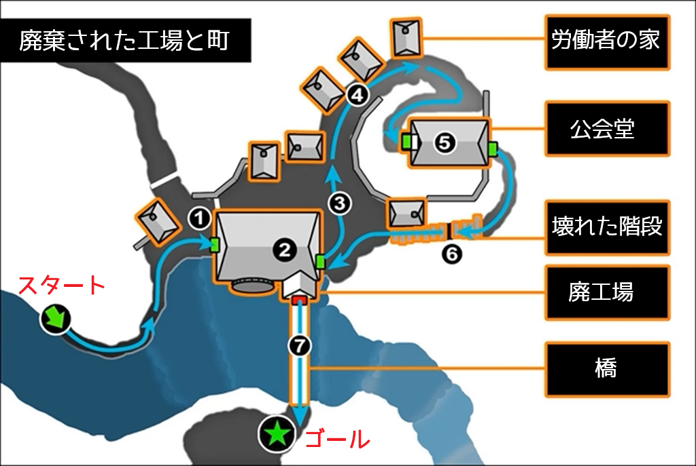
&emsp;&emsp;ランドマーク: 橋、廃工場、公会堂
&emsp;&emsp;パンくず: 労働者の家
&emsp;&emsp;標識: 壊れた階段(一方通行を示す)
&emsp;&emsp;(Epic Games「ゲーム開発でのレベル ブロックアウトの作成」より抜粋)
</pre>

>**【参考動画】** 
>アンチャーテッドがコンパスなしでプレイヤーを導く工夫 - Game Maker`s Toolkit 
><https://www.youtube.com/watch?v=k70_jvVOcG0>
>
>ゲーム開発でのレベル ブロックアウトの作成
><https://dev.epicgames.com/community/learning/courses/Qk3/unreal-engine-b939a0>
