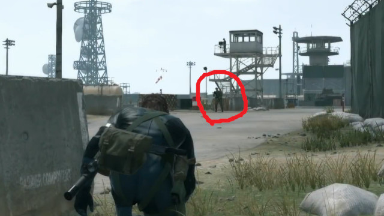
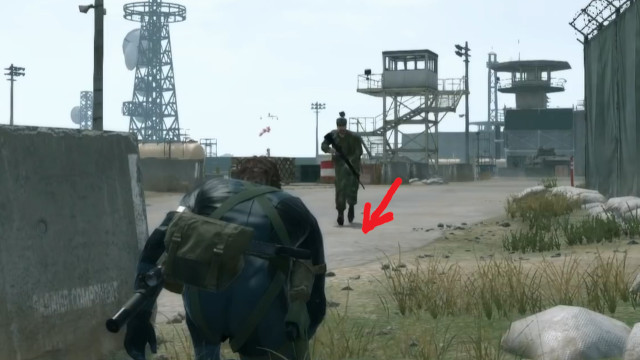

[ゲームデザイン改善ガイド 第12回]

# 楽しくて面白い遊び方に誘導する

## 1. プレイヤーは堅実な遊び方を好む

&emsp; 
左=レベル20でレベル52に与えるダメージ&emsp;右=レベル52でレベル52に与えるダメージ 
[ゼノブレイドDE(モノリスソフト)]

ゲーム開発者が考える「一番楽しくて面白いゲームの遊びかた」は、気づかないうちに「ハイリスク・ハイリターンな戦略」になりがちです。なぜなら、「危険があったにも関わらず大成功を収めた」というのは「気持ちいい」はずだからです。

問題は、この「気持ちのよさ」の正体は「ギャンブル(賭博)性」であり、「ゲーム(戦略)性」から来たものではない、ということです。多くのプレイヤーは「ゲームをしたい」からゲームを遊んでいるのであって、「ギャンブルをしたい」とは思っていません。

さらに、多くのプレイヤーは「できるだけ簡単かつ堅実な方法で」ゲームをクリアしたいと考えています。「簡単かつ堅実な方法」がとても退屈で、何度も繰り返し行う必要があり、全然面白くなかったとしても、他の「面白いけれど難しい方法」は選びません。

その理由は、「**クリアこそが、かしこい戦略を選んだプレイヤーへの最大の報酬**」だからです。これが「ゲームをクリアすると楽しい」と感じる理由のひとつです。そして、クリアできなかった場合は、「徒労」や「喪失」というストレスを感じます。

楽しく遊びたいのにストレスを受けてしまった場合、面白くないと感じるのは当然です。そのため、多くのプレイヤーは「確実にクリアできる遊び方を好む」のです。

例えば、レベル制のRPGを考えてみましょう。多くのプレイヤーは「適正レベルでボスと生死をかけて戦う」より、「レベルを少し上げて危なげなくボスを倒す」ことを好みます。負けると時間が無駄になる戦略より、確実に勝てる戦略のほうが「かしこい」からです。

とはいえ、ゲームとして考えると「パーティの魔力が枯渇し、自分も瀕死になるほどギリギリの戦いを制した」という体験のほうが心に残り、面白いことも事実です。

そこで問題になるのは、

**ゲームの一番楽しくて面白い遊び方を、プレイヤーに選んでもらう方法はあるのか？**

ということです。

これは、プレイヤーだけの問題ではありません。ゲーム開発者は、自分たちが考えた「一番楽しくて面白い遊び方」を中心にゲームを作っており、そのために膨大な時間と予算を注ぎ込んでいるからです。

プレイヤーが「開発者の意図とは異なる遊び方」をすると、開発にかけた時間と予算が無駄になってしまいます。これは、プレイヤーにとってもゲーム開発者にとっても不幸なことです。

一般的に、プレイヤーが「開発者の意図した遊び方」をしてくれない理由は、「その遊び方をすると、納得のいかない体験をするはめになる」という経験があるからです。これは、ゲーム内容に「プレイヤーから見て理不尽に感じる何か」があることを意味します。

本テキストでは、このような「理不尽」をなくすために、以下の項目について掘り下げていきます。

>* ペナルティの代わりに報酬を使う
>* メカニズムとシステムを活用する
>* 適切なペナルティを設計する

## 2. ペナルティの代わりに報酬を使う

&emsp; 
XCOM 2(Firaxis Games)のターン制限(左)と、味方ユニットの死亡(右)

「開発者が望まない行動をしたらペナルティを与える」というのは、プレイヤーにゲームを嫌いになってもらうための、最も簡単な方法のひとつです。

というのも、人々は、自分が最善だと思う行動を意味もなく制限されたり、選んだ行動に対して理不尽な罰を受けることを嫌うからです。

例えば、「死んだキャラは復活しない(パーマ・デス)」タイプの戦略ゲームで、ある目的(「ハッキングされる前に通信中継装置を破壊しろ」など)を達成しなくてはならないとします。

「死んだキャラは復活しない」という制限があるため、多くのプレイヤーはキャラクターができるだけ負傷しないよう慎重に、言い方を変えると「消極的な」戦い方をしたいと考えます。

しかし、「ゲーム内時間で8分を越えるとハッキングされて作戦失敗になる」という条件がある場合、あまり慎重な戦い方をしていては制限時間に間に合いません。

そのため、プレイヤーは「多少は被害が出るとしても、ある程度積極的に行動する」必要に迫られます。とはいえ、回復可能な被害しか出ないような難易度設定では、プレイヤーはほとんど緊張を感じないでしょう。

ある程度の緊張を感じてもらうには、プレイヤーの選択に一定のリスクを持たせなくてはなりません。パーマデスを持つゲームにおいて、リスクとはまさに「パーマデス」のことです。

しかし、「パーマデス」はプレイヤーにとって大きなストレスになります。そのため、多くのプレイヤーは「キャラクターを誰も死なせずにクリアできるまでリセットを繰り返す」ことで、ストレスをなくそうとします。

こうなってしまうと、プレイヤーの時間を浪費させるだけになってしまいます。さらに悪いことに、「時間を掛けて育てたお気に入りのキャラクターを死なせてしまった」場合、プレイヤーはもうそのゲームを遊ばなくなってしまうかもしれません。

原因は、「死んだキャラは復活しない」と「時間内にクリアする」という、２つの制限のペナルティが大きすぎることにあります。

| ルール | 意図 | ペナルティ |
|:-----|:-----|:-----|
| 時間内にクリアする | プレイヤーに大胆な行動を取らせる | ゲームオーバー |
| 死んだキャラは復活しない | プレイヤーに慎重な行動を取らせる | キャラを失う |

この問題を解決する方法はいくつか考えられます。簡単なのは「制限とペナルティ」を「目標と報酬」に変えることです。

例えば、「時間内にクリアしないとゲームオーバー」を「時間内にクリアしたらより良いアイテムがもらえる」に変えます。この場合、プレイヤーはアイテムを諦めて慎重にプレイしてもよいし、リスクを背負ってアイテム獲得を目指してもよいわけです。

どちらを選んでも、クリアさえできればゲームオーバーにはなりません。選択の自由はプレイヤーにあり、死亡のリスクが強制されくなったので、理不尽に感じることはなくなります。また、報酬を「ハッキングされそうになった試作兵器」などにすれば、物語的なつながりも表現できます。

| ルール | 意図 | 報酬 |
|:-----|:-----|:-----|
| 時間内にクリアする | プレイヤーに大胆な行動を取らせる | アイテムが得られる |

また、死亡の条件を緩和することもできます。例えば、戦闘中にやられても「瀕死」になるだけで、クリア後にお金を払って「治療」できるようにします。そして、短時間でクリアするほど経験値や報奨金が増えるシステムを導入します。

このシステムでは、「死亡」というリスクを「お金が減る」というリスクに変えることで、ペナルティを弱めています。そして、勇敢な行動に報酬を与えることで、治療費と報酬アップのバランスを取るように仕向けています。

| ルール | 意図 | 報酬/ペナルティ |
|:-----|:-----|:-----|
| 時間内にクリアする | プレイヤーに大胆な行動を取らせる | 経験値やお金が得られる |
| 瀕死のキャラはお金で復活できる | プレイヤーに大胆な行動を取らせる | お金が減る |

このように、大きすぎるペナルティを避け、さらに報酬を活用することで、プレイヤーが「行動を強制されている」という理不尽さを感じにくくなるはずです。

もちろん、「報酬アイテムがクリアにほぼ必須」とか「治療費が高額すぎる」場合は、やはり理不尽に感じるでしょう。これは、ゲーム全体のバランス調整の問題となります。

>**【Tips】**
>
>* 「制限とペナルティ」の代わりに「目標と報酬」を使うこと。結果的に同じ遊び方になったとしても、プレイヤーは報酬の方にやりがいを感じる。

## 3. メカニズムとシステムを活用する

&emsp; 
左=Doom 2016(id Software)のグローリー・キル&emsp;右=Blood Borne(From Software)のリゲイン

開発者が一番楽しいと思う遊び方をしてもらいたい場合、そして、あまり楽しくない遊び方はしてほしくない場合、一つの方法は、楽しい遊び方を推奨するようなメカニズムを入れることです。

FPSは基本的に「敵の攻撃を受けないように、遮蔽物に隠れて遠くから攻撃する」ゲームです。しかし、id softwareが開発した「DOOM(ドゥーム) 2016」というFPSゲームでは、プレイヤーは敵に向かって突進するようにプレイします。

なぜかというと、DOOM 2016には「グローリー・キル」というシステムがあるからです。グローリー・キルは「弾薬を消費しない一撃必殺の近接攻撃」で、成功すると大量の体力回復アイテムが手に入ります。

また、グローリー・キルが発動すると、敵を倒す演出中はずっと無敵時間が続きます。そのため、効率的なプレイ方法は「敵の群れに突撃してグローリー・キルを連発する」ことになります。

もちろん、ただ突撃するだけでは簡単に撃ち殺されてしまうため、障害物の隙間をぬって素早く敵に接近する技術が求められます。

別の例として、From Softwareが開発した「ブラッド・ボーン」というアクションRPGには、「リゲイン」というシステムがあります。「リゲイン」は「ダメージを受けても数秒以内に反撃すれば体力が回復する」というシステムです。

「リゲイン」は近接武器でのみ発動します。そのため、多少ダメージを受けるリスクがあろうと、積極的に敵に近寄って攻撃することが、結果的に最も効率よく敵を倒す手段になります。

また、振りの遅い(威力の高い)武器ほど体力回復量が多く設定されているため、もしダメージを受けても武器を振り切ることさえできればお釣りが来ます。「重い武器は使いにくい」という問題を軽減する効果もあるわけです。

このように、一般にプレイヤーが避けようとする行動を、メカニズムによって逆転させることで、プレイヤーが消極的なプレイより積極的なプレイをするように仕向けることができるのです。

>これらのメカニズムがあっても、ゲーム中にきちんと説明を入れなくては意味がないことに注意してください。プレイヤーは知らないメカニズムを使うことはできないからです。

&emsp; 
左=ソニック・カラーズ(SEGA)のスコアシステム 右=スーパーマリオ3Dワールドのタイムアップ

もう一つの方法は、「楽しくて面白い遊び方を推奨するゲームシステム」を作ることです。

スコアシステムは良い例です。例えばSEGAが開発した「ソニック」シリーズは、ステージを早くクリアするほどスコアがアップします。このスコアシステムは、「ステージを高速で駆け抜ける」遊び方を推奨しています。

2025年現在では、時間制限自体がなくなる傾向にあります。2021年に発売された「ソニック・カラーズ・アルティメット」や2023年に発売された「スーパーマリオブラザーズ・ワンダー」では、タイムアップで死亡することはなくなりました。

別の例として、Riot Gamesが開発した「Valorant」では、高いスコアを得るには「早く、できれば連続で敵をキルする」、「多くのダメージを与える」、「スキルによる味方のキルのアシスト」が必要となります。

これらは全て「できるだけ前に出て撃ち合う」ことを推奨するものです。高いスコアを取るほどランクが上がり、報酬がもらえて、より強いプレイヤーと戦えるようになります。

>**【Tips】**
>
>* メカニズムやシステムを「開発者が面白いと思う遊び方」をサポートするように設計すること。うまく設計できれば、プレイヤーは自然に意図した遊び方で遊ぶようになる。

## 4. 適切なペナルティを設計する

&emsp;
&emsp;
 
左=市民を攻撃する&emsp;中=逮捕される&emsp;右=保釈金を支払う 
[スリーピング・ドッグズ(United Front Games)]

「ペナルティ」は必ずしも悪いものではありません。正義の味方としてプレイするゲームで一般市民を攻撃したら、なんらかのペナルティ(クリア報酬が下がるとか)を受けるのは理にかなっています。

例えば、「スリーピング・ドッグズ」というアクションアドベンチャーゲームでは、香港警察の一員として、犯罪組織への潜入捜査を行います。

犯罪組織で認められるには、多数の犯罪ミッションをクリアする必要があります。このとき、敵対者や目撃者を残虐に殺害するほど、経験値が増えてスキルを獲得しやすくなり、クリアが近づきます。

しかし、やり過ぎると警察から指名手配され、巡回中の警官に捕まると高額な保釈金を払わされ、クリアが遠のきます。そのため、(少なくとも最初のうちは)敵対者だけを排除して警官や一般人には極力手を出さない、という遊び方に落ち着きます。

&emsp;
&emsp;
 
左=何かに気づく&emsp;中=調べに来る&emsp;右=侵入者と認識 
[Metal Gear Solid 5(コナミ)]

別の例として、ステルスゲームを考えてみましょう。プレイヤーが敵に見つかった瞬間にゲームオーバーにするのは簡単です。ただ、このシステムはゲームとして見ても単純すぎますし、現実的とも言い難いです。つまり、ペナルティが大きすぎるのです。

コナミの「メタルギアソリッドＶ」では、敵がプレイヤーを発見するまでにいくつかの段階があります。最初は「何か見えた気がする」、次に「あれは何だ？」、そして最後に「侵入者だ！」という具合です。

このように、発見されるまでに段階がある場合、多少のミスならば挽回することができます。「何か見えた気がする」状態なら、すぐに身を隠せば問題ありません。「あれは何だ？」状態なら、消音器付きの銃で無力化できます。

そのうえ、「敵だ！」となっても反撃の余地があり、うまくいけば仲間が来るまでにまた身を隠せるかもしれません。挽回手段があることで、プレイヤーは多少危険ではあってもさまざまなことを試す余裕ができるわけです。

&emsp;
 
左=敵を無力化&emsp;右=証拠を隠滅 
[Metal Gear Solid 5(コナミ)]

そして、本当に推奨されない行為には十分なペナルティを与えることができます。例えば、ステルスゲームで敵の只中に突進して暴れまわる、ということは普通できません。これは、プレイヤーの装備や能力を十分に弱し、多くの敵と同時に戦うことを難しくすることで実現できます。

プレイヤーを弱くする方法には、受けるダメージが大きい、体力が低い、攻撃手段が乏しい、などが考えられます。

また、スコアシステムを「できるだけ見つからないで任務を達成できるほど高得点」とするのも方法の一つです。最初のプレイでは手際が悪くても、何度もプレイするうちに上手になっていく感覚を持たせることもできるでしょう。

>**【Tips】**
>
>* 大きすぎるペナルティは、プレイヤーの選択を無意味にしてしまう。
>* 挽回できる程度のペナルティは遊び方の幅を広げ、プレイヤーに苦行ではなく、自分の意志でゲームの面白さを追求する余裕を与える。

<pre class="tnmai_assignment">
<strong>【課題】</strong>
プランナー:

これまでに作成した、または制作中の企画書や仕様書についてゲームルールを全て書き出しなさい。書き出したルールのそれぞれについて、ルールの意図とプレイヤーの行動に与える影響、報酬、ペナルティを書き出しなさい。そのうえで、それらのルールが企画の意図に沿っていない場合、どうすれば改善できるかを考えなさい。

プログラマ:

これまでに作成した、または制作中のゲームについて、ゲームルールをすべて書き出しなさい。書き出したルールのそれぞれについて、ルールの意図とプレイヤーの行動に与える影響、報酬、ペナルティを書き出しなさい。そのうえで、それらのルールが企画の意図に沿っていない場合、どうすれば改善できるかを考えなさい。
</pre>

>**【参考動画】** 
>プレイヤーをプレイヤー自身から守ること - Game Maker's Toolkit
><https://www.youtube.com/watch?v=7L8vAGGitr8>
