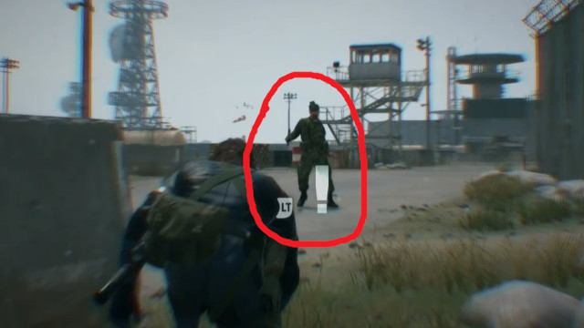
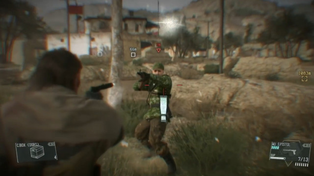

[ゲームデザイン改善ガイド 第12回]

# 意図した遊び方に誘導する

## 1. プレイヤーは堅実な遊び方を好む

&emsp; 
左=レベル20でレベル52に与えるダメージ&emsp;右=レベル52でレベル52に与えるダメージ 
[ゼノブレイドDE(モノリスソフト)]

ゲーム開発者が考える「一番楽しくて面白いゲームの遊びかた」は、気づかないうちに「ハイリスク・ハイリターンな戦略」になりがちです。なぜなら、「危険があったにも関わらず大成功を収めた」というのは「気持ちいい」はずだからです。

問題は、この「気持ちのよさ」の正体は「ギャンブル(賭博)性」であり、「ゲーム(戦略)性」から来たものではない、ということです。多くのプレイヤーは「ゲームをしたい」からゲームを遊んでいるのであって、「ギャンブルをしたい」とは思っていません。

さらに、多くのプレイヤーは「できるだけ簡単かつ堅実な方法で」ゲームをクリアしたいと考えています。「簡単かつ堅実な方法」がとても退屈で、何度も繰り返し行う必要があり、全然面白くなかったとしても、他の「面白いけれど難しい方法」は選びません。

その理由は、

&emsp;**クリアこそが、かしこい戦略を選んだプレイヤーへの最大の報酬**

だからです。これが「ゲームをクリアすると楽しい」と感じる理由のひとつです。そして、クリアできなかった場合は、「徒労」や「喪失」というストレスを感じます。

楽しく遊びたいのにストレスを受けてしまった場合、面白くないと感じるのは当然です。そのため、多くのプレイヤーは「確実にクリアできる遊び方を好む」のです。

例えば、レベル制のRPGを考えてみましょう。多くのプレイヤーは「適正レベルでボスと生死をかけて戦う」より、「レベルを少し上げて危なげなくボスを倒す」ことを好みます。負けると時間が無駄になる戦略より、確実に勝てる戦略のほうが「かしこい」からです。

とはいえ、ゲームとして考えると「パーティの魔力が枯渇し、自分も瀕死になるほどギリギリの戦いを制した」という体験のほうが心に残り、面白いことも事実です。

そこで問題になるのは、

&emsp;**ゲームの一番楽しくて面白い遊び方を、プレイヤーに選んでもらう方法はあるのか？**

ということです。

これは、プレイヤーだけの問題ではありません。ゲーム開発者は、自分たちが考えた「一番楽しくて面白い遊び方」を中心にゲームを作っており、そのために膨大な時間と予算を注ぎ込んでいるからです。

プレイヤーが「開発者の意図とは異なる遊び方」をすると、開発にかけた時間と予算が無駄になってしまいます。これは、プレイヤーにとってもゲーム開発者にとっても不幸なことです。

一般的に、プレイヤーが「開発者の意図した遊び方」をしてくれない理由は、「その遊び方をすると、納得のいかない体験をするはめになる」という経験があるからです。これは、ゲーム内容に「プレイヤーから見て理不尽に感じる何か」があることを意味します。

本テキストでは、このような「理不尽」をなくすために、以下の項目について掘り下げていきます。

>* ペナルティの代わりに報酬を使う
>* メカニズムとシステムを活用する
>* 適切なペナルティを設計する

## 2. ペナルティの代わりに報酬を使う

### 2.1 ペナルティは嫌われやすい

&nbsp; 
XCOM 2(Firaxis Games)のターン制限(左)と、味方ユニットの死亡(右)

「開発者が望まない行動をしたらペナルティを与える」というのは、プレイヤーにゲームを嫌いになってもらうための、最も簡単な方法のひとつです。

というのも、人間は「自分が最善だと思う行動を意味もなく制限されたり、選んだ行動に対して理不尽な罰を受けることを嫌う」からです。

上の画像のXCOM2(エックス・コム・ツー)というゲームは「死んだキャラは復活しない(パーマ・デス)」タイプの戦略ゲームです。ステージごとに「敵に奪取される前に通信装置を破壊しろ」などの目的が与えられ、制限ターン数以内に目的を達成しなくてはなりません。

さて、「パーマ・デス」があるゲームでは、プレイヤーはキャラクターができるだけ負傷しないよう慎重に、「消極的な」戦い方をしたいと考えます。しかし、XCOM2の場合は、制限ターン数があるためにそう簡単にはいきません。プレイヤーは「多少は被害が出るとしても、ある程度積極的に行動する」必要に迫られます。

このとき、「プレイヤーにある程度の緊張を感じてもらう」には、プレイヤーの選択に一定のリスクを持たせなくてはなりません。パーマ・デスのあるゲームにおいて、リスクとはまさに「パーマ・デス」です。

しかし、「手塩にかけて育てたキャラクターを永久に失う」パーマ・デスは、プレイヤーにとって大きなストレスになります。そのため、多くのプレイヤーは「キャラクターを誰も死なせずにクリアできるまでリセットを繰り返す」ことで、ストレスをなくそうとします。

こうなってしまうと、プレイヤーの時間を浪費させるだけになってしまいます。さらに悪いのは、プレイヤーが「やり直す価値を感じられなくなった」場合です。プレイヤーはもうそのゲームを遊ばなくなってしまうかもしれません。

原因は、「パーマ・デス」と「時間内にクリアする」という、２つのペナルティが大きすぎることにあります。

| ルール | 意図 | ペナルティ |
|:-----|:-----|:-----|
| 時間内にクリアする | プレイヤーに大胆な行動を取らせる | ゲームオーバー |
| パーマ・デス | プレイヤーに慎重な行動を取らせる | キャラを失う |

### 2.2 「ペナルティ」を「報酬」に変える

ペナルティは「望ましくない行動を抑止する」ものです。これが嫌われるのは「やりたいことをやらせてもらえない」「やりたくないことを強制される」という印象を与えるためです。

同じ目標を達成しつつ、プレイヤーに良い印象を与えるには「抑止」の代わりに「推奨」を使います。つまり、「望ましい行動を推奨する」ようにするのです。

例えば、「時間内にクリアしないとゲームオーバー」を「時間内にクリアしたらアイテムがもらえる」に変えます。プレイヤーはアイテムを諦めて慎重にプレイしてもよいし、リスクを背負ってアイテム獲得を目指しても構いません。

どちらを選んでも、クリアできればゲームオーバーにはなりません。選択の自由はプレイヤーにあるので、理不尽に感じることはなくなります。また、報酬を「敵から守ったアイテム」などにすれば、物語的なつながりも表現できます。

| ルール | 意図 | 報酬 |
|:-----|:-----|:-----|
| 時間内にクリアする | プレイヤーに大胆な行動を取らせる | アイテムが得られる |
| パーマ・デス | プレイヤーに慎重な行動を取らせる | キャラを失う |

パーマ・デスをなくす方法もあります。例えば、戦闘中にやられても「瀕死」になるだけで、クリア後にお金を払って「治療」できるようにします。そして、「時間内にクリアすれば貰えるお金が増える」ようにします。

「パーマ・デス」という大きなリスクを「お金が減る」という小さなリスクに変えることで、ペナルティを弱めるわけです。うまくいけば誰も死なずにより多くのお金が手に入ります。

もし誰か瀕死になっても、時間内にクリアしてお金が手に入ればリスクはチャラにできます。もちろん、最初から追加のお金はあきらめて、慎重にプレイしても構いません。

| ルール | 意図 | 報酬/ペナルティ |
|:-----|:-----|:-----|
| 時間内にクリアする | プレイヤーに大胆な行動を取らせる | お金が増える |
| キャラはお金で復活できる | プレイヤーに大胆な行動を取らせる | お金が減る |

このように、「ペナルティで行動を抑止する」代わりに「報酬で行動を推奨する」ことで、プレイヤーは進んでゲームが意図した遊びかたをするようになります。

>**【Tips】**
>
>* 「制限とペナルティ」の代わりに「目標と報酬」を使う。結果的に同じ遊び方になったとしても、プレイヤーは報酬の方にやりがいを感じる。

## 3. メカニズムとシステムを活用する

開発者が一番楽しいと思う遊び方をしてもらいたい場合、そして、あまり楽しくない遊び方はしてほしくない場合、以下のような対処法が考えられます。

1. 楽しい遊び方を推奨するようなメカニズムを入れる
2. 楽しくて面白い遊び方を推奨するゲームシステムを作る

### 3.1 楽しい遊び方を推奨するようなメカニズムを入れる

ゲームに適切な「メカニズム」を加えることで、プレイヤーを楽しい遊び方に誘導できます。 
以下では、例として「グローリー・キル」と「リゲイン」を取り上げます。

なお、ここでいう「メカニズム」は、「ゲームシステムを構成する個々の機能やルール」とします。

&emsp; 
左=Doom 2016(id Software)のグローリー・キル&emsp;右=Blood Borne(From Software)のリゲイン

#### 例１：グローリー・キル

FPSは基本的に「敵の攻撃を受けないように、遮蔽物に隠れて遠くから攻撃する」ゲームです。しかし、id softwareが開発した「DOOM(ドゥーム) 2016」というFPSゲームでは、プレイヤーは敵に向かって突進するようにプレイします。

なぜかというと、DOOM 2016には **グローリー・キル** というシステムがあるからです。グローリー・キルは「弾薬を消費しない一撃必殺の近接攻撃」で、成功すると大量の体力回復アイテムが手に入ります。

さらに、グローリー・キルに成功すると、少しだけ無敵時間が得られます。そのため、効率的なプレイ方法は「敵の群れに突撃してグローリー・キルを連発する」ことになります。

ただ、やみくもに突撃しても、近づく前にやられてしまいます。そこで、地形を活用し、ダメージを抑えつつ素早く敵に接近する技術が求められます。 
その報酬がグローリー・キルというわけです。

#### 例２：リゲイン

From Softwareが開発した「ブラッド・ボーン」というアクションRPGには、「リゲイン」というシステムがあります。「リゲイン」は「ダメージを受けても数秒以内に反撃すれば体力が回復する」というシステムです。

「リゲイン」は近接武器でのみ発動します。そのため、多少ダメージを受けるリスクがあろうと、積極的に敵に近寄って攻撃することが、結果的に最も効率よく敵を倒す手段になります。

また、振りの遅い(威力の高い)武器ほど体力回復量が多く設定されているため、もしダメージを受けても武器を振り切ることさえできればお釣りが来ます。「重い武器は使いにくい」という問題を軽減する効果もあるわけです。

#### その他の例

* オフライン状態の時間に応じて経験値倍率が増える(World of Warcraft)
* 近距離攻撃を当てると遠距離攻撃用の弾薬が得られる(God Eater, Hyper Light Drifter)
* 武器に耐久度があり壊れる(収集・クラフト系ゲーム全般, ゼルダの伝説BotW)

このように、普通ならプレイヤーが避けようとする行動であっても、メカニズム次第で積極的に選ばせることが可能です。プレイヤーに「消極的なプレイより積極的なプレイをするように仕向ける」ことができるのです。

>良いのメカニズムがあっても、ゲーム中にきちんと説明を入れなくては意味がないことに注意してください。プレイヤーは知らないメカニズムを使うことはできないからです。

### 3.2 楽しくて面白い遊び方を推奨するゲームシステムを作る

ゲーム全体の「システム」を、面白い遊び方を推奨するように設計することでも、プレイヤーの遊び方を誘導できます。

  
左=ソニック・カラーズ(SEGA)の得点システム 右=バーンアウトの危険運転システム

#### 例１：得点システム

得点システムは良い例です。例えばSEGAが開発した「ソニック」シリーズは、ステージを早くクリアするほど得点が増えます。この得点システムは、「ステージを高速で駆け抜ける」遊び方を推奨しています。

また、Riot Gamesが開発した「Valorant」で高い得点を得るには「早く、できれば連続で敵をキルする」、「多くのダメージを与える」、「スキルによる味方のキルのアシスト」などの行動が必要となります。

これらは「できるだけ前に出て撃ち合う」ことを推奨するものです。高い得点を取るほどランクが上がり、報酬がもらえて、より強いプレイヤーと戦えるようになります。

#### 例２：危険運転システム

Criterion Gamesが開発した「バーンアウト」というレースゲームでは、ドリフト、高所からのジャンプ、看板などの破壊、対向車線を走る、他の車への接触や激突など、とにかく危険な運転をするほどブーストゲージが増加し、レース終了時の報酬が増えます。

もちろん、運転をしくじれば車がクラッシュし、大きなタイムロスにつながります。致命的なクラッシュをしないように注意しながら危険な運転を繰り返し、ブーストを切らさず走り続けることが、レースに勝利する近道です。

>余談ですが、開発者のアレックスは危険運転システムについて「シューティングゲーム「斑鳩」の敵弾吸収システムから着想を得た」と述べています。
><https://web.archive.org/www.japan.ea.com/bor/interview/alex-cd.html>

>**【Tips】**
>
>* メカニズムやシステムを「開発者が面白いと思う遊び方」を推奨するように設計する。そうすれば、プレイヤーは自然に意図された遊び方をするようになる。

## 4. 適切なペナルティを設計する

「ペナルティ(罰)」は必ずしも悪いものではありません。正義の味方としてプレイするゲームで一般市民を攻撃したら、なんらかのペナルティ(クリア報酬が下がるとか)を受けるのは理にかなっています。

しかし、あまりに極端なペナルティは、プレイヤーのやる気を大きく減らします。ペナルティは大きすぎず小さすぎず、適切に運用しなくてはなりません。

### 4.1 ペナルティでゲームバランスを調整する

 
左=市民を攻撃する&emsp;中=逮捕される&emsp;右=保釈金を支払う 
[スリーピング・ドッグズ(United Front Games)]

「スリーピング・ドッグズ」というアクションアドベンチャーゲームでは、香港警察の一員として、犯罪組織への潜入捜査を行います。

犯罪組織で認められるには、多数の犯罪ミッションをクリアする必要があります。このとき、敵対者や目撃者を残虐に殺害するほど、経験値が増えてスキルを獲得しやすくなり、クリアが近づきます。

しかし、やり過ぎると警察から指名手配され、巡回中の警官に捕まると高額な保釈金を払わされ、クリアが遠のきます。軽い犯罪なら警察の捜査もゆるく、捕まった場合の保釈金も少ないです。しかし、犯罪を重ねると捜査が厳しくなり、保釈金も高額になっていきます。

プレイヤーの経験や技術に応じて、あまり犯罪をおかさずにプレイしたり、犯罪上等の高難易度プレイを
そのため、(少なくとも最初のうちは)敵対者だけを排除して警官や一般人には極力手を出さない、という遊び方に落ち着きます。

### 4.2 ペナルティを段階的にする

 
左=何かに気づく&emsp;中=調べに来る&emsp;右=侵入者と認識 
[Metal Gear Solid 5(コナミ)]

別の例として、ステルスゲームを考えてみましょう。プレイヤーが敵に見つかった瞬間にゲームオーバーにするのは簡単です。ただ、このシステムはゲームとして見ても単純すぎますし、現実的とも言い難いです。つまり、ペナルティが大きすぎるのです。

コナミの「メタルギアソリッドＶ」では、敵がプレイヤーを発見するまでにいくつかの段階があります。最初は「何か見えた気がする」、次に「あれは何だ？」、そして最後に「侵入者だ！」という具合です。

このように、発見されるまでに段階がある場合、多少のミスならば挽回することができます。「何か見えた気がする」状態なら、すぐに身を隠せば問題ありません。「あれは何だ？」状態なら、消音器付きの銃で無力化できます。

そのうえ、「敵だ！」となっても反撃の余地があり、うまくいけば敵の増援が来るまでにまた身を隠せるかもしれません。挽回手段があることで、プレイヤーは多少リスクがあろうとも、さまざまなことを試す余裕ができるわけです。

 
左=敵を無力化&emsp;右=証拠を隠滅 
[Metal Gear Solid 5(コナミ)]

そして、本当に推奨されない行為には十分なペナルティを与えることができます。例えば、ステルスゲームで敵の只中に突進して暴れまわる、ということは普通できません。これは、プレイヤーの装備や能力を十分に弱し、多くの敵と同時に戦うことを難しくすることで実現できます。

プレイヤーを弱くする方法には、受けるダメージが大きい、体力が低い、攻撃手段が乏しい、などが考えられます。

また、得点システムを使って「できるだけ見つからないで任務を達成できるほど高得点」とする方法もあります。最初のプレイでは手際が悪くても、何度もプレイするうちに上手になっていく感覚を持たせることができるでしょう。

>**【Tips】**
>
>* 大きすぎるペナルティは、プレイヤーの選択を無意味にしてしまう。
>* 挽回できる程度のペナルティは遊び方の幅を広げ、プレイヤーに苦行ではなく、自分の意志でゲームの面白さを追求する余裕を与える。

<pre class="tnmai_assignment">
<strong>【課題】</strong>
プランナー、プログラマー共通:

これまでに作成した、または現在制作中の企画書や仕様書、ゲームについて、
以下の手順に従って、意図した面白い遊びかたを推奨しているかどうかを検証、改善しなさい。

  1. メカニズムとシステムを可能なかぎり書き出す
  2. 書き出した各メカニズム・システムについて、それらのペナルティと報酬を書き出す
  3. ペナルティを与える場合、それを報酬で置き換える方法を考える
  4. 報酬の場合、より企画の意図を推奨するように変えられないかを考える
</pre>

>**【参考動画】** 
>プレイヤーをプレイヤー自身から守ること - Game Maker's Toolkit 
><https://www.youtube.com/watch?v=7L8vAGGitr8>
>
>眼の前に吊られたごほうび - 桜井政博のゲームを作るには 
><https://www.youtube.com/watch?v=rA_FN6BTGms>
>
>ほめてやれ！ - 桜井政博のゲームを作るには 
><https://www.youtube.com/watch?v=1xRDwQqSn6I>
>
>ズルを許す - 桜井政博のゲームを作るには 
><https://www.youtube.com/watch?v=ODmMrl_STi0>
