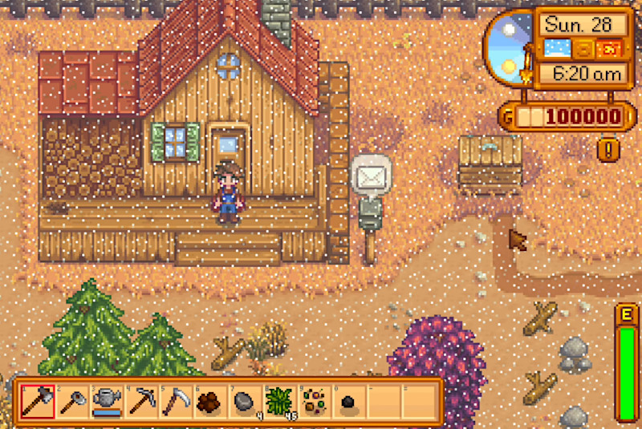

[ゲームデザイン改善ガイド 第13回]

# 障がいがあってもゲームを遊べるようにする

## 1. さまざまな障がい

多くのコンピューターゲームは「誰でも楽しめるもの」として作られています。しかし、さまざまな理由から実際には「誰でも」とはなっていません。

特に、以下のような「障がい」がある場合、数多くのゲームが「自分たちには遊べないもの」になっているのが現実です。

>* 視覚障がい(目が見えない、色が分からない)
>* 聴覚障がい(音が聞こえない、聞こえにくい)
>* 運動障がい(手足が動かせない、特定の動きが難しい)
>* 認識障がい(文字を読むのが難しい、)

本テキストでは、「障がいがあったとしても、ゲームを楽しくプレイできるようにする方法」を解説します。 
さらに、この改善によってゲームを遊びやすくすると、障がいの有無にかかわらず多くのプレイヤーの役に立つことを示します。

## 2. 視覚障がい

### 2.1 色以外の要素を組み込む

 
神奈川県の「色使いのガイドライン」より 

まずは「視覚障がい」から説明しましょう。多くのゲームが「緑色は安全、赤色は危険」のような色分けを利用しています。これは、現実世界で使われている色分けを流用しているからです。

しかし、世の中には「赤と緑を識別できない」人々が存在します。これは「色覚異常」として知られており、日本では男性ではおよそ20人にひとり(5%)、女性ではおよそ500人にひとり(0.2%)存在します。

あなたの作ったゲームが「赤と緑を識別できること」を中心に作られていたとしましょう(色合わせパズルなど)。すると、日本の約3%の人々は、あなたの作ったゲームを遊べません。 
この問題への解決策は、以下の2つです。

>1. 色以外の要素で識別できるようにする。
>2. 色覚異常でも見分けられる色を使う。

これらの要素を追加すると、障がいがない人々にとっても情報がより識別しやすくなり、色だけにたよる場合よりも楽しくゲームを遊べるようになります。

おすすめは`1`です。重要な情報の識別には色に加えて、形、記号、エフェクト、アニメーションなどが利用できます。

&emsp; 
左=ChromaGun(Pixel Maniacs)の色と記号&emsp;右=スプラトゥーン3(任天堂)の色覚サポート

とはいえ、全てのゲームで`1`の解決策が使えるわけではありません。任天堂が開発した「スプラトゥーン」という3D対戦シューティングゲームでは、互いにインクを塗り合って面積を競います。

インクは不定形なので、形で識別することはできません。また、最小の塗り面積は小さなシミ程度しかないため、記号の表示も難しいです。インクは画面全体に表示されることもあるので、エフェクトやアニメーションは画面を見づらくするだけです。

このような場合は、`2`の解決策を選ぶことになります。定番は「青」と「オレンジ」の組み合わせです。3種類以上の識別が必要な場合、何種類かの色の組み合わせを用意して、オプション画面で切り替えられるようにするとよいでしょう。

### 2.2 効果音、音声、振動を利用する

視力がほとんどない人々は、音声を頼りにゲームを遊んでいます。以下のような要素に効果音を付けることで、多くの人がゲーム内で起きたことを的確に把握できるようになります。

>* 敵が出現した(「ぐおおおお！(敵の咆哮)」)
>* 爆弾が投げ込まれた(「爆弾！」)
>* 現在の体力残量(ピコーン、ピコーン、ピコン、ピコン、ピコピコ、ピピピ...)
>* UI要素の読み上げ(「そうび」「おぷしょん」「いぐじっと」)
>* アイテム取得音(「チャリーン」)
>* 壁にぶつかった音(「ドンッ」)
>* 敵AIの行動の変化(「そこに誰かいるのか？」→「気のせいか」)

これらは、実際のゲームで実現されているものがほとんどです。ということは、就職作品においても、これらの効果音や音声があるかどうかで評価が違ってくるわけです。

特に3Dゲームでは、画面に見えていない領域のほうが多いです。そのため、効果音や音声がなければ、周囲で起こっていることが分かりません。

なにより、できるだけ多くの要素に効果音や音声を付けると、臨場感が増して楽しいゲームになります。どんなに面白いゲームでも、効果音が貧弱なままでは面白さを伝えきれないものです。

音声と同様に、振動機能によっても周囲の状況を伝えられます。ただし、振動の強さをオフにできる機能は必須です。

>**【Tips】**
>
>* できるだけ多くの要素に効果音や音声を付けること。視力に頼らなくても十分な情報が得られると、ゲーム環境を把握しやすくなる。
>* 音声が聞こえにくい人々のために、次に挙げる「聴覚障がい」への配慮を忘れないように。

## 3. 聴覚障がい

### 3.1 音を利用したパズルには視覚的な補助を入れる

&emsp; 
左=鳥の声の高さを答える:The Witness(Thekla, Inc)&emsp;右=画像でヒントを表示:Undertale(Toby Fox)

いくつかのゲームでは「音から答えを見つけるパズル」が登場します。聴覚に問題を抱えている場合、これらのパズルを解くには大きな困難が伴います。

自分自身の聴覚が正常だとしても、例えば家族の生活音があるリビングルームや、移動中のバス、電車など、騒音の中でゲームをプレイしている場合は同じことが起こります(遮音ヘッドフォンを持っていれば別ですが)。

また、会話に問題がなくても、音の高低やメロディを聞き取るのが苦手な場合もあります。そのため、このようなパズルをゲームに組み込む場合は、音声に頼らない解決方法も用意するべきでしょう。

音符の画像を表示する、振動の大小で表現する、などが考えられます。振動を利用する場合、振動の強弱を設定できる機能が必要になるでしょう。

>**【Tips】**
>
>* 音無しでもプレイできるようにすると、音量を上げられない環境でも遊びやすい。
>* 音声だけに頼ったパズルを作らない。

### 3.2 効果音を視覚的に表示する

ゲームではさまざまな情報が画面に表示されます。聴覚障がいの場合、これらの画像情報を受け取ることには苦労しません。しかし、音声による情報の取得には非常な苦労が伴います。

音声には効果音だけでなく、ナレーションやキャラクターの台詞なども含まれます。音が聞こえない、あるいは聞こえにくい人々にもそれらの情報を伝えるために、多くのゲームでは「字幕」を利用しています。

映画では爆発や銃撃などの効果音にも字幕が付いています。ゲームの効果音は映画よりもずっと重要なので、少なくとも重要な効果音だけでも何らかの方法で画面に表示するとプレイしやすくなります。

&emsp; 
左=手榴弾アイコン(Call of Duty:WW II(Sledgehammer Games))&emsp;右=方向表示付き音声ログ(マインクラフト(Mojang))

例えば`Call of Duty`というFPSでは、敵が投げた爆弾が画面外にある場合、その爆弾までの距離と方向が画面の端に表示されます。

もしこの表示がなかったら、他の部分に集中していて「手榴弾を投げる音声」に気づかなかった場合に、「見えない爆弾でやられた」という体験をすることになるでしょう。

「爆弾が近くにある」という情報を表示することで、このような体験を減らすことができます。これは、聴覚に問題がある人々だけでなく、視覚から情報を得るすべての人々にとって価値があります。

また、`Minecraft`のように、発生した音声イベントを「チャットウィンドウ風に文字で表示」するゲームも存在します。音声再生関数に、「ウィンドウに単語を送る」機能を追加するだけなので、比較的簡単に実装できるのが利点です。

ここでも振動を利用できます。 
もちろん、振動の強弱を設定したり、オフにできる機能は必要です。

>**【Tips】**
>
>* 音声以外に、画面外で起きた出来事を伝える手段を持つこと。音声は聞き取れない場合があるので、視覚的に補助する要素があると出来事に気づきやすくなる。

### 3.3 音量を制御する機能をつける

 
音量設定画面(モータルコンバットX(NetherRealm Studios))

開発者が「最適」と考える音量バランスが、全てのプレイヤーにとって最適であるとは限りません。特に、「多くの音が鳴っている空間で、特定の音声を聞き取るのが苦手な人」にとっては、大抵のゲームのBGMはうるさすぎます。

パズルの場合と同様にプレイしている環境によっては、BGMの音量を下げて効果音の音量だけを上げたい、という場合もあるでしょう。

これらは、設定画面などで「BGMと効果音の音量を個別に指定する機能」があれば簡単に解決します。ゲームによっては、ナレーションや会話の音量を指定できる機能があると便利かもしれません。

>**【Tips】**
>
>* 音量を制御するオプションを用意すること。人や環境によって効果音の聞き取りやすさは異なるため、音量を設定できると快適にゲームを遊べるようになる。

## 4. 動作障がい

### 4.1 キーマッピング機能を用意する

&emsp; 
左=World of Tanks(War Gaming) 右=Tital fall 2(Respawn Entertainment)

現在のゲームコントローラーには、たくさんのキーやスティックがあります。多くのゲームでは、これらのキーやスティックを特定の操作に割り当てます。

しかし、これらの割り当てが一部しか変更できなかったり、まったく変更できないゲームが数多く存在します。

ですが、例えば「指を怪我して包帯を巻いている」とか、「腱鞘炎で指を曲げると痛い」などの理由で、特定のキー操作が難しいことがあります。これらの症状があっても、キー割り当てを変更できればゲームを遊べる可能性があります。

特に問題が大きいのは、コントローラーの上部にある`L`、`R`キー(トリガー)です。これらのキーは、人差し指や中指をうまく使えない状態では役に立ちません。

`L`、`R`キー(トリガー)の機能を表面のボタンに割り当てることができれば、親指だけでゲームを操作できるようになります。

コントローラーのモーションセンサーを利用する場合も、同じ機能を持つキーを設定できるようにするべきです。例えばジャイロ・センサーです。人によっては直感的かもしれませんが、うまく操作できない人もいます。

また、アナログ操作については、感度設定もできるとよいでしょう。デジタルなキーと比べて、アナログ操作は人による違いが大きいため、「誰にでも操作しやすい感度」などありえないからです。

振動機能は便利ですが、人によっては痛みを感じたり、保持力が弱い人ではコントローラーを落としてしまう原因にもなります。これらの問題を防ぐには、振動の強弱を設定したり、オフにできる機能が必要になります。

>**【Tips】**
>
>キーコンフィグを用意する。すると、プレイヤーごとに操作しやすいキー配置や感度で遊べるようになる。

### 4.2 操作をできるだけ単純にする

「複雑な操作」自体がゲームの面白さに直結している場合を除いて、ゲームの操作は単純であるほど良いです。覚えるキーが少なくなり、操作に迷うことが少なくなるからです。

例えば、「剣で攻撃」と「銃で攻撃」がある場合、敵との距離によって自動的に切り替わるようにできるでしょう。

また、ゲームの設定に「オートエイム」があると、スティックによる細かい操作が強要されないため、特にゲームに不慣れなプレイヤーにとって役立ちます。

特に3Dゲームでは、射撃、近接攻撃のどちらの場合でも正確な攻撃が難しくなりがちです。弾を自動的に敵に向かって発射したり、少し離れた位置からでも自動的に接近して斬りつける機能があると、ゲームが遊びやすくなります。

>**【Tips】**
>
>ゲームに必要な最小限のキーで操作できるようにする。すると、プレイヤーが覚えることが減って、ゲームに集中できるようになる。

### 4.3 スティックを回させない、ボタンを連打させない

&emsp;
 
左=スパイダーマン2(Insomniac Games)の設定画面&emsp;右=セレステ(Matt Makes)の設定画面

シューティングゲームでは、ボタンを押すたびに弾が発射されます。敵を早く倒すにはボタンを連打して、できるだけ短時間に多くの弾を発射しなくてはなりません。

しかし、ボタン連打は普通の人でもかなり指が疲れます。ましてや、怪我や病気をしている場合はとても連打などできません。

そのため、例えばボタンを押しているあいだ、自動的に弾が連射されるように設計を変えると遊びやすくなります。もし「弾を撃たない」ことがゲーム性に組み込まれていない場合、ボタンを押さなくても常に弾が連射される設計にすることも可能です。

「弾を打たない」ゲーム性が必要な場合、ボタンを押すたびに「連射」と「停止」が切り替わる設計にすることもできるでしょう。

また、ゲームによっては「敵につかまれた場合に、スティックをぐるぐる回したり、ボタンを連打すると抜けられる」仕様があります。これらは臨場感を高めるために効果的ですが、指を怪我している場合などは実行が困難です。

また、これらの激しい操作は、プレイヤーの手を炒める原因になったり、コントローラーの寿命を縮めたりという欠点もあります。そのため、「特定のボタンを押すだけ、または方向スティックを倒すだけ」で済む設計のほうがよいでしょう。

それから、PCのキーボードやマウスで操作する場合、これらの激しい操作自体があまり適合しません。そのため、「キーボードでも操作できる」ゲームを作る場合、結局は激しい操作を断念するしかありません。

>**【Tips】**
>
>激しい操作を使わず、簡単な操作で同じことを実現できるようにする。激しい操作はプレイヤーの指を痛めたり、コントローラーの寿命を縮める原因になる。

### 4.4 一時停止機能をつける

ゲーム中、急にトイレに行きたくなった経験は、多くの人が持っていると思います。そんなとき、ゲームを一時停止できると役に立ちます。

一時停止機能は、デバッグなどで「ここをもうちょっと詳しく見たい」という場合にも役立ちます。

一般的には「デルタタイム」を`0`にするか、「一時停止中はアップデート関数を呼び出さない」ことで実現できます。また、ステータス画面やオプション画面への切り替え機能でも、一時停止を代用できます。

ゲームによっては一時停止だけでなく「ゲームスピード」そのものを変更できるものもあります。特に「目まぐるしく状況が変化する」タイプのゲームを作っている場合は、実装してみるとよいでしょう。この機能もデバッグに役立つはずです。

>**【Tips】**
>
>一時停止やゲームスピードの調整機能はデバッグにも便利。

## 5. 認識障がい

### 5.1 3D酔いに対するオプションを用意する

&emsp;
 
左=バトルフィールドV(DICE)のビデオ設定&emsp;右=タイタンフォール2(Respawn Games)の照準

「3D酔い」は特に3Dゲームで起こる「乗り物酔いの一種」で、「目は動きを伝えているのに、体は動いてないと感じている」という不一致が原因とされています。

3D酔いを軽減するには、以下の手法を使います。

>* 歩行をシミュレートするカメラの上下の揺れをなくす設定を付ける。
>* 画面の中央に「照準アイコン」を表示する。
>* 視野角を選択できるようにする。
>* 画面を振動させる量や頻度を減らしたり、完全になくす設定を付ける。
>* カメラを不必要に動かさない(キャラクターがある程度動くまではカメラを動かさない)。
>* カメラの急な動きを避ける(敵をロックオンするときや、キャラクターとカメラの距離を切り替えるときに滑らかに動かす)。
>* 1人称視点ではなく3人称視点を使う。

これらの機能を実装しているのに、それでも3D酔いを起こすゲームも存在します。しかし、それでもないよりはマシです。

>**【Tips】**
>
>3D酔いを軽減するための設定を用意する。思っているより体調が悪いときなど、これらの設定が役に立つ場合がある。

### 5.2 ちらつく画像や繰り返しパターンを避ける

 
スターデューバレー(ConcernedApe)の雪エフェクト

1997年、アニメ「ポケットモンスター」において、多くの子供達が「光過敏性発作(ひかり・かびんせい・ほっさ)」を起こす事件がありました。

この事件の原因は「赤と青の点滅が長期間繰り返された」ことです。実際には赤と青に限らず、明るさや色あいが大きく異なる2色以上の点滅において、同様の問題を引き起こすことが分かっています。

この問題を避けるには、以下のガイドラインに従ってください。

>* 「点滅」は「輝度の10%の変化」と定義される。
>* 点滅する部分が画面の20%を占める場合、1秒間に2回まで制限する(3回以上はアウト)。
>* 輝度の大きく(10%以上)異なる縞模様を表示しない。

関連して、一見してなんの問題もなさそうなエフェクトでも、一部の人々にとっては吐き気や頭痛を引き起こす原因になる場合があります。

例えば、ConcernedApeが開発した「スターデューバレー」という牧場経営RPGでは、「雪のエフェクトを非表示にするオプション」が提供されています。

画面エフェクトを無効にするオプションは、「フラグ変数を用意して`true`のときだけエフェクトを表示する」だけです。比較的簡単に作れるので、ぜひ実装してください。

>**【Tips】**
>
>画面エフェクトを無効にするオプションを用意する。疲れているときなどに「目が疲れるエフェクト」を見なくて済む。

### 5.3 読みやすいフォントを選ぶ

 

ゲームのさまざまな部分に特徴的なフォントを利用すると、ゲームを格好良く見せられるように思えます。また、小さなフォントを使えば、より多くの情報を表示できます。

しかし、これは「落とし穴」です。タイトルロゴは別として、ゲームで使われる文字のほとんどは、プレイヤーに情報を伝えるために存在します。そのため、一番に優先するべきなのは「読みやすいこと」なのです。

たとえ、全ての重要な効果音が文字で表示されたとしても、その文字が読みにくかったとしたらどうなるでしょう。重要な情報を見逃したり、文字に気を取られてキャラクターをうまく操作できなかったりするかもしれません。

情報が見づらいゲームは遊びにくく、楽しいゲーム体験を得られません。そして、楽しくないゲームは就職活動において不利になります。

そのため、フォントは大きく読みやすいものを選ぶ必要があります。そして、フォントの選択は早い段階で行うべきです。あとになるほど、レイアウトの修正などの余分な作業が増えるからです。

特に、ゲーム中に表示されるフォントに関しては、輪郭線を付けたり、下地を配置することで、背景と区別できるようになります。

>**【Tips】**
>
>ゲーム内の文字情報を読みやすくするには、「BIZ UDPゴシック(モリサワ, Google Fonts)」などの読みやすいフォントを選ぶ。

### 5.4 ゲームの目的を分かりやすく示す

&emsp; 

ゲーム画面に「現在のプレイヤーが行うべきこと(目的)」を画面に表示しておくのは良いことです。目的を表示することで、初めて遊ぶプレイヤーでもやることが明確になります。

また、現実世界で道に迷いやすい人は、ゲームでも目的地への経路を見つけにくい傾向にあります。「パンくず」などの構造物は有効ですが、気づいてもらえない場合もあります。

そのため、目的はできるだけ具体的に示さなくてはなりません。例えば「ゴールへ向かえ」はまったく具体的ではありません。代わりに「道に沿って北にある街へ向かえ」とか、「旗をたどって森の中の砦へ向かえ」のような文章を表示します。

また、目的地の方向を示す矢印を表示したり、道筋を目立つ色の線で表示することも有効です。

>**【Tips】**
>
>ゲームの現在の目的を、文章や矢印などで表示する。初めて遊ぶプレイヤーでも、何をするべきか迷うことがなくなる。

### 5.5 難易度選択機能を用意する

&emsp; 
SOMA(Frictional Games)の難易度設定

ゲームプレイヤーの腕前は<ruby>千差万別<rt>せんさばんべつ</rt></ruby>です。そのため、ひとつの難易度設定で、全てのプレイヤーにとって遊びやすく面白いゲームを作ることは不可能です。

難易度を選べるようになっていると、より多くのプレイヤーが最後まで遊べるようになります。「簡単」「普通」「難しい」のような全体設定でも良いですが、時間制限や体力、ダメージ量を個別に変更できれば、より多くのプレイヤーがゲームを楽しめるようになります。

さらに、時間無限や体力無限、ダメージ強化などの設定ができると、プレイヤーだけでなくゲームをデバッグする助けにもなります。

>**【Tips】**
>
>難易度選択機能を用意する。ゲームに不慣れなプレイヤーの役に立つだけでなく、デバッグにも役に立つ。

<pre class="tnmai_assignment">
<strong>【課題】</strong>
プランナー:

これまでに作成した、または作成中の仕様書に「障がいを持つ人を考慮した仕様」がなければ、その仕様を考えて追加しなさい。すべてに対応する必要はなく、思いつく限りで構いません。

プログラマ:

これまでに作成した、または作成中のゲームに、「障がいを持つ人を考慮した機能」を追加する方法を考え、可能なら実際に追加しなさい。すべてに対応する必要はなく、思いつく限りで構いません。
</pre>

>**【参考動画】** 
>色盲や低視力の人に向けてゲームを改善する - Game Maker`s Toolkit 
><https://www.youtube.com/watch?v=xrqdU4cZaLw>
>
>難聴や聴覚障害のある人に向けてゲームを改善する - Game Maker`s Toolkit 
><https://www.youtube.com/watch?v=4NGe4dzlukc>
>
>運動障害のある人に向けてゲームを改善する - Game Maker`s Toolkit 
><https://www.youtube.com/watch?v=Ufe0i26DGiA>
>
>認知障害のある人に向けてゲームを改善する - Game Maker`s Toolkit 
><https://www.youtube.com/watch?v=ObhvacfIOg0>
>
>色が薄れた世界 - 桜井政博のゲームを作るには 
><https://www.youtube.com/watch?v=4Tfnskapqjg>
>
>ボタン設定 - 桜井政博のゲームを作るには 
><https://www.youtube.com/watch?v=Z5zdNEmNoxo>
>
>いまどきの親切設計 - 桜井政博のゲームを作るには 
><https://www.youtube.com/watch?v=7iLDVKItxjk>
