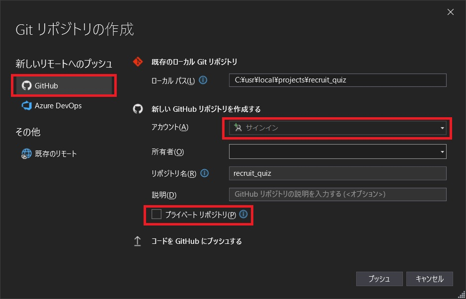

[就職試験対策 第01回]

# 一般常識(数学)

## 1 数式

### 1.1 数式クイズプログラムを作成する

本テキストでは、就職試験で出題される一般常識問題の予習をしていきます。しかし、ただ問題を解くだけでは面白くありません。そこで、「一般常識のクイズを出すプログラム」を作成することにします。

目的はあくまでも就職試験対策なので、コンソールアプリケーションとして作成します。以下の手順でプロジェクトを作成してください。

>1. Visual Studioを起動。
>2. 「新しいプロジェクトの作成」をクリック。
>3. 「空のプロジェクト」を選択し、「次へ」をクリック。
>4. プロジェクト名を`recruit_quiz`(リクルート・クイズ)に変更し、「作成」をクリック(「場所」はどこでも構いません)。

この方法で作成されたプロジェクトにはファイルがありません。ソリューションエクスプローラーに表示されている「ソースファイル」フィルタを右クリックし、「追加→新しい項目」を選んで`main.cpp`を追加してください。

それでは、簡単な数学クイズを追加しましょう。次のコードで先頭に`+`の付いている行を、先頭の`+`を除いて`main.cpp`に追加してください。

```diff
+#include <iostream>
+using namespace std;
+
+int main()
+{
+  cout << "[リクルート試験対策クイズ]\n";
+  cout << "13x(-5)の答えは？\n";
+
+  int answer;
+  cin >> answer;
+  if (answer == 13*-5) {
+    cout << "正解！\n";
+  } else {
+    cout << "間違い！正解は" << 13*-5 << "\n";
+  }
+}
```

プログラムが書けたら、「ローカルWindowsデバッガー」ボタンをクリックして実行してください。正答と誤答の両方を試して、プログラムの動作を確認してください。

### 1.2 Git(ギット)について

Git(ギット)は、プログラムのソースコードなどの変更履歴を記録・追跡するための分散型バージョン管理システムです。「バージョン管理システム」は、ファイルの変更履歴を管理するためのプログラムです。

バージョン管理システム(VCS)とは、一つのファイル、またはファイルの集合に対して、時間とともに加えられていく変更を記録し、後で特定バージョンを呼び出すことができるようにするツールです。

VCSはゲーム開発でも必須のツールです。そこで、クイズプログラムをサンプルに、実際にバージョン管理をしようと思います。

### 1.3 ローカル・リポジトリとリモート・リポジトリ

Gitでは、次のような構造でファイルのバージョンを管理しています。

<p align="center">

</p>

「リポジトリ」とは倉庫や金庫といった意味で、ファイルの状態を保存する場所です。変更履歴を管理したいファイルをリポジトリの管理下に置くことで、その変更履歴を記録することができます。

リポジトリは自分のPC内にある「ローカル・リポジトリ」と、サーバなどネットワーク上にある「リモート・リポジトリ」の2箇所にあります。基本的にローカル・リポジトリで作業を行い、プッシュという操作によって、その作業内容をリモート・ポジトリへ送り込みます。

上の図では、衛宮さん、遠坂さん、間桐さんのPCにあるのがローカル・リポジトリで、ネットワーク上のPCにあるのがリモート・リポジトリにあたります。

Gitでは、全てのリポジトリは対等です。そのため、どのリポジトリ同士でも変更を反映し合うことができます。ただし、個人間で変更をやり取りするだけだと、同じプロジェクトの関わる他の人々には、それらの変更を反映できません。

そのため、通常はネットワーク上にリモートリポジトリを作成し、各個人はリモートリポジトリから変更履歴を取得したり、変更を反映したりします。

>Gitについて詳しく知るには、公式サイトの日本語解説`git-scm.com/book/ja/v2`を読むとよいでしょう。

### 1.4 ローカルリポジトリを作成する

Gitを使うには専用のツールが必要です。Visual StudioにはGit用のツールが組み込まれていますので、すぐに使い始められます。

まずはプロジェクト用のリポジトリを作成します。`Git`メニューにある「Gitリポジトリの作成」をクリックしてください。

<p align="center">

</p>

すると、リポジトリ作成ウィンドウが開きます。

<p align="center">

</p>

今はローカルリポジトリのみ作成することにします。リモートリポジトリの追加には下準備が必要なので、あとで行います。以下の手順で、ローカルリポジトリを作成してください。

>1. 左側のリストから「ローカルのみ」を選択。
>2. ライセンステンプレートに「MIT License(エムアイティー・ライセンス)」を選択。
>3. 「README.mdの追加」にチェックを入れる。
>4. 「作成」ボタンをクリック。

これで、プロジェクトがローカルリポジトリに記録されました。

### 1.5 クイズプログラムを変更する

複数の問題を扱えるように、クイズプログラムを改造しましょう。`main.cpp`を次のように変更してください。

>先頭に`-`記号のある行を削除し、`+`記号のある行を追加してください。先頭が空白の行は変更しないでください。

```diff
 #include <iostream>
+#include <string>
 using namespace std;
+
+// 問題文と答えをまとめる構造体
+struct Question
+{
+  string s; // 問題文
+  int a;    // 答え
+};
+
 int main()
 {
+  Question questions[] = {
+    { "13×(-5)", 13 * -5 },
+    { "(-21)÷(-3)", -21 / -3 },
+    { "7-(4+2)÷2", 7 - (4 + 2) / 2 },
+  };
+
   cout << "[リクルート試験対策クイズ]\n";
-  cout << "13x(-5)の答えは？\n";

+  for (const auto& e : questions) {
+    cout << e.s << "の答えは？\n";
     int answer;
     cin >> answer;
-    if (answer == 13*-5) {
+    if (answer == e.a) {
       cout << "正解！\n";
     } else {
-      cout << "間違い！正解は" << 13*-5 << "\n";
+      cout << "間違い！正解は" << e.a << "\n";
     }
+  } // for questions
 }
```

プログラムが書けたらビルドして実行してください。3つの問題が出題されたら成功です。

### 1.6 ファイルの変更を記録する

変更した内容をリポジトリに記録しましょう。上部の「表示」メニューから「Git変更」を選択してください。すると、「Git変更ウィンドウ」が表示されます。

<p align="center">

</p>

ウィンドウの中央あたりに「変更(1)」という項目があります。ここには、変更されたファイルの一覧が表示されます。項目の右側の数字は「変更されたファイルの数」です。

ここには現在、`main.cpp`だけが表示されているはずです。そのため、「変更」の横の数字も`1`になっているわけです。

さて、Gitでは、変更された複数のファイルを「ひとかたまりのグループ」として保存します。そのため、ファイルをリモートリポジトリにアップロードするには、以下の3つのコマンドを順番に実行する必要があります。

>1. ステージ: ファイルを「グループ」に追加する。
>2. コミット: 「グループ」をローカルリポジトリに保存する。
>3. プッシュ: 「グループ」をリモートリポジトリにアップロードする。

とはいえ、まだローカルリポジトリしか作成していませんので、とりあえず`1`と`2`だけを行います。

一覧に表示されている`main.cpp`を右クリックして、「ステージ」を選択してください。すると、Git変更ウィンドウの表示が次のように変化します。

<p align="center">

</p>

ファイルを「ステージ」すると、「変更」欄から「ステージされている変更」欄に移動します。これで「ステージ」は完了です。

続いて「コミット」を行います。これは以下の手順で行います。

>1. 「メッセージを入力してください<必須>」と書かれている部分に、変更内容の説明を書く。
>2. 「ステージング済みをコミット」ボタンをクリックする。

メッセージの内容ですが、「問題数を増やす。」とでも書いておいてください。

<p align="center">

</p>

これで、「コミット」は完了です。

>これまでの変更履歴を確認するには、上部の「Git」メニューから「ブランチ履歴の表示」を選択します。

<br>

>**【1章のまとめ】**
>
>* Git(ギット)は「バージョン管理」のためのツール。
>* 「リポジトリ(倉庫や金庫といった意味)」は、ファイルの状態を保存する場所。
>* Gitのリポジトリには、自分のPC上に作成する「ローカル・リポジトリ」と、ネットワーク上に作成する「リモート・リポジトリ」がある。
>* ファイルの変更をリポジトリに反映するには、「ステージ」、「コミット」、「プッシュ」という3つの操作を実行する。
>* 「ステージ」、「コミット」はローカルリポジトリに対する操作、「プッシュ」はリモートリポジトリに対する操作。

<div style="page-break-after: always"></div>

## 2 GitHub(ギット・ハブ)

### 2.1 GitHub(ギットハブ)について

>注意: 以下の設定を行うには、インターネットに接続している必要があります。

ここまで見てきたように、Gitはローカルリポジトリだけでも運用可能です。しかし、PCが壊れたときなどのバックアップを考えて、大抵はリモートリポジトリも作成します。

とはいえ、サーバーPCを用意して、Gitをインストールして、ネットワークで使えるようにして、と、やることが多いため、企業ならともかく個人でリモートリポジトリを用意するのは大変です。

そこで、「誰でも簡単にリモートリポジトリを作成できるサービス」として作られたのが、GitHub(ギットハブ)です。GitHubを利用すると、自分でサーバーPCを用意しなくても、リモートリポジトリを作成できます。

### 2.2 GitHubのユーザー登録

GitHubにリモートリポジトリを作成するには、GitHubにユーザー登録(サインアップ)する必要があります。Webブラウザで以下のURLにアクセスし、「GitHubに登録する」ボタンをクリックしてください。

>`github.com`

<p align="center">

</p>

案内に従って、ユーザー登録を完了させてください。途中、登録したメールアドレスに「確認メール」が届きます。メールを開いて、指示に従ってください。

### 2.3 リモートリポジトリを設定する

GitHubにリモートリポジトリを作成する方法はいくつかありますが、今回はVisual Studioから作成する方法を使います。

上部メニューの「Git」をクリックして項目を開き、「Gitサービスにプッシュする」をクリックしてください。

<p align="center">

</p>

すると、以前にも見た「Gitリポジトリを作成」するウィンドウが開きます。

<p align="center">

</p>

<div style="page-break-after: always"></div>

以下の手順で、GitHubリポジトリを作成してください。

>1. 左側のリストから「GitHub」を選択。
>2. 「アカウント」項目の空欄をクリックし、「GitHubアカウント」を選択。
>3. GitHubのページが開くので、下の方にある「Authorize」ボタンをクリック。
>4. Visual Studioに戻り、「説明」の空欄にプロジェクトの説明を書く(とりあえず、「一般常識クイズのプログラム」などと書いておけばよいでしょう)。
>5. 「プライベートリポジトリ」のチェックを外す。

上記の設定が完了したら、「プッシュ」ボタンをクリックします。しばらく待つと、GitHubのサーバにリモートリポジトリが作成されます。

WebブラウザでGitHubのマイページを開き、リモートリポジトリが作成されていることを確認してください。

### 2.4 数値をランダムに選ぶ

現在のプログラムでは問題がいつも同じなので、答えを覚えてしまったらおしまいです。そこで、乱数を使って毎回問題が変わるようにしましょう。`main.cpp`を次のように変更してください。

```diff
 #include <iostream>
 #include <string>
+#include <random>
 using namespace std;

 struct Question
 {
   string q; // 問題文
   int a;    // 答え
 };

 int main()
 {
-  Question questions[] = {
-    { "13×(-5)", 13 * -5 },
-    { "(-21)÷(-3)", -21 / -3 },
-    { "7-(4+2)÷2", 7 - (4 + 2) / 2 },
-  };
+  Question questions[3];
+
+  random_device rd;
+  mt19937 rand(rd());
+
+  // 掛け算
+  int x = uniform_int_distribution<>(1, 30)(rand);
+  int y = uniform_int_distribution<>(1, 20)(rand);
+  questions[0].q = to_string(x) + "x" + to_string(y);
+  questions[0].a = x * y;
+
+  // 割り算
+  x = uniform_int_distribution<>(1, 30)(rand);
+  y = uniform_int_distribution<>(1, 20)(rand);
+  questions[1].q = to_string(x) + "÷" + to_string(y);
+  questions[1].a = x / y;
+
+  // 複雑な式
+  x = uniform_int_distribution<>(1, 100)(rand);
+  y = uniform_int_distribution<>(1, 10)(rand);
+  int z = uniform_int_distribution<>(1, 10)(rand);
+  int w = uniform_int_distribution<>(1, 10)(rand);
+  questions[2].q =
+    to_string(x) + "-(" + to_string(y) + "+" + to_string(z) + ")÷" + to_string(w);
+  questions[2].a = x - (y + z) / w;

   cout << "[リクルート試験対策クイズ]\n";

   for (const auto& e : questions) {
     cout << e.s << "の答えは？\n";
```

このプログラムでは以下のクラスと関数を使用しています。詳しい使い方は、標準ライブラリ解説サイト(`cpprefjp`など)を参照してください。

>* `random_device`: 真の乱数を生成するクラス。処理が遅いので、擬似乱数の初期化にだけ使われることが多い。
>* `mt19937`: 高品質な疑似乱数を生成するクラス。
>* `unniform_int_distribution`: 乱数の値を、コンストラクタで指定した範囲に変換するクラス。
>* `to_string`: 数値を`string`型に変換する関数。桁の指定などはできない。

プログラムが書けたらビルドして実行してください。実行するたびに問題が変化していたら成功です。

<div style="page-break-after: always"></div>

続いて、`main.cpp`の変更をコミットしましょう。Git変更ウィンドウを開くと、以前と同じく変更欄に`main.cpp`が表示されているはずです。

<p align="center">

</p>

一覧に表示されている`main.cpp`を右クリックして、「ステージ」を選択してください。すると、Git変更ウィンドウの表示が次のように変化します。

<p align="center">

</p>

メッセージを入力して、「ステージング済みをコミット」ボタンをクリックしてください。メッセージの内容は「問題の数値をランダムに選ぶ。」とでもしておきましょう。

<div style="page-break-after: always"></div>

### 2.5 端数が出ないようにする

何度かプログラムを実行すると、「割り算の結果が割り切れない」問題が出題されることに気づくかもしれません。一般的に、就職試験では割り切れる問題がほとんどですので、問題を改善しましょう。出題内容を次のように変更してください。

```diff
   // 割り算
   x = uniform_int_distribution<>(1, 30)(rand);
   y = uniform_int_distribution<>(1, 20)(rand);
-  questions[1].q = to_string(x) + "÷" + to_string(y);
-  questions[1].a = x / y;
+  questions[1].q = to_string(x * y) + "÷" + to_string(y);
+  questions[1].a = x;

   // 複雑な式
   x = uniform_int_distribution<>(1, 100)(rand);
   y = uniform_int_distribution<>(1, 10)(rand);
   int z = uniform_int_distribution<>(1, 10)(rand);
   int w = uniform_int_distribution<>(1, 20)(rand);
   questions[2].q =
-    to_string(x) + "-(" + to_string(y) + "+" + to_string(z) + ")÷" + to_string(w);
+    to_string(x) + "-(" + to_string(y * w) + "+" + to_string(z * w) + ")÷" + to_string(w);
-  questions[2].a = x - (y + z) / w;
+  questions[2].a = x - (y + z);

   cout << "[リクルート試験対策クイズ]\n";
```

この変更では、除数を被除数に掛けて、常に除数の倍数にしています。プログラムが書けたらビルドして実行してください。割り切れない問題は出題されなくなったはずです。

<pre class="tnmai_assignment">
<strong>【課題01】</strong>
変更を「ステージ」し、適切なメッセージを書いて「コミット」しなさい。
</pre>

<div style="page-break-after: always"></div>

### 2.6 変更をリモートリポジトリにプッシュする

ローカルリポジトリに新しいコミットが作成されたので、このコミットをリモートリポジトリに反映しましょう。上部メニューの「Git」を選択し、「同期(プル後にプッシュ)」をクリックしてください。

<p align="center">

</p>

これで、ローカルリポジトリに行った変更が、リモートリポジトリに反映されます。

WebブラウザでGitHubのリモートリポジトリを表示し、`main.cpp`の内容を確認してください。行った変更が反映されているはずです。

>**【2章のまとめ】**
>
>* GitHub(ギットハブ)は、リモートリポジトリを作成するサービス。
>* GitHubのリモートリポジトリをローカルリポジトリと連携させるには、GitHub側で「認証」を行う。
>* GitHubに反映したデータは、Webブラウザなどでいつでも確認できる。
