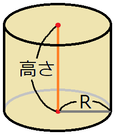
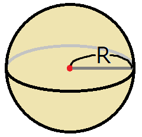

[就職試験対策 第02回]

# 一般常識(数学その２)

## 1 図形、確率、順列、組み合わせ

### 1.1 図形の面積

図形の面積や体積を求める問題は、公式を利用することで作成できます(R=円の半径)。

$$ 四角形の面積 = 縦×横 $$

$$ 三角形の面積 = \frac{底辺×高さ}{2} $$

$$ 直方体の体積 = 縦×横×高さ $$

<p align="center">


</p>

$$ 円周の長さ = 2πR $$

$$ 円の面積 = πR^2 $$

<p align="center">


</p>

<div style="page-break-after: always"></div>

$$ 円柱の表面積 = (底面積×2)+(円周の長さ×高さ) $$

$$ 円錐の体積 = \frac{底面積×高さ}{3} $$

<p align="center">


</p>

$$ 球の表面積 = 4πR^2 $$

$$ 球の体積 = \frac{4}{3}πR^3 $$

<p align="center">

</p>

これらのうち、就職試験でよく出題されるのは「三角形の面積」「円柱の表面積」「円錐の体積」あたりです。

その前に、問題を簡単に増やせるように、配列を`vector`クラスで置き換えておきます。Visual Studioで`recruit_quiz`プロジェクトを開いてください。<br>
そして、`main.cpp`に`vector`ヘッダをインクルードしてください。

```diff
 #include <iostream>
 #include <string>
+#include <vector>
 #include <random>
 using namespace std;
```

次に、`questions`配列を`vector`型に変更してください。

```diff
 int main()
 {
-  Question questions[3];
+  vector<Question> questions(3);

   random_device rd;
   mt19937 rand(rd());
```

それでは、三角形の面積の問題を追加しましょう。よく出るパターンは「面積と底辺から高さを求める」ものです。複雑な式の問題を作成するプログラムの下に、三角形の面積の問題を作成するプログラムを追加してください。

```diff
   int w = uniform_int_distribution<>(1, 20)(rand);
   questions[2].q =
     to_string(x) + "-(" + to_string(y * w) + "+" + to_string(z * w) + ")÷" + to_string(w);
   questions[2].a = x - (y + z);
+
+  // 三角形の面積
+  x = uniform_int_distribution<>(1, 10)(rand);
+  y = uniform_int_distribution<>(1, 5)(rand) * 2;
+  questions.push_back({
+    "面積" + to_string(x*y/2) + "cm^2、底辺" + to_string(y) + "cmの三角形の高さを求めよ。",
+    x });

   cout << "[リクルート試験対策クイズ]\n";

   for (const auto& e : questions) {
     cout << e.q << "の答えは？\n";
```

三角形の面積の公式では、底辺と高さの両方が奇数になると割り切れません。そこで、底辺が必ず偶数になるように、`2`を掛けています。

プログラムが書けたらビルドして実行してください。4問目に三角形の面積の問題が出題され、正答の場合は「正解！」、誤答の場合は「間違い！」と表示されたら成功です。

<pre class="tnmai_assignment">
<strong>【課題01】</strong>
<code>main.cpp</code>に行った変更を「ステージ」し、適切なメッセージを書いて「コミット」しなさい。
</pre>

### 1.2 文末の表現を改善する

現在、三角形の面積の問題の文末は、

>cmの三角形の高さを求めよ。の答えは？

のように表示されます。なんだか「の答えは？」の部分が邪魔ですね。無くしてしまったほうがよさそうです。問題文を表示するプログラムを次のように変更してください。

```diff
   cout << "[リクルート試験対策クイズ]\n";

   for (const auto& e : questions) {
-    cout << e.q << "の答えは？\n";
+    cout << e.q << "\n";
     int answer;
     cin >> answer;
```

問題文がなんであろうと改行は必要だと考えたので、改行だけを残しました。これだけだと数式の問題文から「の答えは？」が消えてしまうので、数式の問題文に「の答えは？」を付け加えましょう。

```diff
   // 掛け算
   int x = uniform_int_distribution<>(1, 30)(rand);
   int y = uniform_int_distribution<>(1, 20)(rand);
-  questions[0].q = to_string(x) + "x" + to_string(y);
+  questions[0].q = to_string(x) + "x" + to_string(y) + "の答えは？";
   questions[0].a = x * y;

   // 割り算
   x = uniform_int_distribution<>(1, 30)(rand);
   y = uniform_int_distribution<>(1, 20)(rand);
-  questions[1].q = to_string(x * y) + "÷" + to_string(y);
+  questions[1].q = to_string(x * y) + "÷" + to_string(y) + "の答えは？";
   questions[1].a = x;

   // 複雑な式
   x = uniform_int_distribution<>(1, 100)(rand);
   y = uniform_int_distribution<>(1, 10)(rand);
   int z = uniform_int_distribution<>(1, 10)(rand);
   int w = uniform_int_distribution<>(1, 20)(rand);
   questions[2].q =
     to_string(x) + "-(" + to_string(y * w) + "+" + to_string(z * w) + ")÷" +
-    to_string(w);
+    to_string(w) + "の答えは？";
   questions[2].a = x - (y + z);
```

プログラムが書けたらビルドして実行してください。問題文の末尾が日本語として自然な表現になっていれば成功です。

<pre class="tnmai_assignment">
<strong>【課題02】</strong>
<code>main.cpp</code>に行った変更を「ステージ」し、適切なメッセージを書いて「コミット」しなさい。
</pre>

<div style="page-break-after: always"></div>

### 1.3 円錐の問題を追加する

次は、「円錐の体積」を求める問題を追加しましょう。三角形の面積の問題の下に、次のプログラムを追加してください。

```diff
   questions.push_back({
     "面積" + to_string(x * y / 2) + "cm^2、底辺" + to_string(y) + "cmの三角形の高さを求めよ。",
     x });
+
+  // 円錐の体積
+  x = uniform_int_distribution<>(1, 10)(rand);
+  y = uniform_int_distribution<>(1, 5)(rand) * 3;
+  questions.push_back({
+    "底面の半径" + to_string(x) + "cm、高さ" + to_string(y) + "cmの円錐がある。\n" +
+    "この円錐の体積をXπcm^3とする。Xの値を求めよ。",
+    x * x * y / 3 });

   cout << "[リクルート試験対策クイズ]\n";

   for (const auto& e : questions) {
     cout << e.q << "\n";
```

円錐の体積の公式は「底面積×高さ÷3」です。このプログラムでは、3で割ったときに端数が出ないように、高さの値を「乱数の3倍」にしています。

プログラムが書けたらビルドして実行してください。円錐の体積の問題が出題され、正答と誤答の両方が正しく判定できていたら成功です。

<pre class="tnmai_assignment">
<strong>【課題03】</strong>
<code>main.cpp</code>に行った変更を「ステージ」し、適切なメッセージを書いて「コミット」しなさい。
</pre>

<pre class="tnmai_assignment">
<strong>【課題04】</strong>
円錐の体積を求める問題の下に、球の体積を求める問題を追加しなさい。
正しく動作することを確認したら、変更を「ステージ」し、適切なメッセージを書いて「コミット」しなさい。
</pre>

<div style="page-break-after: always"></div>

### 1.4 サイコロの問題を追加する

続いて、「確率の問題」を追加します。定番はサイコロを使った問題です。ですが、ここで問題が発生します。

一般的に、「確率」の表現には「小数」か「分数」を使います。しかし、現在の「答え」の型は`int`型なので、どちらも表現できません。そのため、`y / 6`は`0`か`1`のどちらかに変換されてしまいます。これは、「答え」の型を変える必要がありそうです。

さて、小数と分数のどちらを使うかですが、「小数」では`1/3`などの無限小数を正確に表現しづらいです。できれば、「分数」で書きたいところです。ところが、C++には分数を表現できるクラスはありません。考えられる対策は以下の2つです。

>1. 答えを、分母と分子の２つの値で表す。
>2. 答えを、文字列で表す。

今後は数学だけでなく、国語のように「文字で答える問題」も追加する予定です。そこで、文字にも対応できるように、`2`の「文字列で表す」対策を採用することにします。

`Question`構造体の定義を次のように変更してください。

```diff
 // 問題文と答えをまとめる構造体
 struct Question
 {
   string q; // 問題文
-  int a;    // 答え
+  string a; // 答え
 };

 int main()
 {
   vector<Question> questions(3);
```

次に、`to_string`関数を使って答えの値を文字列に変換します。`main`関数の中にある「答え」を設定するプログラムを、次のように変更してください。

```diff
   // 掛け算
   int x = uniform_int_distribution<>(1, 30)(rand);
   int y = uniform_int_distribution<>(1, 20)(rand);
   questions[0].q = to_string(x) + "x" + to_string(y) + "の答えは？";
-  questions[0].a = x * y;
+  questions[0].a = to_string(x * y);

   // 割り算
   x = uniform_int_distribution<>(1, 30)(rand);
   y = uniform_int_distribution<>(1, 20)(rand);
   questions[1].q = to_string(x * y) + "÷" + to_string(y) + "の答えは？";
-  questions[1].a = x;
+  questions[1].a = to_string(x);

   // 複雑な式
   x = uniform_int_distribution<>(1, 100)(rand);
   y = uniform_int_distribution<>(1, 10)(rand);
```

<pre class="tnmai_assignment">
<strong>【課題04】</strong>
<code>to_string</code>関数を使って、「複雑な式」、「三角形の面積」、「円錐の体積」、「球の体積」の答えを<code>string</code>型に変換しなさい。
</pre>

入力データの型も`string`型に変えなくてはなりません。`cin`で入力を受け取るプログラムを次のように変更してください。

```diff
   for (const auto& e : questions) {
     cout << e.q << "\n";
-    int answer;
+    string answer;
     cin >> answer;
     if (answer == e.a) {
       cout << "正解！\n";
```

<pre class="tnmai_assignment">
<strong>【課題05】</strong>
<code>main.cpp</code>に行った変更を「ステージ」し、以下のメッセージを書いて「コミット」しなさい。
<code>分数や単語を扱えるように、答えの型をintからstringに変更</code>
</pre>

>コミットメッセージには、変更内容だけでなく「変更の理由」も書くべきです。あとで見返したとき「なぜその変更を行ったのか」が分かることが大切です。

さて、問題の発端となった「確率」の話に戻りましょう。「分数の答え」は、可能ならば「約分(やくぶん)」するのが<ruby>定石<rt>じょうせき</rt></ruby>です。

分数を約分するには、分母と分子の「最大公約数」を求め、その数で分子と分母を割ります。「最大公約数」を求めるには「ユークリッドの互除法(ごじょほう)」という方法を使います。

>1. `a`を`b`で割った余り`r0`を求める。
>2. `b`を`r0`で割った余り`r1`を求める。
>3. `r0`を`r1`で割った余り`r2`を求める。
>4. 余りが`0`になるまで繰り返す。

このように、ユークリッドの互除法では「除数を余りで割る」ことを繰り返します。そして、「余りが`0`なったときの除数」が「最大公約数」になります。

`Question`構造体の定義の下に、次の関数定義を追加してください。関数名の`gcd`は`Greatest Common Divisor`(グレイテスト・コモン・ディバイザー、「最大公約数」という意味)の略語です。

```diff
 struct Question
 {
   string q; // 問題文
   string a; // 答え
 };
+
+// 最大公約数を求める
+int gcd(int a, int b)
+{
+  // 余りが0になったときの除数を返す
+  while (b) {
+    int r = a % b;
+    a = b; // 除数を次の被除数にする
+    b = r; // 余りを次の除数にする
+  }
+  return a;
+}

 int main()
 {
   vector<Question> questions(3);
```

それでは、サイコロ問題を作成しましょう。球の体積を求める問題の下に、次のプログラムを追加してください。

```diff
   questions.push_back({
     "半径" + to_string(x) + "cmの球がある。\n" +
     "この球の体積をXπcm^3とする。Xの値を求めよ。",
     4 * x * x * x / 3 });
+
+  // サイコロの確率
+  x = uniform_int_distribution<>(1, 5)(rand);
+  y = uniform_int_distribution<>(1, 6 - x)(rand);
+  z = gcd(y + 1, 6);
+  questions.push_back({
+    "サイコロを1個ふって、" + to_string(x) + "から" + to_string(x + y) +
+    "が出る確率を求めよ。",
+    to_string((y + 1) / z) + "/" + to_string(6 / z) });

   cout << "[リクルート試験対策クイズ]\n";

   for (const auto& e : questions) {
     cout << e.q << "\n";
```

プログラムが書けたらビルドして実行してください。円錐の体積の問題が出題され、正答と誤答の両方が正しく判定できていたら成功です。

<pre class="tnmai_assignment">
<strong>【課題06】</strong>
<code>main.cpp</code>に行った変更を「ステージ」し、適切なメッセージを書いて「コミット」しなさい。
</pre>

### 1.5 順列の問題を追加する

サイコロと同程度に出題されるのは「順列」や「組み合わせ」の問題です。例えば「５人のうち２人を選んで並べる方法は何通りあるか？」という問題です。実際に数えてみると、以下のように「２０通り」になります。

>12 13 14 15<br>
>21 23 24 25<br>
>31 32 34 35<br>
>41 42 43 45<br>
>51 52 53 54

これは数学で言う「順列」の問題で、式にすると $_5P_2$ となります(`P`は「順列」を意味する英単語`Permutation`(パーミュテーション)の頭文字です)。

順列は以下の公式で計算できます。ここで`!`は階乗を表します(例えば`5!=5x4x3x2x1`)。

$$ _nP_r = \frac{n!}{(n - r)!}$$

筆算や暗算で計算する場合、「`n!`の先頭から`r`個までの掛け算」と覚えるとよいでしょう。例えば $_5P_2$ の場合、「`5x4x3x2x1`の先頭2個までの掛け算」なので`5x4`となります。

それでは「順列」の問題を追加しましょう。サイコロの問題の下に、次のプログラムを追加してください。

```diff
   questions.push_back({
     "サイコロを1回ふって、" + to_string(x) + "から" + to_string(x + y) +
     "が出る確率を求めよ。",
     to_string((y + 1) / z) + "/" + to_string(6 / z) });
+
+  // 順列
+  x = uniform_int_distribution<>(3, 7)(rand);
+  y = uniform_int_distribution<>(1, x)(rand);
+  z = 1;
+  for (int i = 0; i < y; i++) {
+    z *= x - i;
+  }
+  questions.push_back({
+    to_string(x) + "人のうち" + to_string(y) + "人を選んで並べる方法は何通りあるか？",
+    to_string(z) });

   cout << "[リクルート試験対策クイズ]\n";

   for (const auto& e : questions) {
     cout << e.q << "\n";
```

プログラムが書けたらビルドして実行してください。順列の問題が出題され、正答と誤答の両方が正しく判定できていたら成功です。

<pre class="tnmai_assignment">
<strong>【課題07】</strong>
<code>main.cpp</code>に行った変更を「ステージ」し、適切なメッセージを書いて「コミット」しなさい。
</pre>

### 1.6 組み合わせの問題を追加する

「組み合わせ」問題もよく出題されます。これは、「５人のうち２人を選ぶ組み合わせは何通りあるか？」のような問題です。「順列」との違いは、「並び順を考慮しない」ところです。

そのため、「組み合わせの数」は、次のように「順列から重複する並びを除いた数」になります。

>12 13 14 15<br>
>~~21~~ 23 24 25<br>
>~~31~~ ~~32~~ 34 35<br>
>~~41~~ ~~42~~ ~~43~~ 45<br>
>~~51~~ ~~52~~ ~~53~~ ~~54~~

「組み合わせ」は以下の公式で計算できます。

$$ _nC_r = \frac{_nP_r}{r!} = \frac{n! / (n - r)!}{r!} $$

分子の部分は「順列」そのものです。分母は重複する組み合わせの倍率です。例えば分母が`2`の場合、並び順だけが違う組み合わせが2個ずつ存在することになります。

先程の問題を式にすると $_5C_2$ となります(`C`は「組み合わせ」を意味する英単語`Combination`(コンビネーション)の頭文字です)。

それでは「組み合わせ」の問題を追加しましょう。順列の問題の下に、次のプログラムを追加してください。

```diff
   questions.push_back({
     to_string(x) + "人のうち" + to_string(y) + "人を選んで並べる方法は何通りあるか？",
     to_string(z) });
+
+  // 組み合わせ
+  x = uniform_int_distribution<>(3, 6)(rand);
+  y = uniform_int_distribution<>(1, x)(rand);
+  z = 1;
+  for (int i = 0; i < y; i++) {
+    z *= x - i;
+  }
+  for (int i = 0; i < y; i++) {
+    z /= y - i;
+  }
+  questions.push_back({
+    to_string(x) + "人のうち" + to_string(y) + "人を選ぶ組み合わせは何通りあるか？",
+    to_string(z) });

   cout << "[リクルート試験対策クイズ]\n";

   for (const auto& e : questions) {
```

<pre class="tnmai_assignment">
<strong>【課題08】</strong>
<code>main.cpp</code>に行った変更を「ステージ」し、適切なメッセージを書いて「コミット」しなさい。
</pre>

### 1.7 変更をリモートリポジトリにプッシュする

Gitにおいて、間違えたコミットをやり直す方法はいくつもありますが、プッシュをやり直す方法はほとんどありません。そのため、一般的には「ひとまとめにできる作業を終えた」タイミングでプッシュします。

これは「テキストの章を終えた」のような瞬間で、例えば「今」です。

<pre class="tnmai_assignment">
<strong>【課題09】</strong>
<code>Git</code>メニューから「同期」を選択し、コミットをリモートリポジトリに反映しなさい。
</pre>
