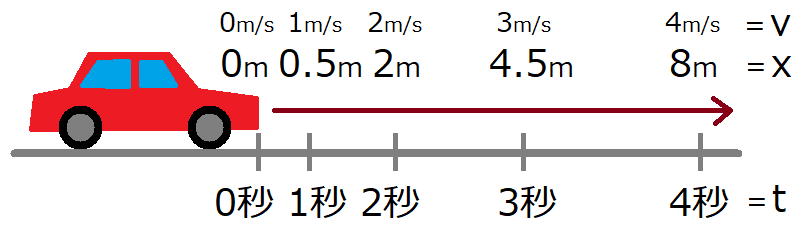

[就職試験対策 第06回]

# 一般常識(理科)

## 1 物理(その１)

### 1.1 等速直線運動の問題を出題する(その1)

このテキストでは、「物理」の問題を出題する関数を作っていきます。出題範囲は以下の3つとします。

>* 等速直線運動
>* 等加速度直線運動
>* 重力加速度

最初に、関数を宣言するヘッダファイルを追加します。ソリューションエクスプローラーの<br>
「ソースファイル」を右クリックし、「追加→新しい項目」を選択してください。<br>
そして、`exam_science.h`という名前のヘッダファイルを追加してください。

「物理の問題を作成する関数」の名前は`CreatePhysicsExam`(クリエイト・フィジックス・エグザム、「物理の試験を作成する」という意味)とします。<br>
追加した`exam_science.h`を開き、次のプログラムを追加してください。

```diff
 #pragma once
+#include "question.h"
+
+// 物理の問題を作成する
+QuestionList CreatePhysicsExam();
```

続いて、C++ファイルを追加します。ソリューションエクスプローラーの「ソースファイル」を右クリックし、「追加→新しい項目」を選択してください。そして、`exam_science.cpp`という名前のC++ファイルを追加してください。

<div style="page-break-after: always"></div>

それでは、「等速直線運動」の問題から作成していきましょう。等速直線運動の公式は次のようになります。

$$ x = vt $$

$$
v = 速度　　 \\\\
t = 移動時間 \\\\
x = 移動距離
$$

<p align="center">
<br>
[v=5m/sの場合の移動時間と移動距離]
</p>

まずは、「速度」と「移動距離」から「移動時間」を求めてみます。<br>
追加した`exam_science.cpp`を開き、次のプログラムを追加してください。

```diff
+#include "exam_science.h"
+#include "utility.h"
+#include <random>
+using namespace std;
+
+/*
+* 物理の問題を作成する
+*/
+QuestionList CreatePhysicsExam()
+{
+  QuestionList questions;
+  questions.reserve(10);
+  random_device rd;
+
+  { // 等速直線運動
+    constexpr int divisors[] = { 1, 2, 3, 4, 5, 6, 10, 12, 15, 20, 30, 60 };
+    int i = uniform_int_distribution<>(0, size(divisors) - 1)(rd);
+    int v = uniform_int_distribution<>(1, 10)(rd) * 60 / divisors[i]; // 時速
+    int t = uniform_int_distribution<>(1, 10)(rd) * divisors[i]; // 時間
+    questions.push_back({
+      "時速" + to_string(v) + "kmで移動する車がある。\nこの車が" + to_string(v * t / 60) +
+      "km移動するのにかかる時間を分単位で求めよ",
+      to_string(t) });
+  } // 等速直線運動
+
+  return questions;
+}
```

このプログラムでは、答えに当たる「時間」をランダムに選択して、時速と時間から移動距離を求めています。時間の単位は「分」なので、「時間」に変換するために`60`で割る必要があります。この除算で端数が出ないように、時速と時間には適当な数を掛けています。

配列変数`divisors`(ディバイザーズ、「除数列」のような意味)は、`60`を割り切れる数の集まりです。この配列の値を時速と時間に掛けて、「時速x時間」を常に`60`の倍数にすることで、端数が出ないようにしています。

それでは、理科の問題が出題されるようにしましょう。<br>
`main.cpp`を開き、`exam_science.h`をインクルードしてください。

```diff
 #include "question.h"
 #include "exam_japanese.h"
 #include "exam_english.h"
+#include "exam_science.h"
 #include <iostream>
 #include <string>
 #include <vector>
```

次に、教科を選択するプログラムを、次のように変更してください。

```diff
   questions.push_back({
     to_string(x) + "人のうち" + to_string(y) + "人を選ぶ組み合わせは何通りあるか？",
     to_string(z) });

   cout << "[リクルート試験対策クイズ]\n";

-  cout << "教科を選んでください\n1=数学\n2=国語\n3=英語\n";
+  cout << "教科を選んでください\n1=数学\n2=国語\n3=英語\n4=理科\n";
   int subject;
   cin >> subject;
   if (subject == 2) {
     questions = CreateKanjiExam();
     QuestionList synonymExam = CreateSynonymExam();
     questions.insert(questions.end(), synonymExam.begin(), synonymExam.end());
     QuestionList antonymExam = CreateAntonymExam();
     questions.insert(questions.end(), antonymExam.begin(), antonymExam.end());
     QuestionList idiomExam = CreateIdiomExam();
     questions.insert(questions.end(), idiomExam.begin(), idiomExam.end());
     QuestionList homophoneExam = CreateHomophoneExam();
     questions.insert(questions.end(), homophoneExam.begin(), homophoneExam.end());
   } else if (subject == 3) {
     questions = CreateEnglishWordExam();
     QuestionList phraseExam = CreateEnglishPhraseExam();
     questions.insert(questions.end(), phraseExam.begin(), phraseExam.end());
+  } else if (subject == 4) {
+    questions = CreatePhysicsExam();
   }

   for (const auto& e : questions) {
     cout << e.q << "\n";
     string answer;
```

プログラムが書けたらビルドして実行してください。教科選択で`4`を選んだとき、等速直線運動の問題が出題されたら成功です。

<pre class="tnmai_assignment">
<strong>【課題01】</strong>
<code>main.cpp</code>, <code>exam_science.h</code>, <code>exam_science.cpp</code>, <code>recruit_quiz.vcproj</code>,
<code>recruit_quiz.vcproj.filters</code>を「ステージ」し、適切なメッセージを書いて
「コミット」しなさい。
</pre>

### 1.2 等速直線運動の問題を出題する(その2)

次に、移動距離と移動時間から時速を求める問題を作成します。`exam_science.cpp`を開き、速度と距離から時間を求める問題の下に、次のプログラムを追加してください。

```diff
     questions.push_back({
       "時速" + to_string(y) + "kmで移動する車がある。\nこの車が" + to_string(y * z / 60) +
       "km移動するのにかかる時間を分単位で求めよ",
       to_string(z) });
+
+    i = uniform_int_distribution<>(0, size(divisors) - 1)(rd);
+    v = uniform_int_distribution<>(1, 10)(rd) * 60 / divisors[i]; // 速度
+    t = uniform_int_distribution<>(1, 10)(rd) * divisors[i]; // 時間
+    questions.push_back({
+      "ある車が" + to_string(v * t / 60) + "km離れた地点まで移動するのに" + to_string(t) +
+      "分かかった。\nこの車の平均時速を求めよ",
+      to_string(v) });
   } // 等速直線運動

   return questions;
 }
```

プログラムが書けたらビルドして実行してください。教科選択で`4`を選んだとき、等速直線運動の問題が2つ出題されたら成功です。

<pre class="tnmai_assignment">
<strong>【課題02】</strong>
<code>exam_science.cpp</code>を「ステージ」し、適切なメッセージを書いて「コミット」しなさい。
</pre>

<div style="page-break-after: always"></div>

### 1.3 等加速度直線運動

等加速度直線運動は、以下の3つの公式の組み合わせで表現されます。

$$
\begin{aligned}
 v &= v_0 + at &...(1) \\\\
 x &= v_0t + \frac{1}{2}at^2 &...(2) \\\\
 v^2 - v_0^2 &= 2ax &...(3)
\end{aligned}
$$

$$
\begin{aligned}
v &= 速度　　 \\\\
v_0 &= 初速　　 \\\\
a &= 加速度　 \\\\
t &= 移動時間 \\\\
x &= 移動距離 \\\\
\end{aligned}
$$

<p align="center">
<br>
[a=1m/s²の場合の移動時間と速度]
</p>

公式(1)は、等加速度直線運動では「速度が時間に比例して線形に変化する」ことを表しています。公式(1)は、「移動距離が時間に反比例する」ことを表しています。

公式(3)は、公式(1)と公式(2)を変形したものです。この式自体は何も表しませんが、等加速度直線運動を構成する5つの変数について、不明な変数の値を計算するためのツールになります。

それでは、公式(1)を利用する問題から作成しましょう。`exam_science.cpp`を開き、等速直線運動の問題作成プログラムの下に、次のプログラムを追加してください。

```diff
       "ある車が" + to_string(y * z / 60) + "km離れた地点まで移動するのに" + to_string(z) +
       "分かかった。\nこの車の平均時速を求めよ",
       to_string(y) });
   } // 等速直線運動
+
+  { // 等加速度直線運動
+    // 公式: v = v0 + at を使って解く問題
+    int v0 = uniform_int_distribution<>(1, 10)(rd); // 初速
+    int a = uniform_int_distribution<>(1, 5)(rd);  // 加速度
+    int t = uniform_int_distribution<>(1, 20)(rd); // 移動時間
+    questions.push_back({
+      "秒速" + to_string(v0) + "mで移動していた車が、進行方向に大きさ" + to_string(a) +
+      "m/sで等加速度直線運動をはじめた。\n" + to_string(t) + "秒後の速度をm/s単位で求めよ。",
+      to_string(v0 + a * t) });
+  } // 等加速度直線運動

   return questions;
 }
```

次に、公式(2)を利用する問題を作成します。公式(1)を利用する問題の下に、次のプログラムを追加してください。

```diff
     questions.push_back({
       "秒速" + to_string(x) + "mで移動していた車が、進行方向に大きさ" + to_string(y) +
       "m/sで等加速度直線運動をはじめた。\n" + to_string(z) + "秒後の速度をm/s単位で求めよ。",
       to_string(x + y * z) });
+
+    // 公式: x = v0t + 1/2*at^2 を使って解く問題
+    v0 = uniform_int_distribution<>(5, 20)(rd);    // 初速
+    a = uniform_int_distribution<>(1, 5)(rd) * 2; // 加速度
+    t = uniform_int_distribution<>(1, 10)(rd);    // 移動時間
+    questions.push_back({
+      "秒速" + to_string(v0) + "mで移動していた車が、進行方向に大きさ" + to_string(a) +
+      "m/sで等加速度直線運動をはじめた。\n加速を始めてから" + to_string(t) +
+      "秒後までに移動した距離をm単位で求めよ。",
+      to_string(v0 * t + a * t * t / 2) });
   } // 等加速度直線運動

   return questions;
 }
```

公式(2)には`1/2`が含まれるため、この計算で端数が出ないように、加速度の値を2倍しています。

最後に、公式(3)を利用する問題を追加します。公式(2)を利用する問題の下に、次のプログラムを追加してください。

```diff
     questions.push_back({
       "秒速" + to_string(x) + "mで移動していた車が、進行方向に大きさ" + to_string(y) +
       "m/sで等加速度直線運動をはじめた。\n加速を始めてから" + to_string(z) +
       "秒後までに移動した距離をm単位で求めよ。",
       to_string(x * z + y * z * z / 2) });
+
+    // 公式: v^2 - v0^2 = 2ax を使って解く問題
+    a = -uniform_int_distribution<>(1, 5)(rd) * 2; // 加速度
+    t = uniform_int_distribution<>(1, 10)(rd);    // 移動時間
+    v0 = -a * t; // 初速
+    questions.push_back({
+      "秒速" + to_string(v0) + "mで移動していた車がブレーキをかけたところ、" +
+      to_string(v0 * t + a * t * t / 2) + "m進んで停止した。\n" +
+      "ブレーキの加速度ををm/s^2単位で求めよ。",
+      to_string(a) });
   } // 等加速度直線運動

   return questions;
 }
```

公式(3)はさまざまな用途に使えますが、この問題では両辺を $2x$ で割ることで加速度 $a$ を求めます。この場合の式は次のようになります。

$$ a = \frac{v^2 - v_0^2}{2x} $$

>ここで作成した問題の場合、問題文に「停止した」とあるので、 $v = 0$ になります。

この式から分かることは、回答しやすいように答えの値が端数を含まないようにするには、答えが $2x$ で割り切れなくてはならない、ということです。しかし、 $2x$ で割り切れる $v^2 - v_0^2$ の値を計算するのは少し面倒です。

そこで、答えとなる加速度を先に決めてから、公式(2)を利用して「停止するまでの距離 $x$ 」を求めるようにしてみました。

これで、等加速度直線運動の問題が出題されるようになりました。

プログラムが書けたらビルドして実行してください。教科選択で`4`を選んだとき、等加速度直線運動の問題が出題されたら成功です。

<pre class="tnmai_assignment">
<strong>【課題03】</strong>
<code>exam_science.cpp</code>を「ステージ」し、適切なメッセージを書いて「コミット」しなさい。
</pre>

### 1.4 重力加速度

加速度つながりで、重力の問題を追加していきます。重力はゲームでもおなじみで、ゲームプログラマ向けの採用試験においても高い確率で出題されます。

公式は「等加速度直線運動」がそのまま使えます。大きな違いは「加速度が分かっている」ことです。重力による加速度は「重力加速度」と呼ばれ、一般には約 $9.8m/s^2$ となります。

>重力は質量中心からの距離の2乗に反比例します。そのため、赤道付近や高い山の上では重力が弱くなり、極付近や深海では重力が強くなります。

それでは、重力加速度の問題を追加しましょう。`exam_science.cpp`を開き、等加速度直線運動の問題を作成するプログラムの下に、次のプログラムを追加してください。

```diff
       to_string(z * y - x * y * y / 2) + "m進んで停止した。\n" +
       "ブレーキの加速度ををm/s^2単位で求めよ。",
       to_string(x) });
   } // 等加速度直線運動
+
+  { // 重力加速度
+    int t = uniform_int_distribution<>(1, 10)(rd); // 移動時間
+    int x = 98 * t * t / 2; // 10倍することで、小数点以下第1位までを整数として表す
+    string answer = to_string(x / 10); // 整数部を文字列化
+    if (x % 10) {
+      // 小数部がある場合は小数部を文字列化
+      answer += '.';
+      answer += '0' + x % 10;
+    }
+    questions.push_back({
+      "重力加速度を9.8m/s^2とする。\n十分に高い位置から物体を静かに落とすと、物体は" +
+      to_string(t) + "秒間でXm落下する。\n" +
+      "Xの値を小数点以下第1位まで求めよ(空気抵抗はないものとする)。",
+      answer });
+  } // 重力加速度

   return questions;
 }
```

重力加速度は小数点以下第1位までの値で表されるため、問題の答えも少数を含む可能性があります。そこで、小数点以下第1位まで求める問題にしています。

また、このプログラムでは、答えの小数点以下第1位までをプログラムで文字列化しています。
`to_string`関数では小数点以下の桁数を制御できないからです。

重力加速度の問題をもう一つ追加しましょう。ひとつめの重力加速度の問題を作成するプログラムの下に、次のプログラムを追加してください。

```diff
     questions.push_back({
       "重力加速度を9.8m/s^2とする。\n十分に高い位置から物体を静かに落とすと、物体は" +
       to_string(t) + "秒間でXm落下する。\n" +
       "Xの値を小数点以下第1位まで求めよ(空気抵抗はないものとする)。",
       answer });
+
+    int v0 = uniform_int_distribution<>(1, 10)(rd); // 初速
+    t = uniform_int_distribution<>(1, 10)(rd);  // 移動時間
+    int v = v0 - 98 * t; // 速度
+    answer.clear();
+    if (v < 0) {
+      v = -v;
+      answer = '-';
+    }
+    answer += to_string(v / 10);
+    if (v % 10) {
+      answer += '.';
+      answer += '0' + v % 10;
+    }
+    questions.push_back({
+      "重力加速度を9.8m/s^2とする。\n初速" + to_string(v0) +
+      "m/sで物体を鉛直に投げ上げたとき、" + to_string(t) +
+      "秒後の物体の速度はXm/sである。\n" +
+      "Xの値を小数点以下第1位まで求めよ(空気抵抗はないものとする)。",
+      answer });
   } // 重力加速度

   return questions;
 }
```

これは「鉛直投げ上げ」の問題です。答えを求めるには、等加速度直線運動の公式(1)を使います。この問題では答えがマイナスになりうるため、答えの文字列にもマイナスが含まれる場合があります。

また、除算の答えは、被除数がマイナスの場合とプラスの場合で異なります。そのため、剰余を使って数値を文字に変換するとき、被除数がマイナスの場合は符号を反転する必要があることに注意してください。

&emsp;&emsp; $10 / 3 = 3 ... 1$ <br>
&emsp;&emsp; $-10 / 3 = -3 ... -1$

プログラムが書けたらビルドして実行してください。教科選択で`4`を選んだとき、重力加速度の問題が出題されたら成功です。

<pre class="tnmai_assignment">
<strong>【課題04】</strong>
<code>exam_science.cpp</code>を「ステージ」し、適切なメッセージを書いて「コミット」しなさい。
</pre>

<pre class="tnmai_assignment">
<strong>【課題05】</strong>
<code>Git</code>メニューから「同期」を選択し、コミットをリモートリポジトリに反映しなさい。
</pre>
