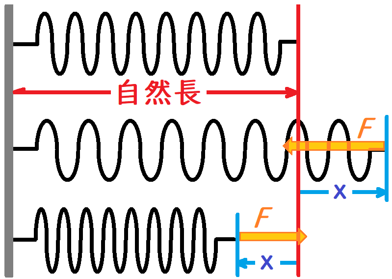
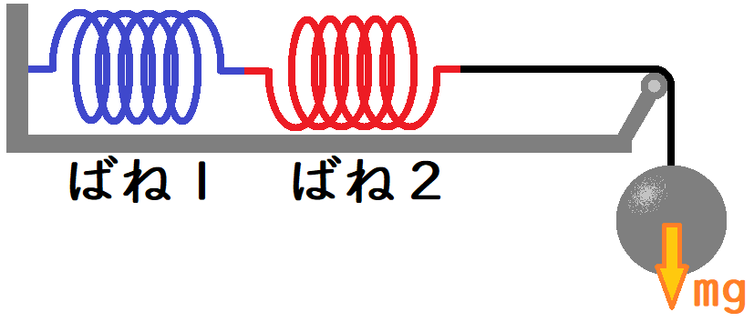
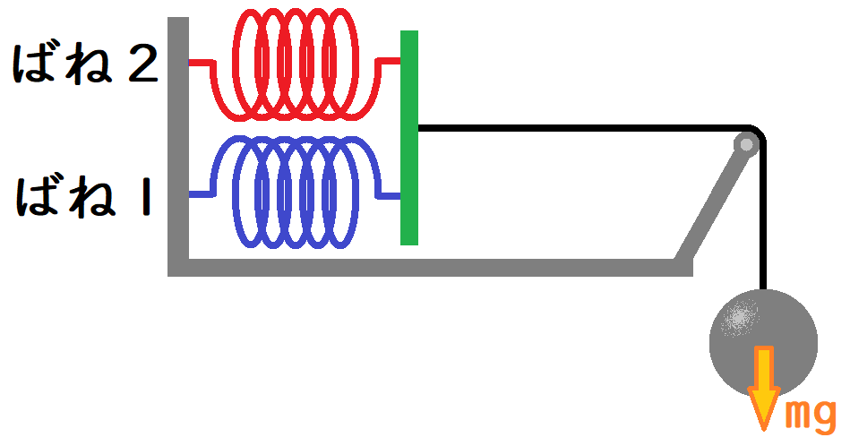
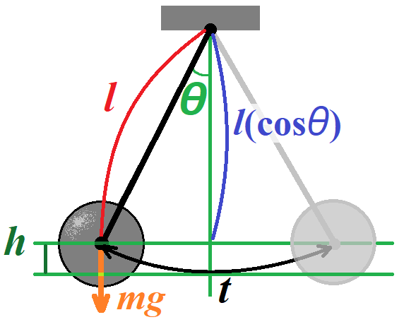

[就職試験対策 第07回]

# 一般常識(理科)

## 1 物理(その２)

### 1.1 浮力(その１)

前回に引き続き、「物理」の問題を出題する関数を作っていきます。出題範囲は以下の3つとします。

>* 浮力
>* ばね
>* 振り子

まずは、「浮力」の問題から作成していきましょう。浮力は、水が物体の「上面を押す力」と「下面を押す力」を合わせた力になります。この水が物体を押す力を「水圧」といいます。

水圧は水の深いところほど大きくなります。物体の「上面」より「下面」のほうが深い位置にあるため、「上面を押す力」と「下面を押す力」を合わせると上向きの力になります。この「上向きの力」が「浮力」です。

上記の定義から、浮力を求めるには「上面を押す力 - 下面を押す力」を計算すれば求められそうです。しかし、いちいち差を求めなくても、物体の体積から求めることもできます。物体の体積を利用する方法には、以下の2つの利点があります。

>* 上下の力の差を求めるより計算が簡単。
>* 体積さえ分かれば、複雑な形状でも浮力を求められる。

さて、物体を同じ体積の水で置き換えた場合、その水の浮力は重力と釣り合うはずです。つまり、浮力を $F$、水の質量を $m$ 、重力を $g$ とすると、以下の式が成り立ちます。

$$ F = mg ...(1) $$

物体の質量 $m$ は、物体の密度 $p$ に物体の体積 $V$ を掛けたものです。つまり、

$$ m = pV ...(2) $$

そして、式(1)と(2)から、

$$ F = pVg $$

という式が導かれます。また、水の密度はほぼ $1000kg/m^3$ です(厳密には温度によって異なる。例えば温度4°のときは約 $999.97g/cm^3$ となる)。そのため、密度 $p$ を $1000$ に置き換えることができます。

$$ F = 1000Vg $$

>体積 $V$ は「水面下にある部分の体積」であることに注意してください。

このように、浮力は密度と体積によって決まります。そのため、水より密度の低い物体は浮力が重力を上回るので浮き上がり、水より密度の高い物体は浮力が重力を下回るため沈んでいきます。

浮力は $N$ (ニュートン)という単位で表されます。1ニュートンは次のように定義されます。

$$ 1N = 1kgの質量を持つ物体に1m/sの加速度を生じさせる力 $$

例えば、質量5kgの物体にかかる重力は $5*9.8=49N$ となります。

>問題によっては、重力加速度を $10m/s^2$ に単純化している場合があります。また、単に $g$ とされる場合もあります。重力が関わる問題では、重力加速度の値を常に確認するようにしましょう)。

それでは、体積から浮力を求める問題を出題しましょう。`exam_science.cpp`を開き、重力加速度の問題を作成するプログラムの下に、次のプログラムを追加してください。

```diff
     questions.push_back({
       "重力加速度を9.8m/s^2とする。\n初速" + to_string(v0) + "m/sで物体を鉛直に投げ上げたとき、"
       + to_string(t) + "秒後の物体の速度はXm/sである。\n" +
       "Xの値を小数点以下第1位まで求めよ(空気抵抗はないものとする)。",
       answer });
   } // 重力加速度
+
+  { // 浮力
+    int s = uniform_int_distribution<>(5, 20)(rd); // 底面積
+    int h = uniform_int_distribution<>(2, 10)(rd); // 高さ
+    int v = s * h + 5; // 体積を求め、四捨五入のため5を加える
+    string answer = to_string(v / 100); // 整数部を文字列に変換
+    v /= 10;           // 小数点以下第2位に当たる部分を捨てる
+    if (v % 10) {      // 小数点以下第1位が0以外なら、少数部を文字列に加える
+      answer += '.';
+      answer += '0' + v % 10;
+    }
+    questions.push_back({
+      "質量100gの物体にはたらく重力を1Nとする。\n底面積" + to_string(s) + "cm^2、高さ" +
+      to_string(h) + "cmの円柱を完全に水中に沈めた。\n" +
+      "このとき、この円柱に働く浮力はXニュートンである。\n" +
+      "Xの値を小数点以下第2位を四捨五入して求めよ。",
+      answer });
+  } // 浮力

   return questions;
 }
```

この問題は、体積をグラム数に変換し、グラム数から重力の強さをニュートンで求める、という内容になります。<br>
ところで、体積と質量の単位は以下のように変換できます。

$$
\begin{aligned}
1m^3 &= 1,000,000cm^3 \\\\
 1kg &= 1,000g
\end{aligned}
$$

水の密度は $1000kg/m^3$ なので、単位変換すると $1g/cm^3$ になります。これは、体積($cm^3$)をグラム数($g$)に変換できることを意味します。

それから、重力加速度の定義が $10m/s^2$ なので、水 $100g$ にかかる重力はちょうど $1N$ になります。つまり、体積($cm^3$)を $100$ で割れば浮力が求められます。

>底面積 $s$ と高さ $h$ の最小値を`5`と`2`にした理由は、体積の最小値が $10cm^3$ を下回ると答えが $0N$ になってしまうためです。「浮力ゼロ」は答えとして不自然なので、避けたかったのです。

プログラムが書けたらビルドして実行してください。教科選択で`4`を選んだとき、重力加速度の問題の次に、浮力の問題が出題されたら成功です。

<pre class="tnmai_assignment">
<strong>【課題01】</strong>
<code>exam_science.cpp</code>を「ステージ」し、適切なメッセージを書いて「コミット」しなさい。
</pre>

### 1.2 浮力(その２)

次に、重さの差から浮力を求める問題を追加します。体積から浮力を求める問題の下に、次のプログラムを追加してください。

```diff
       "質量100gの物体にはたらく重力を1Nとする。\n底面積" + to_string(s) + "cm^2、高さ" +
       to_string(h) + "cmの円柱を完全に水中に沈めたとき、この円柱に働く浮力はXニュートンである。\n" +
       "Xの値を小数点以下第2位を四捨五入して求めよ。",
       answer });
+
+    int x = uniform_int_distribution<>(20, 50)(rd) * 10;  // 重さ(空中)
+    int y = uniform_int_distribution<>(x / 2, x - 1)(rd); // 重さ(水中)
+    int z = x - y + 5;
+    answer = to_string(z / 100);
+    z /= 10;
+    if (z % 10) {
+      answer += '.';
+      answer += '0' + z % 10;
+    }
+    questions.push_back({
+      "質量100gの物体にはたらく重力を1Nとする。\nある物体の重さをばねはかりではかると、" +
+      to_string(x) + "gを示した。\n" + "この物体を完全に水に入れたところ、ばねはかりは"
+      + to_string(y) + "gを示した。\nこのとき、物体にはたらく浮力はXニュートンである。\n" +
+      "Xの値を小数点以下第2位を四捨五入して求めよ。",
+      answer });
   } // 浮力

   return questions;
 }
```

この問題では、ばねはかりにはたらく力が水中に入れる前と入れたあとで異なる、という点に着目して浮力を計算します。軽くなったぶんだけ浮力が働いているわけですね。

変数 $x$ が「水中に入れる前の重さ」、変数 $y$ が「水中に入れたあとの重さ」です。 $y$ のほうが軽くないとおかしいですが、かといって、あまり軽くなりすぎるのも不自然です。そこで、 $y$ が取りうる値は $x/2$ から $x-1$ の範囲としてみました。

プログラムが書けたらビルドして実行してください。教科選択で`4`を選んだとき、浮力の問題が２問出題されたら成功です。

<pre class="tnmai_assignment">
<strong>【課題02】</strong>
<code>exam_science.cpp</code>を「ステージ」し、適切なメッセージを書いて「コミット」しなさい。
</pre>

### 1.3 浮力(その３)

最後に、水に浮く物体に関する問題を追加します。重さの差から浮力を求める問題の下に、次のプログラムを追加してください。

```diff
       "質量100gの物体にはたらく重力を1Nとする。\nある物体の重さをばねはかりではかると、" +
       to_string(x) + "gを示した。\n" + "この物体を完全に水に入れたところ、ばねはかりは"
       + to_string(y) + "gを示した。\nこのとき、物体にはたらく浮力はXニュートンである。\n" +
       "Xの値を小数点以下第2位を四捨五入して求めよ。",
       answer });
+
+    int p0 = uniform_int_distribution<>(1, 9)(rd) * 100; // 密度
+    s = uniform_int_distribution<>(5, 10)(rd);           // 底面積
+    h = uniform_int_distribution<>(5, 10)(rd);           // 高さ
+    z = h * p0 + 50;
+    answer = to_string(z / 1000);
+    z /= 100;
+    if (z % 10) {
+      answer += '.';
+      answer += '0' + z % 10;
+    }
+    questions.push_back({
+      "密度" + to_string(p0) + "kg/m^3、底面積" + to_string(s) + "cm^2、高さ" +
+      to_string(h) + "cmの物体を水に沈めようとしたところ、Xcm沈んで静止した。\n" +
+      "Xの値を小数点以下第1位まで求めよ。",
+      answer });
   } // 浮力

   return questions;
 }
```

水の密度を $p$ 、物体の密度を $p0$ とすると、物体の水中に沈む部分の長さは、水と物体の密度の比だけで決まります。

$$ 水面下の長さ = 高さ(h) * \frac{p0}{p} $$

なお、上記のプログラムでは、少数部を計算するために、水の密度 $1000kg/m^3$ による除算を後回しにしています。素直に計算すると、

$$ z = h * p0 / 1000 + 0.05 $$

のようになりますが、これだと小数部分が切り捨てられてしまいます。そこで全体を $1000$ 倍したまま計算を行います。つまり、

$$ z = 1000(h * p0 / 1000 + 0.05) = h * p0 + 50 $$

とします。整数部を求めるには $1000$ で割ります。小数点以下第1位を求めるには $100$ で割り、 $10$ で割ったあまりを計算します。

なお、底面積は無意味なのですが、計算に必要な数値を選ぶ能力を見るために問題に含めています。また、密度は $100kg/m^3$ 単位でランダムに選ぶようにしました。あまり細かい数値にしても、計算が面倒になるだけだからです。

プログラムが書けたらビルドして実行してください。教科選択で`4`を選んだとき、浮力の問題が３問出題されたら成功です。

<pre class="tnmai_assignment">
<strong>【課題03】</strong>
<code>exam_science.cpp</code>を「ステージ」し、適切なメッセージを書いて「コミット」しなさい。
</pre>

<div style="page-break-after: always"></div>

### 1.4 ばね(その１)

次に「ばね」の力の問題が出題されるようにします。ばね問題では、「ばねの伸びと引く(押す)力は比例する」という「フックの法則」が使われます。フックの法則は以下の式であらわされます。

$$
\begin{aligned}
フックの&法則: F = kx \\\\
&F = 力 \\\\
&k = ばね定数 \\\\
&x = ばねの自然長からの変化量
\end{aligned}
$$

<p align="center">
<br>
</p>

「自然長(しぜんちょう)」は、「力をかけていないばねが自然に停止する長さ」です。図のように、ばねを引っ張ったり縮めたりすると、自然長に戻ろうとする力 $F$ がはたらきます。

「ばね定数」は、「ばねの素材や長さ」によって決まる「ばねの強さ」です。<br>
一般的な単位は $N/m$(ニュートン毎メートル)です。

>現実のばねがフックの法則に従うのは、伸ばしたり縮めたりする量が一定値以下の場合だけです。それを超えると、ばねの形が元に戻らなくなったり、裂けてしまう場合があります。

それでは、ばねの問題を追加しましょう。`exam_science.cpp`を開き、浮力の問題の下に、次のプログラムを追加してください。

```diff
       "密度" + to_string(p0) + "g/cm^3、底面積" + to_string(s) + "cm^2、高さ" +
       to_string(h) + "cmの物体を水に沈めようとしたところ、Xcm沈んで静止した。\n" +
       "Xの値を小数点以下第1位まで求めよ。",
       answer });
   } // 浮力
+
+  { // ばね
+    int a = uniform_int_distribution<>(10, 30)(rd);    // 自然長(cm)
+    int x = uniform_int_distribution<>(1, a / 2)(rd);  // 自然長からの変化量(cm)
+    int m = uniform_int_distribution<>(1, 20)(rd) * 10;// 質量(g)
+    int k = 100 * m / x + 5;            // kの100倍を求め、四捨五入のため5を足す
+    string answer = to_string(k / 100); // 整数部を文字列に変換
+    k /= 10;      // 小数点以下第2位に当たる部分を捨てる
+    if (k % 10) { // 小数点以下第1位が0以外なら、少数部を文字列に加える
+      answer += '.';
+      answer += '0' + k % 10;
+    }
+    questions.push_back({
+      "重力加速度を10m/s^2とする。\n長さ" + to_string(x) + "cmのばねの先端に" +
+      to_string(m) + "gの重りをつけて、天井から吊り下げた。\nすると、ばねの長さが" +
+      to_string(a + x) + "cmになった。\n" +
+      "このばねの「ばね定数」を小数点以下第２位を四捨五入して求めよ。",
+      answer });
+  } // ばね

   return questions;
 }
```

この問題では、バネの長さの単位を $cm$ 、質量の単位を $g$ としています。しかし、ばね定数の単位は $N/m$ です。長さの単位をメートル($m$)に合わせるには、変化量 $x$ を $100$ で割って $m$ に変換する必要があります。

また、 $1N$ は「 $1kg$ の物体に $1m/s$ の加速度を生じさせる力」ですが、問題文の質量の単位はグラム($g$)です。そのため、 $kg$ に変換するために $1000$ で割る必要があります。これらの単位変換を加えた式は、重力加速度を $g$ とすると次のようになります。

>注意: 重量単位の $g$(グラム)と重力加速度を表す記号 $g$ を混同しないように気をつける。

$$
\begin{aligned}
(&m / \underline{1000})g &= k(x / \underline{100}) \\\\
  &kgに変換 &mに変換
\end{aligned}
$$

これを $k$ について解くと次の式になります。

$$ k = \frac{(m / 1000)g}{x / 100} $$

さらに $g = 10m/s^2$ なので、次のように式を変形できます。

$$ k = \frac{m / 100}{x / 100} = \frac{m}{x} $$

ただし、答えは「小数点以下第２位を四捨五入した値」でなくてはなりません。整数の範囲でこの計算をするために、両辺を $100$ 倍します。

$$ 100k = 100\frac{m}{x} $$

これで $k$ が求められます。あとは整数部と、必要なら小数部を文字列化して答えを作成します。

プログラムが書けたらビルドして実行してください。教科選択で`4`を選んだとき、浮力の問題のあとにばねの問題が出題されたら成功です。

<pre class="tnmai_assignment">
<strong>【課題04】</strong>
<code>exam_science.cpp</code>を「ステージ」し、適切なメッセージを書いて「コミット」しなさい。
</pre>

### 1.5 ばね(その２)

次に、２つのばねをつないだ場合の問題を作成します。ばねのつなぎ方には「直列」と「並列」の２つが考えられます。まずは、「ばねを直列につないだ場合」を考えましょう(m=質量 g=重力加速度)。

<p align="center">
<br>
</p>

ばね１とばね２があるとして、２つのばね方程式 $F1$ と $F2$ は次のようになります。

$$
F_1 = k_1x_1 \\\\
F_2 = k_2x_2
$$

重力加速度を $g$ 、おもりの重さを $m$ とします。ばね１の下にばね２をつないだとすると、それぞれのばねにかかる力は次のようになります。

$$
F_1 = mg \\\\
F_2 = mg
$$

このように、直列つなぎの場合、すべてのバネに同じ力がかかる事が分かります。この $F_1 = F_2 = mg$ を最初の式に代入すると、次の式になります。

$$
mg = k_1x_1 \\\\
mg = k_2x_2
$$
$$ x_1 = \frac{mg}{k_1} $$
$$ x_2 = \frac{mg}{k_2} $$

次に、２つのばねを直列につないだ場合の「全体のばね定数」を $k_c$ とします。 $k_c$ を求めるには、「変化量の合計」 $(x_1 + x_2)$ をばね方程式 $F=kx$ に当てはめて、次のように式を変形します。

$$ mg = k_c(x_1 + x_2) = k_c(\frac{mg}{k_1} + \frac{mg}{k_2}) $$
$$ 1 = k_c(\frac{1}{k_1} + \frac{1}{k_2}) $$
$$ \frac{1}{k_c} = \frac{1}{k_1} + \frac{1}{k_2} $$
$$ k_c = \frac{k_1k_2}{k_1 + k_2} $$

それでは、上の式を利用して「変化量の合計」を求める問題を作成しましょう。`exam_science.cpp`を開き、ばねの問題を作成するプログラムに、次のプログラムを追加してください。

```diff
       "重力加速度を10m/s^2とする。\n長さ" + to_string(x) + "cmのばねの先端に" +
       to_string(m) + "gの重りをつけて、天井から吊り下げた。\nすると、ばねの長さが" +
       to_string(a + x) + "cmになった。\n" +
       "このばねの「ばね定数」を小数点以下第２位を四捨五入して求めよ。",
       answer });
+
+    int k1 = uniform_int_distribution<>(1, 10)(rd); // ばね定数1(N/m)
+    int k2 = uniform_int_distribution<>(1, 9)(rd);  // ばね定数2(N/m)
+    if (k2 >= k1) {
+      k2++;
+    }
+    m = uniform_int_distribution<>(1, 10)(rd) * 10; // 質量(g)
+    x = 100 * m * (k1 + k2) / (k1 * k2) + 5;
+    answer = to_string(x / 100);
+    x /= 10;
+    if (x % 10) {
+      answer += '.';
+      answer += '0' + x % 10;
+    }
+    questions.push_back({
+      "重力加速度を10m/s^2とする。\nばね定数が" + to_string(k1) + "と" + to_string(k2) +
+      "の2つのばねを直列につなぎ、" + to_string(m) + "gの重りをつけて天井から吊り下げた。\n" +
+      "すると、ばねの長さが合わせてXcm伸びて静止した。\n" +
+      "Xの値を小数点以下第２位を四捨五入して求めよ。",
+      answer });
   } // ばね

   return questions;
 }
```

$cm$ 単位の変化量 $x$ を求める式は、ばね方程式をそのまま書き写し、小数部分を扱うために $100$ 倍しているように見えます。実際の式は、単位の変換を伴う次の式を変形したものです。

$$
\begin{aligned}
x &= \underline{10} * (m / &\underline{1000}) * (&\underline{100} * (k1 + k2) / (k1 * k2)) \\\\
  &重力加速度 &kgに変換 \quad &mに変換
\end{aligned}
$$

ここで、 $10(重力加速度)$, $1000(kgに変換)$, $100(mに変換)$ の部分が打ち消し合うので、結局は次の式になります。

$$ x = m * (k1 + k2) / (k1 * k2) $$

この式は「ばね方程式」そのものに見えますが、実際には「適切な単位の変換を行った結果」だと理解することが重要です。問題でどんな単位が指定されても、正しい式を立てられる必要があるからです。

プログラムが書けたらビルドして実行してください。教科選択で`4`を選んだとき、ばねの問題が２問出題されたら成功です。

<pre class="tnmai_assignment">
<strong>【課題05】</strong>
<code>exam_science.cpp</code>を「ステージ」し、適切なメッセージを書いて「コミット」しなさい。
</pre>

### 1.6 ばね(その３)

続いて、「ばねを並列につないだ場合」を考えましょう。

<p align="center">
<br>
</p>

このとき、ばね１とばね２の変化量は同じ $x$ になります。そして、両方のばねを力 $mg$ で引っ張るので、次の式が成り立ちます。

$$ mg = k_1x + k_2x = (k_1 + k_2)x $$

それでは、問題を作成しましょう。ばねの２つめの問題を作成するプログラムの下に、次のプログラムを追加してください。

```diff
       "重力加速度を10m/s^2とする。\nばね定数が" + to_string(k1) + "と" + to_string(k2) +
       "の2つのばねを直列につなぎ、" + to_string(m) + "gの重りをつけて天井から吊り下げた。\n" +
       "すると、ばねの長さが合わせてXcm伸びて静止した。\n" +
       "Xの値を小数点以下第２位を四捨五入して求めよ。",
       answer });
+
+    k1 = uniform_int_distribution<>(1, 10)(rd); // ばね定数1(N/m)
+    k2 = uniform_int_distribution<>(1, 10)(rd); // ばね定数2(N/m)
+    m = uniform_int_distribution<>(1, 10)(rd) * 10; // 質量(g)
+    x = 100 * m / (k1 + k2) + 5;
+    answer = to_string(x / 100);
+    x /= 10;
+    if (x % 10) {
+      answer += '.';
+      answer += '0' + x % 10;
+    }
+    questions.push_back({
+      "重力加速度を10m/s^2とする。\nばね定数が" + to_string(k1) + "と" + to_string(k2) +
+      "の２本のばねを水平な天井に固定し、ばねの下端に木の棒を水平に取り付けた。\n" +
+      "この棒の中央に質量" + to_string(m) + "gの重りを吊り下げた。\n" +
+      "すると、ばねの長さがそれぞれXmだけ伸びて静止した。\n" +
+      "Xの値を小数点以下第２位を四捨五入して求めよ。",
+      answer });
   } // ばね

   return questions;
```

プログラムが書けたらビルドして実行してください。教科選択で`4`を選んだとき、ばねの問題が３問出題されたら成功です。

<pre class="tnmai_assignment">
<strong>【課題06】</strong>
<code>exam_science.cpp</code>を「ステージ」し、適切なメッセージを書いて「コミット」しなさい。
</pre>

### 1.7 振り子(その１)

<p align="center">

</p>

振り子運動でよく出題されるのは、「周期」と「速度」に関する問題です。

>1. 周期 $t$: 振り子の長さ $l$ だけで決まる
>2. 速度 $s$: 振り子の最大の高さ $h$ だけで決まる

周期の問題から考えていきましょう。振り子の長さを $l$ 、重力加速度を $g$ とすると、周期 $t$ は以下の公式で求められます。

$$ t = 2\pi\sqrt{\frac{l}{g}} $$

$g$ と $\pi$ は定数なので、周期 $t$ に影響するのは振り子の長さ $l$ だけです。

この公式を使って、振り子の周期の問題を作成しましょう。`exam_science.cpp`を開き、ばねの問題を作成するプログラムの下に、次のプログラムを追加してください。

```diff
       "の２本のばねを水平な天井に固定し、ばねの下端に木の棒を水平に取り付けた。\n" +
       "この棒の中央に質量" + to_string(m) + "gの重りを吊り下げた。\n" +
       "すると、ばねの長さがそれぞれXmだけ伸びて静止した。\nXの値を小数点以下第２位を四捨五入して求めよ。",
       answer });
   } // ばね
+
+  { // 振り子
+    int l = uniform_int_distribution<>(1, 10)(rd); // 長さ(m)の平方根
+    int m = uniform_int_distribution<>(1, 10)(rd); // 質量(g)
+    questions.push_back({
+      "長さ" + to_string(l * l) + "mの糸に質量" + to_string(m) +
+      "kgの重りをつけ、わずかに揺らしたところ、周期はX秒であった。Xの値を求めよ。\n" +
+      "なお、重力加速度gと円周率πについて、π = √gが成り立つものとする。",
+      to_string(2 * l) });
+  } // 振り子

   return questions;
```

この問題の質量 $m$ は引っ掛けです。周期を求めるために必要なのは、振り子の長さだけだからです。

それから、「重力加速度 $g$ と円周率 $π$ について、 $\sqrt{g} = \pi$ が成り立つものとする」という注釈についてですが、これは周期 $t$ の公式に代入してみると意味が分かります。

$$ t = 2\pi\sqrt{\frac{l}{g}} = 2\sqrt{g}\sqrt{\frac{l}{g}} = 2\sqrt{g}\frac{\sqrt{l}}{\sqrt{g}} = 2\sqrt{l} $$

このように、 $\pi = \sqrt{g}$ と定義することで計算を簡単にできるのです。こんな変換が可能な理由は、昔は１メートルの長さを「振り子の周期が２秒になる長さ」としていたからです。周期 $t$ の式に $t=2, l=1$ を代入し、 $\pi$ について解くと次のようになります。

$$
\begin{aligned}
2 &= 2\pi\sqrt{\frac{1}{g}} \\\\
\frac{1}{\pi} &= \sqrt{\frac{1}{g}} = \frac{1}{\sqrt{g}} \\\\
\pi &= \sqrt{g}
\end{aligned}
$$

ご覧のとおり、問題文の注釈と同じ定義を導くことができます。もちろん、現代の１メートルは光速から計算するように変更されているため、上の式は成り立ちません。とはいえ、過去の定義からあまりずれないように配慮されているので、おおよその値を計算するときは役立ちます。

プログラムが書けたらビルドして実行してください。教科選択で`4`を選んだとき、ばねの問題の次に振り子の問題が出題されたら成功です。

<pre class="tnmai_assignment">
<strong>【課題07】</strong>
<code>exam_science.cpp</code>を「ステージ」し、適切なメッセージを書いて「コミット」しなさい。
</pre>

### 1.8 振り子(その２)

振り子の速度は、おもりを落としたときの高さによって決まります。おもりを落とす直前、おもりは位置エネルギー $E_p$ だけを持っており、運動エネルギー $E_k$ はゼロです。

おもりが落下を始めると、位置エネルギーは時間とともに運動エネルギーに変わっていきます。そして、糸が垂直になった地点では位置エネルギー $E_p$ がゼロになり、すべてのエネルギーが運動エネルギー $E_k$ に置き換わります。

その後、おもりが上昇するごとに、今度は運動エネルギーが位置エネルギーに置き換わっていきます。エネルギー保存の法則から、総エネルギー量を $E$ とすると、次の式が成り立ちます。

$$ E = E_p + E_k $$

そこで、運動エネルギーの公式、

$$ E_k = \frac{1}{2}mv^2 $$

の $E_k$ に位置エネルギー $E_p$ を代入すれば、速度 $v$ を求められます。

位置エネルギー $E_p$ は、質量 $m$ 、重力加速度 $g$ 、糸の長さ $l$ 、糸の角度 $θ$ から、次のように計算されます。

$$ E_p = mgl(1 - cosθ) $$

この式の $l(1 - cosθ)$ は、おもりを落とす高さ $h$ です。ですから、角度ではなく高さが分かっている場合は、次の式が使えます。

$$ E_p = mgh $$

運動エネルギーの式の $E_k$ に $mgh$ を代入すると、振り子の最高速度を求める公式は次のようになります。

$$ mgh = \frac{1}{2}mv^2 $$
$$ gh = \frac{1}{2}v^2 $$
$$
2gh = v^2 \\\\
v = \sqrt{2gh}
$$

それでは、振り子の速度の問題を追加しましょう。ひとつめの振り子の周期の問題の下に、次のプログラムを追加してください。

```diff
     questions.push_back({
       "長さ" + to_string(l * l) + "mの糸に質量" + to_string(m) +
       "kgの重りをつけ、わずかに揺らしたところ、周期はX秒であった。Xの値を求めよ。\n" +
       "なお、重力加速度gと円周率πについて、π = √gが成り立つものとする。",
       to_string(2 * l) });
+
+    l = uniform_int_distribution<>(1, 10)(rd); // 長さ(m)
+    m = uniform_int_distribution<>(1, 10)(rd); // 質量(kg)
+    int max_v = (int)sqrt(20 * l); // 速度の上限(2gh=v^2を根拠とする)
+    int v = uniform_int_distribution<>(1, max_v)(rd); // 速度
+    questions.push_back({
+      "重力加速度を10m/s^2とする。\n長さ" + to_string(l) + "mの糸に質量" + to_string(m) +
+      "kgのおもりをつけた振り子がある。\nこのおもりを最下点から高さ" +
+      to_string(v * v * 100 / 20) + "cmの位置で静かに放した。\n" +
+      "このとき、おもりが最下点を通過するときの速度をm/s単位で求めよ。",
+      to_string(v) });
   } // 振り子

   return questions;
 }
```

ところで、高さから速度を求めるには平方根を計算する必要がありますが、平方根を筆算で求めるのは大変です。そこでこの問題では、まず速度 $v$ を決めて、速度から「おもりを放す高さ」を計算しています。

平方から根を求めるのではなく、先に根に当たる速度 $v$ の値を決めることで、問題を解くときに簡単に平方根を求められるようにしています。

また、おもりを放す高さ $h$ が振り子の長さ $l$ を超えると、糸の張力が失われるため計算式が違ってきます。そこで、振り子の式が成り立つ範囲で速度 $v$ を決めています。

プログラムが書けたらビルドして実行してください。教科選択で`4`を選んだとき、振り子の問題が２問出題されたら成功です。

<pre class="tnmai_assignment">
<strong>【課題08】</strong>
<code>exam_science.cpp</code>を「ステージ」し、適切なメッセージを書いて「コミット」しなさい。
</pre>

<pre class="tnmai_assignment">
<strong>【課題09】</strong>
<code>Git</code>メニューから「同期」を選択し、コミットをリモートリポジトリに反映しなさい。
</pre>
